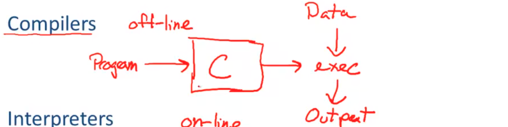
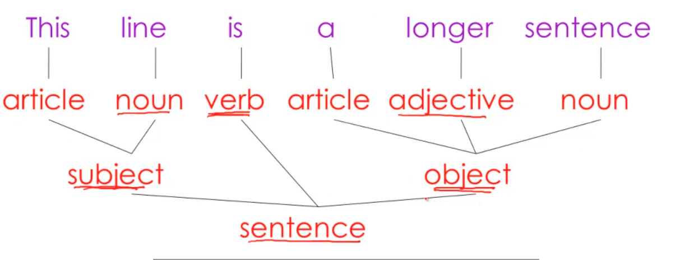
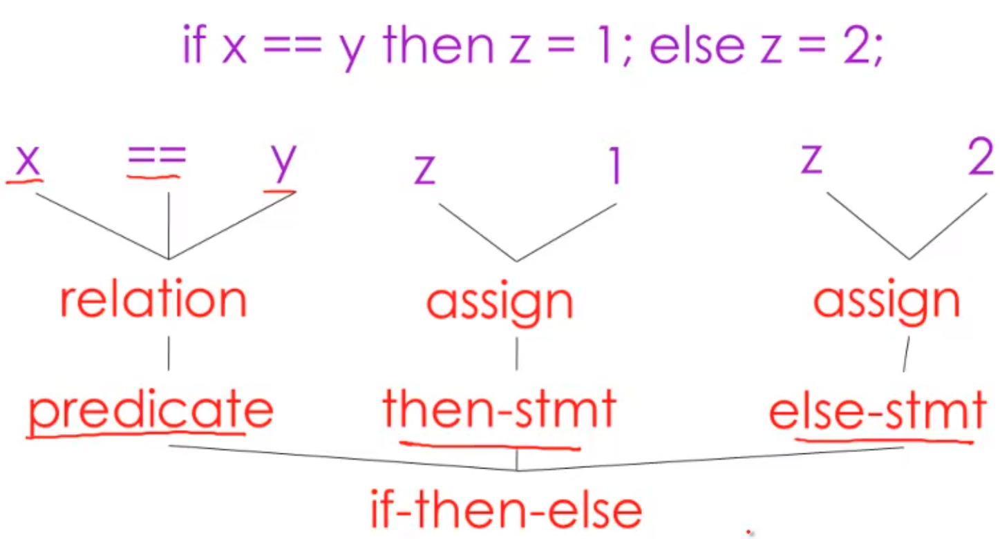
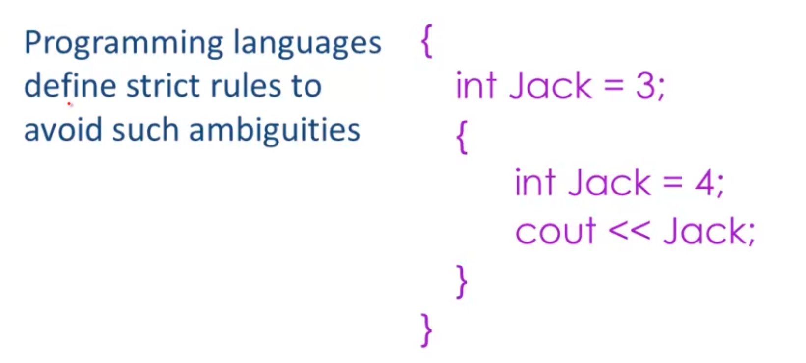
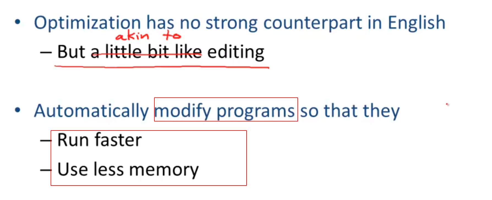

# CS-143 斯坦福编译原理

## Intro to Compilers

- Complers

  ​    

- Interpreters : Online

  

---

### 编译器的pipline

- Lexical Analysis: 词汇分析： 目的是将源码文本划分成单词“words”或者是“tokens”标记。

- Parsing： 解析 = Diagramming Sentences: The diagram is a tree.

Once words are undersood, the next step is to understand sentence structure. 一旦词被理解了，接下来需要解析

- Semantic Analysis： 语义分析 : 避免ambiguities.

  

- Optimization

  

- Code Generation

   

## The Economy of Programming Languages

1. Why are there so many programming languages?

   不同的领域有不同侧重的需求。

   - 说科学计算领域：对于浮点计算的支持要好，数组支持好，并行度高；FORTARN

   - 业务应用程序领域： 持久化数据， 报告生成， 数据分析，SQL

   - 系统程序领域： 资源管理， 细粒度控制，响应速度 C/C++

2. Why are there new programming languages?

   程序员需要花费时间在具体的编程语言上。

3. What is a good programming language?

---

## Cool Overview

Classroom Object Oriented Language : Cool 是面向对象语言的缩写：

Designed to be implementable in a short time.

Give a taste of implementation of modern:

- Abstraction
- Static typing 
- Reuse(inheritance)
- Memory management
- And more

A complete compiler:

- Cool -> MIPS assembly language MIPS汇编语言

  MIPS(Million Instructions Per Second)：单字长定点指令平均执行速度 Million Instructions Per Second的缩写，每秒处理的百万级的[机器语言](https://baike.baidu.com/item/机器语言/2019225?fromModule=lemma_inlink)指令数。

In 5 programming assignments
- Write a Cool Program
- Lexical analysis
- Parsing
- Semantic analysis
- Code Generation