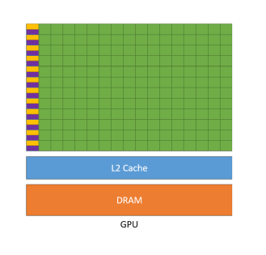

# GPU 基本知识


> CPUs延迟导向设计
>
> 
>
> - 内存大：多级缓存机制
> - 控制复杂
> - - 分支预测
>   - 流水线数据前送
> - 运算单元强大
> - - 整型浮点型复杂运算速度快


> GPUs: 吞吐导向设计
>
> 


## GPU编程

- 计算密集型

  数值计算的比例要远大于内存操作， 因此内存访问的延时，可以被计算覆盖。

- 数据并行

  大任务可以拆解成执行相同指令的小任务，因此对复杂流程控制的需求较低。


# GPU 编程与CUDA

> CUDA(Compute Unified Device Architecture),由英伟达公司2007年开始推出,初衷是为GPU增加一个易用的编程
> 接口,让开发者无需学习复杂的着色语言或者图形处理原语。


> OpenCL(Open Computing Languge)是2008年发布的异构平台并行编程的开放标准,也是一个编程框架。OpenCL
> 相比CUDA,支持的平台更多,除了GPU还支持CPU、DSP、FPGA等设备。


##  CUDA 编程并行计算整体流程

```c++
void GPUKernel(float* A, float* B, float* C, int n)
{
    // 1. Allocate device memory for A, B, and C, 
    // Copy A and B to device memory
    
    // 2. Kernel launch code - to have the device
    // to perform the actual vector addition
    
    // 3. copy C from the device memory 
    // Free device vectors
}
```


## CUDA 编程术语： 硬件


- Device=GPU
- Host = CPU
- Kernel = GPU上运行的函数

## CUDA 编程术语： 内存模型

上面的图可能画得不是很多， 没有画出线程处理器SP 。


- CUDA中的内存模型分为以下几个层次
  - 每个线程处理器(SP)都有自己的registers（寄存器）
  - 每个SP都有自己的local memory局部存储器， register 和local memory 只能被自己的线程访问
  - 每个多核处理器（SM）都哟有自己的shared memory（共享内存），shared memory可以被线程块内所有的线程访问。
  - 一个GPU的所有SM共有一块global memory(全局内存)， 不同线程块的线程可以使用。

## CUDA 编程术语： 软件

-  CUDA中的内存模型分为几个层次
  - 线程处理器（SP）对应线程（thread）
  - 多核处理器（SM）对应线程块（thread block）
  - 设备端（device）对应线程块组合体（grid）
- 一个kernel其实由一个grid来执行。
- 一个kernel一次只能在一个GPU上执行。


## 线程块： 可扩展的集合体

将线程数组分为多个块

- 块内的线程通过共享内存，原子操作和屏障同步进行协作（shared memory, atomic operations and barrier synchronization）
- 不同块中的线程不能协作


## 网格（grid）: 并行线程块组合

- CUDA 核函数由线程网格（组成）执行

- - 每个线程都有一个索引，用于计算内存地址和做出控制决策。

  

## 线程块id & 线程id： 定位独立线程的门牌号

每个线程使用索引来决定要处理的数据

- blockIdx: 1D, 2D, or 3D
- threadIdx: 1D, 2D, or 3D


> GPU 上运行函数kernel对应一个Grid，每个Grid内有多个Block， 每个block 里面由多个Thread组成。
>
> 运行方式：
>
> Block中的thread是并行执行的
>
> Grid中的Block是独立执行的， 多个Block可以采用任何顺序执行操作，即并行，随机或者顺序操作，这种方式扩展了我们的操作空间。

## 线程id计算

- dim3 dimGrid(M,N);
- dim3 dimBlock(P, Q, S)

$$
threadId.x = blockIdx.x*blockDim.x + threadIdx.x \\
threadId.y = blockIdx.y* blockDim.y + threadIdx.y
$$

## 线程束 warp

SM 采用的时SIMT（Single-Instruction, Multiple-Thread, 单指令多线程）架构。

warp(线程束)是最基本的执行单元，一个warp包含32个并行的thread， 这些thread以不同数据资源执行相同的指令。

warp 的本质是线程在GPU上运行的最小单元。


当一个kernel被执行时， grid中的线程块被分配到SM上， *一个线程块的thread只能在一个SM上调度*， SM一般可以调度多个线程块，大量的thread可能被分配到不同的SM上。每个thread拥有自己的程序计数器和状态寄存器，并且用该线程自己的数据执行指令，这就是所谓的Single Instruction Multiple Thread(SIMT).


由于warp的大小时32， 所以block所包含的thread的大小一般要设置成32的倍数


## 作业1.2

1. 线程束warp

   GPU 的控制单元与计算单元是如何结合的， 或者说warp线程束是如何在软件和硬件端被执行的， 为什么说线程束是执行核函数的最基本单元？

   

   

2. 线程ID

   计算下图中Thread(3, 0 , 0) 的线程ID

​	


$$
thread.x = 3* 3+ 0 = 9\\
thread.y = 3*2 + 0 = 6
$$

## 并行计算实例

### CPU 加法

```c++
#include <iostream>
#include <cstdlib>
#include <sys/time.h>

using namespace std;

void vecAdd(float* A, float* B, float* C, int n) {
    for (size_t i = 0; i < n; i++)
    {
        C[i] = A[i] + B[i];
    }
}

int main(int argc, char** argv) {

    int n = atoi(argv[1]);
    cout << n << endl;

    size_t size = n * sizeof(float);

    // host memery
    float *a = (float *)malloc(size);
    float *b = (float *)malloc(size);
    float *c = (float *)malloc(size);

    for (size_t i = 0; i < n; i++)
    {
        float af = rand() / double(RAND_MAX);
        float bf = rand() / double(RAND_MAX);
        a[i] = af;
        b[i] = bf;
    }

    struct timeval t1, t2;
    gettimeofday(&t1, NULL);
    vecAdd(a, b, c, n);
    gettimeofday(&t2, NULL);
    double timeuse = (t2.tv_sec - t1.tv_sec) + (double)(t2.tv_usec - t1.tv_usec) / 1000000.0;
    cout<<timeuse<<endl;
    free(a);
    free(b);
    free(c);
    return 0;
}
```

上面的计算具有：

1. 访问内存的次数少
2. 控制简单
3. 计算简单
4. 并行度高

更加适合在GPU上进行计算。

### GPU 加法

```c++
#include<iostream>
#include<cstdlib>
#include<sys/time.h>
#include<cuda_runtime.h>

using namespace std;

__global__
void vecAddKernel(float* A_d, float* B_d, float* C_d, int n) {
    int i = threadIdx.x + blockDim.x * blockIdx.x;
    if (i < n)
    {
        C_d[i] = A_d[i] + B_d[i];
    }
}

int main(int argc, char** argv) {
    int n = atoi(argv[1]);
    cout << n << endl;

    size_t size = n * sizeof(float);
    float *a = (float* )malloc(size);
    float *b = (float* )malloc(size);
    float *c = (float* )malloc(size);

    for (size_t i = 0; i < n; i++)
    {
        float af = rand() / double(RAND_MAX);
        float bf = rand() / double(RAND_MAX);
        a[i] = af;
        b[i] = bf;
    }
    
    float *da = NULL;
    float *db = NULL;
    float *dc = NULL;

    cudaMalloc((void **)&da, size);
    cudaMalloc((void **)&db, size);
    cudaMalloc((void **)&dc, size);

    cudaMemcpy(da, a, size, cudaMemcpyHostToDevice);
    cudaMemcpy(db, b, size, cudaMemcpyHostToDevice);
    cudaMemcpy(dc, c, size, cudaMemcpyHostToDevice);

    struct timeval t1, t2;

    int threadPerBlock = 256;
    int blockPerGrid = (n + threadPerBlock -1) / threadPerBlock;

    gettimeofday(&t1, NULL);
    vecAddKernel <<< blockPerGrid, threadPerBlock >>> (da, db, dc, n);
    // gettimeofday(&t2, NULL);
    cudaMemcpy(c, dc, size, cudaMemcpyDeviceToHost);
    gettimeofday(&t2, NULL);

    double time_use = (t2.tv_sec - t1.tv_sec) + (double)(t2.tv_usec - t1.tv_usec) / 1000000.0;

    cout<<time_use<<endl;

    cudaFree(da);
    cudaFree(db);
    cudaFree(dc);
    return 0;
}
```

# CUDA C 编程 矩阵乘法


# TensorRT 介绍

## TensorRT 是什么？

1. 高性能深度学习推理优化器和加速库
2. 低延迟和高吞吐量
3. 部署到超大规模数据数据、嵌入式或汽车产品


## TensorRT 工作流程介绍

保存好的TRT模型文件可以从磁盘重新加载到TRT执行引擎中，不需要再次执行优化步骤。


## TensorRT 优化策略介绍

1. 


