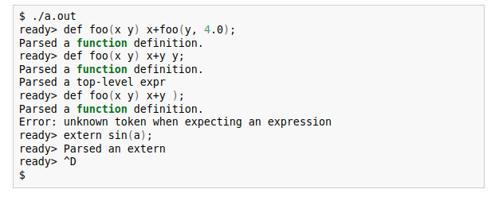

## Kaleidoscope: Lexer

https://llvm.org/docs/tutorial/MyFirstLanguageFrontend/LangImpl01.html

### The Lexer

在实现一种语言时，首先需要的是能够处理文本文件并识别它所说的内容。 这样做的传统方法是使用“词法分析器”（又名“扫描器”）将输入分解为“token”。 词法分析器返回的每个标记都包含一个标记代码和一些可能的元数据（例如，数字的数值）。 首先，我们定义可能性：

```c++
// The lexer returns tokens [0-255] if it is an unknown character, otherwise one
// of these for known things.
enum Token {
  tok_eof = -1, 

  // commands
  tok_def = -2, 
  tok_extern = -3, 

  // primary
  tok_identifier = -4, 
  tok_number = -5
};

static std::string IdentifierStr; // Filled in if tok_identifier
static double NumVal;             // Filled in if tok_number
```

我们的词法分析器返回的每个标记要么是 Token 枚举值之一，要么是一个“未知”字符，如“+”，作为其 ASCII 值返回。 如果当前标记是标识符，则 IdentifierStr 全局变量保存标识符的名称。 如果当前标记是数字文字（如 1.0），则 NumVal 保留其值。 为简单起见，我们使用全局变量，但这不是真正语言实现的最佳选择:)。


词法分析器的实际实现是一个名为 gettok 的函数。 调用 gettok 函数以从标准输入返回下一个标记。 它的定义开始于：

```c++
/// gettok - Return the next token from standard input.
static int gettok() {
  static int LastChar = ' ';

  // Skip any whitespace.
  while (isspace(LastChar))
    LastChar = getchar();

 /*
 gettok 通过调用 C getchar() 函数从标准输入一次读取一个字符来工作。 它在识别它们时吃掉它们，并将最后读取但未处理的字符存储在 LastChar 中。 它必须做的第一件事是忽略标记之间的空白。 这是通过上面的循环完成的。

gettok 需要做的下一件事是识别标识符和特定关键字，如“def”。 Kaleidoscope 使用这个简单的循环来做到这一点：
 */
  if (isalpha(LastChar)) { // identifier: [a-zA-Z][a-zA-Z0-9]*
    IdentifierStr = LastChar;
    while (isalnum((LastChar = getchar())))
      IdentifierStr += LastChar;

    if (IdentifierStr == "def")
      return tok_def;
    if (IdentifierStr == "extern")
      return tok_extern;
    return tok_identifier;
  }

    /*
    请注意，此代码会在对标识符进行词法分析时将“IdentifierStr”设置为全局。 此外，由于语言关键字由同一循环匹配，因此我们在这里以内联方式处理它们。 数值相似：
    
    这些都是用于处理输入的非常简单的代码。 从输入中读取数值时，我们使用 C strtod 函数将其转换为存储在 NumVal 中的数值。 请注意，这并没有进行足够的错误检查：它会错误地读取“1.23.45.67”并像您输入“1.23”一样处理它。 随意扩展它！ 接下来我们处理评论：
    */
  if (isdigit(LastChar) || LastChar == '.') { // Number: [0-9.]+
    std::string NumStr;
    do {
      NumStr += LastChar;
      LastChar = getchar();
    } while (isdigit(LastChar) || LastChar == '.');

    NumVal = strtod(NumStr.c_str(), nullptr);
    return tok_number;
  }
/*
我们通过跳到行尾来处理评论，然后返回下一个标记。 最后，如果输入与上述情况之一不匹配，则它要么是像“+”这样的运算符字符，要么是文件末尾。 这些是用这段代码处理的：
*/
  if (LastChar == '#') {
    // Comment until end of line.
    do  
      LastChar = getchar();
    while (LastChar != EOF && LastChar != '\n' && LastChar != '\r');

    if (LastChar != EOF)
      return gettok();
  }

  // Check for end of file.  Don't eat the EOF.
  if (LastChar == EOF)
    return tok_eof;

  // Otherwise, just return the character as its ascii value.
  int ThisChar = LastChar;
  LastChar = getchar();
  return ThisChar;
}
```

### Kaleidoscope:Implementing a Parser and AST

欢迎阅读“使用 LLVM 实现语言”教程的第 2 章。 本章向您展示如何使用第 1 章中构建的词法分析器为我们的 Kaleidoscope 语言构建一个完整的解析器。 有了解析器后，我们将定义并构建一个抽象语法树 (AST)。

我们将构建的解析器结合使用**递归下降解析和运算符优先解析**来解析 Kaleidoscope 语言（后者用于二进制表达式，前者用于其他所有内容）。 在我们开始解析之前，让我们先谈谈解析器的输出：抽象语法树。


#### 2.1 AST

程序的 AST 以一种易于编译器后期阶段（例如代码生成）解释的方式捕获其行为。 我们基本上希望语言中的每个结构都有一个对象，而 AST 应该紧密地模拟语言。 在 Kaleidoscope 中，我们有表达式、原型和函数对象。 我们首先从表达式开始：


```c++
/// ExprAST - Base class for all expression nodes.
class ExprAST {
public:
  virtual ~ExprAST() = default;
};

/// NumberExprAST - Expression class for numeric literals like "1.0".
class NumberExprAST : public ExprAST {
  double Val;

public:
  NumberExprAST(double Val) : Val(Val) {}
};

/*
上面的代码显示了基本 ExprAST 类和我们用于数字文字的一个子类的定义。 关于此代码需要注意的重要一点是 NumberExprAST 类将文字的数值捕获为实例变量。 这允许编译器的后续阶段知道存储的数值是什么。

现在我们只创建 AST，所以它们没有有用的访问器方法。 例如，添加一个虚拟方法来漂亮地打印代码将非常容易。 以下是我们将在 Kaleidoscope 语言的基本形式中使用的其他表达式 AST 节点定义：
*/

/// VariableExprAST - Expression class for referencing a variable, like "a".
class VariableExprAST : public ExprAST {
  std::string Name;

public:
  VariableExprAST(const std::string &Name) : Name(Name) {}
};


/// BinaryExprAST - Expression class for a binary operator.
class BinaryExprAST : public ExprAST {
  char Op;
  std::unique_ptr<ExprAST> LHS, RHS;

public:
  BinaryExprAST(char Op, std::unique_ptr<ExprAST> LHS,
                std::unique_ptr<ExprAST> RHS)
      : Op(Op), LHS(std::move(LHS)), RHS(std::move(RHS)) {}
};
```

这一切（有意）相当直接：变量捕获变量名，二元运算符捕获它们的操作码（例如“+”），调用捕获函数名以及任何参数表达式的列表。 我们的 AST 的优点之一是它捕获了语言特性，而无需讨论语言的语法。 请注意，这里没有讨论二元运算符的优先级、词法结构等。

对于我们的基本语言，这些是我们将定义的所有表达式节点。 因为它没有条件控制流，所以它不是图灵完备的； 我们将在以后的文章中解决这个问题。 接下来我们需要做的两件事是一种谈论函数接口的方式，以及一种谈论函数本身的方式：

```c++
/// PrototypeAST - This class represents the "prototype" for a function,
/// which captures its name, and its argument names (thus implicitly the number
/// of arguments the function takes).
//PrototypeAST - 此类表示函数的“原型”，它捕获其名称及其参数名称（因此隐式地表示函数采用的参数数量）。

class PrototypeAST {
  std::string Name;
  std::vector<std::string> Args;

public:
  PrototypeAST(const std::string &Name, std::vector<std::string> Args)
      : Name(Name), Args(std::move(Args)) {}

  const std::string &getName() const { return Name; }
};

/// FunctionAST - This class represents a function definition itself.
/// 这个类代表一个函数定义本身。
class FunctionAST {
  std::unique_ptr<PrototypeAST> Proto;
  std::unique_ptr<ExprAST> Body;

public:
  FunctionAST(std::unique_ptr<PrototypeAST> Proto,
              std::unique_ptr<ExprAST> Body)
      : Proto(std::move(Proto)), Body(std::move(Body)) {}
};
```

在 Kaleidoscope 中，函数的类型只包含参数的个数。 由于所有值都是双精度浮点数，因此不需要在任何地方存储每个参数的类型。 在更激进和现实的语言中，“ExprAST”类可能有一个类型字段。


有了这个脚手架，我们现在可以讨论 Kaleidoscope 中的解析表达式和函数体。


####  2.2 Parser Basics

现在我们有了要构建的 AST，我们需要定义解析器代码来构建它。 这里的想法是，我们想要将诸如“x+y”之类的东西（由词法分析器作为三个标记返回）解析为一个 AST，可以通过这样的调用生成：

```c++
auto LHS = std::make_unique<VariableExprAST>("x");
auto RHS = std::make_unique<VariableExprAST>("y");
auto Result = std::make_unique<BinaryExprAST>('+', std::move(LHS),
                                              std::move(RHS));
```

为了做到这一点，我们将从定义一些基本的辅助例程开始：


```c++
// CurTok/getNextToken - 提供一个简单的令牌缓冲区。 CurTok 是解析器正在查看的当前标记。 getNextToken 从词法分析器读取另一个标记并用其结果更新 CurTok。

static int CurTok;
static int getNextToken() {
  return CurTok = gettok();
}

```

这在词法分析器周围实现了一个简单的令牌缓冲区。 这使我们能够提前查看词法分析器返回的内容。 我们解析器中的每个函数都假定 CurTok 是当前需要解析的标记。


```c++
/// LogError* - These are little helper functions for error handling.
std::unique_ptr<ExprAST> LogError(const char *Str) {
  fprintf(stderr, "Error: %s\n", Str);
  return nullptr;
}
std::unique_ptr<PrototypeAST> LogErrorP(const char *Str) {
  LogError(Str);
  return nullptr;
}
```

LogError 例程是简单的辅助例程，我们的解析器将使用它们来处理错误。 我们的解析器中的错误恢复不是最好的，也不是特别用户友好，但对于我们的教程来说已经足够了。 这些例程可以更轻松地处理具有各种返回类型的例程中的错误：它们始终返回 null。

有了这些基本的辅助函数，我们就可以实现语法的第一部分：数字文字。


#### 2.4 Basic Expression Parsing

我们从数字文字开始，因为它们最容易处理。 对于语法中的每个产生式，我们将定义一个解析该产生式的函数。 对于数字文字，我们有：

```c++
/// numberexpr ::= number
static std::unique_ptr<ExprAST> ParseNumberExpr() {
  auto Result = std::make_unique<NumberExprAST>(NumVal);
  getNextToken(); // consume the number
  return std::move(Result);
}
```

这个例程非常简单：它期望在当前令牌是 tok_number 令牌时被调用。 它获取当前数值，创建一个 NumberExprAST 节点，将词法分析器推进到下一个标记，最后返回。

这有一些有趣的方面。 最重要的一点是，这个例程会吃掉与产生式对应的所有标记，并返回带有下一个标记（不属于语法产生式）的词法分析器缓冲区。 这是递归下降解析器的一种相当标准的方法。 举个更好的例子，括号运算符定义如下：

```c++
/// parenexpr ::= '(' expression ')'
static std::unique_ptr<ExprAST> ParseParenExpr() {
  getNextToken(); // eat (.
  auto V = ParseExpression();
  if (!V)
    return nullptr;

  if (CurTok != ')')
    return LogError("expected ')'");
  getNextToken(); // eat ).
  return V;
}
```

这个函数说明了关于解析器的一些有趣的事情：

1) 它显示了我们如何使用 LogError 例程。 调用时，此函数期望当前标记为“(”标记，但在解析子表达式后，可能没有“)”等待。 例如，如果用户输入“(4 x”而不是“(4)”，解析器应该发出一个错误。因为可能会发生错误，解析器需要一种方法来表明它们发生了：在我们的解析器中，我们返回 错误时为 null。

2) 这个函数的另一个有趣的方面是它通过调用 ParseExpression 使用递归（我们很快就会看到 ParseExpression 可以调用 ParseParenExpr）。 这很强大，因为它允许我们处理递归语法，并使每个产生式都非常简单。 请注意，括号不会导致 AST 节点本身的构造。 虽然我们可以这样做，但括号最重要的作用是引导解析器并提供分组。 一旦解析器构造了 AST，就不需要括号了。

下一个简单的产生式用于处理变量引用和函数调用：

```c++
/// identifierexpr
///   ::= identifier
///   ::= identifier '(' expression* ')'
static std::unique_ptr<ExprAST> ParseIdentifierExpr() {
  std::string IdName = IdentifierStr;

  getNextToken(); // eat identifier.

  if (CurTok != '(') // Simple variable ref.
    return std::make_unique<VariableExprAST>(IdName);

  // Call.
  getNextToken(); // eat (
  std::vector<std::unique_ptr<ExprAST>> Args;
  if (CurTok != ')') {
    while (true) {
      if (auto Arg = ParseExpression())
        Args.push_back(std::move(Arg));
      else
        return nullptr;

      if (CurTok == ')')
        break;

      if (CurTok != ',')
        return LogError("Expected ')' or ',' in argument list");
      getNextToken();
    }
  }

  // Eat the ')'.
  getNextToken();

  return std::make_unique<CallExprAST>(IdName, std::move(Args));
}

```

这个函数说明了关于解析器的一些有趣的事情：

1) 它显示了我们如何使用 LogError 例程。 调用时，此函数期望当前标记为“(”标记，但在解析子表达式后，可能没有“)”等待。 例如，如果此例程遵循与其他例程相同的样式。 （如果当前令牌是 tok_identifier 令牌，它预计会被调用）。 它还具有递归和错误处理。 一个有趣的方面是它使用前瞻性来确定当前标识符是一个独立的变量引用还是一个函数调用表达式。 它通过检查标识符后面的标记是否为“(”标记来处理此问题，并根据需要构建 VariableExprAST 或 CallExprAST 节点。

现在我们已经准备好所有简单的表达式解析逻辑，我们可以定义一个辅助函数来将它包装到一个入口点中。 我们称这类表达式为“主要”表达式，原因在本教程后面会变得更加清楚。 为了解析任意主表达式，我们需要确定它是哪种表达式：

```c++
/// primary
///   ::= identifierexpr
///   ::= numberexpr
///   ::= parenexpr
static std::unique_ptr<ExprAST> ParsePrimary() {
  switch (CurTok) {
  default:
    return LogError("unknown token when expecting an expression");
  case tok_identifier:
    return ParseIdentifierExpr();
  case tok_number:
    return ParseNumberExpr();
  case '(':
    return ParseParenExpr();
  }
```

既然您看到了这个函数的定义，就更清楚了为什么我们可以在各种函数中假设 CurTok 的状态。 这使用前瞻来确定正在检查哪种表达式，然后使用函数调用对其进行解析。

现在处理了基本表达式，我们需要处理二进制表达式。 它们有点复杂。

#### 2.4 Binary Expression Parsing

二进制表达式更难解析，因为它们通常是模棱两可的。 例如，当给定字符串“x+y*z”时，解析器可以选择将其解析为“(x+y)*z”或“x+(y*z)”。 根据数学上的常见定义，我们期望后面的解析，因为“*”（乘法）比“+”（加法）具有更高的优先级。

有很多方法可以处理这个问题，但一种优雅而有效的方法是使用运算符优先级解析。 这种解析技术使用二元运算符的优先级来指导递归。 首先，我们需要一个优先级表：


```c++
/// BinopPrecedence - This holds the precedence for each binary operator that is
/// defined.
static std::map<char, int> BinopPrecedence;

/// GetTokPrecedence - Get the precedence of the pending binary operator token.
static int GetTokPrecedence() {
  if (!isascii(CurTok))
    return -1;

  // Make sure it's a declared binop.
  int TokPrec = BinopPrecedence[CurTok];
  if (TokPrec <= 0)
    return -1;
  return TokPrec;
}

int main() {
  // Install standard binary operators.
  // 1 is lowest precedence.
  BinopPrecedence['<'] = 10;
  BinopPrecedence['+'] = 20;
  BinopPrecedence['-'] = 20;
  BinopPrecedence['*'] = 40; // highest.

  // Prime the first token.
  fprintf(stderr, "ready> ");
  getNextToken();

  // Run the main "interpreter loop" now.
  MainLoop();

  return 0;
}
```

对于 Kaleidoscope 的基本形式，我们将只支持 4 个二元运算符（这显然可以由您，我们勇敢无畏的读者进行扩展）。 GetTokPrecedence 函数返回当前标记的优先级，如果标记不是二元运算符，则返回 -1。 有了地图可以很容易地添加新的运算符，并清楚地表明该算法不依赖于所涉及的特定运算符，但消除地图并在 GetTokPrecedence 函数中进行比较就足够容易了。 （或者只使用固定大小的数组）。

通过上面定义的帮助器，我们现在可以开始解析二进制表达式了。 运算符优先级解析的基本思想是将具有可能不明确的二元运算符的表达式分解成多个部分。 例如，考虑表达式“a+b+(c+d)*e*f+g”。 运算符优先级解析将其视为由二元运算符分隔的主要表达式流。 因此，它将首先解析前导主表达式“a”，然后它会看到对 [+, b] [+, (c+d)] [*, e] [*, f] 和 [+, g ]. 请注意，因为括号是基本表达式，二进制表达式解析器根本不需要担心像 (c+d) 这样的嵌套子表达式。

首先，表达式是一个主表达式，后面可能跟着一系列 [binop,primaryexpr] 对：


## 编译

```c++
clang++ -g -O3 toy.cpp -I/usr/lib/llvm-6.0/include -std=c++0x -fuse-ld=gold -Wl,--no-keep-files-mapped -Wl,--no-map-whole-files -fPIC -fvisibility-inlines-hidden -Werror=date-time -std=c++14 -Wall -W -Wno-unused-parameter -Wwrite-strings -Wcast-qual -Wno-missing-field-initializers -pedantic -Wno-long-long -Wno-maybe-uninitialized -Wdelete-non-virtual-dtor -Wno-comment -ffunction-sections -fdata-sections -O2 -DNDEBUG  -fno-exceptions -D_GNU_SOURCE -D__STDC_CONSTANT_MACROS -D__STDC_FORMAT_MACROS -D__STDC_LIMIT_MACROS
```


