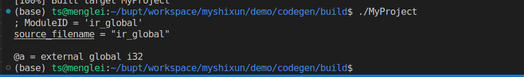

# 0705周报

**完成的工作：**

1. 支持block块

   ```
   {
   statements ....
   }
   ```

2. 支持多个函数定义；

   ```shell
   void functionname(args) {block块}
   int functionname(args){block块}
   args 个数可以为0，也可以是多个。
   ```

3. 支持函数内调用。

4. 支持打印AST。

   例子附件。

**进行中的工作**

1. 了解LLVM IR的格式.

2. 了解LLVM IR相关的模块。

3. 写一个简单的生成LLVM IR的demo

   实现全局函数的IR：int a;

   ```c++
   #include "llvm/IR/IRBuilder.h" // 指令生成器， 加法，减法， 还可以获取类型
   #include "llvm/IR/LLVMContext.h" // 公共的数据结构
   #include "llvm/IR/Module.h" // 一个源文件的抽象{全局变量， 函数， {基本块组成}}
   #include "llvm/IR/Verifier.h" // 校验模块， 校验函数
   
   using namespace std;
   using namespace llvm;
   
   int main() {
     auto llvmContext = std::make_unique<LLVMContext>();
     auto module = std::make_unique<Module>("ir_global", *llvmContext);
     auto irBuilder = std::make_unique<IRBuilder<>>(*llvmContext);
     // int a;
     module->getOrInsertGlobal("a", irBuilder->getInt32Ty());
     module->print(errs(), nullptr);
   
     return 0;
   }
   ```

   ```cmake
   cmake_minimum_required(VERSION 3.0)
   project(test)
   
   find_package(LLVM REQUIRED CONFIG)
   
   message(STATUS "Found LLVM ${LLVM_PACKAGE_VERSION}")
   message(STATUS "Using LLVMConfig.cmake in: ${LLVM_DIR}")
   
   # Set your project compile flags.
   # E.g. if using the C++ header files
   # you will need to enable C++11 support
   # for your compiler.
   
   include_directories(${LLVM_INCLUDE_DIRS})
   separate_arguments(LLVM_DEFINITIONS_LIST NATIVE_COMMAND ${LLVM_DEFINITIONS})
   add_definitions(${LLVM_DEFINITIONS_LIST})
   
   # Find the libraries that correspond to the LLVM components
   # that we wish to use
   llvm_map_components_to_libnames(llvm_libs support core irreader)
   
   # 这里设置源代码
   add_executable(MyProject main.cpp)
   
   # Link against LLVM libraries
   target_link_libraries(MyProject ${llvm_libs})
   
   ```

   

**接下来的工作**

1. 将生成的抽象语法树转成中间代码

   

