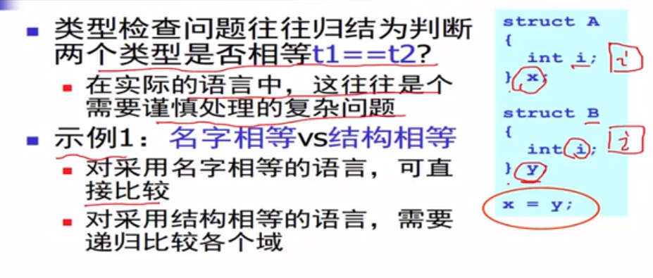

## 4.3.2 二义性文法

给定文法G，如果存在句子s，它有两棵不同的分析树，那么称G是二义性文法。

从编译器角度， 二义性文法存在问题。

- 同一个程序会有不同的含义
- 程序运行的结果不是唯一的。

解决方法： 文法的重写

`表达式文法的重写`


  

## 语法分析

### 自顶向下分析

语法分析：给定文法G和句子s， 回答s是否能够从G推导出来？

基本算法思想：从G的开始符号出发，随意推导出某个句子t， 比较t和s

- 若t == s， 则回答是
- 若t！=s，则？

因为这是从开始符号出发推导出句子，因此称为自顶向下分析。

对应分析树自顶向下的构造顺序。	

```txt
tokens[];		// all tokens
i = 0;
stack = [S]		// S是开始符号
while(stack != [])
	if(stack[top] is a terminal t)
		if(t == token[i++])
			pop();
		else backtrack();
	else if (stack[top] is a nonterminal T)
		pop();
		push(the next right hand side of T)
```

https://www.bilibili.com/video/BV16h411X7JY?t=125.1&p=41

### 递归下降分析算法


- 算法基本思想
  - 每个非终结符构造一个分析函数。
  - 用*前看符号* 指导产生式规则的选择。

示例：


一般的算法框架

```
Parse_X()
	token = nextToken()
	switch(token)
	case ...: 
```


### LL(1)分析算法

语法分析器自动生成，利用分析工具。


LL(1) 分析算法

- 从左（L）向右读入程序，最左L推导，采用一个1 前向符号。
  - 分析高效 线性时间
  - 错误定位和诊断信息准确
  - 很多开源或者商业的生成工具
    - ANTLR

- 算法基本思想
  - 表驱动的分析算法

表驱动的LL分析器架构


## 抽象语法树

分析树：

- 分析树编码了句子的推导过程。
- 但是包含了很多不必要的信息
  - 注意，这些节点会占用额外的存储空间。
- 本质上上，这里的那些信息是重要的。
- 对于表达式而言，编译只需要知道运算符和运算数
  - 优先级、结合性等已经在语法分析部分处理掉了。
- 对于其他语句，函数等语言其他的构造而言也一样。
  - 例如编译器不关系赋值符号是=还是：=或者其他。


### 具体语法和抽象语法

- 具体语法是语法分析器使用的语法

- 必须适合语法分析，如各种分割符， 消除左递归、提取左公因子， 等等

- 抽象语法树是用来表达语法结构的内部表示

  - 现在编译器一般都是采用抽象语法作为前端（词法语法分析器）和后端（代码生成）的接口。


## 抽象语法树数据结构
- 在编译器中， 为了定义抽象语法树，需要使用实现语法来定义一组数据结构。
  - 和实现语法密切相关

- 早期的编译器有的不采用抽象语法树结构
 - 直接在语法制导翻译中生成代码
 - 现在的编译器一般采用抽象语法树作为语法分析器的输出。
 - - 更好地系统支持‘
 - 简单化编译器设计

## 抽象语法树的定义（c语言）

### 数据结构的定义 


构造函数的定义


 示例


优美打印


示例：树的规模


### 抽象语法树的自动生成

 LR分析中生成抽象语法树

- 在语法树动作中，加入生成语法树的代码片段。
- 片段一般是语法树的构造函数
- 在产生式规约的时候，会子弟向上构造整棵树。
- 从叶子到根


 源代码信息的保留和传播

- 抽象语法树是编译前端和后端的接口。
  - 程序一旦被转换成抽象语法树，则源代码即被丢弃。
  - 后续阶段只处理抽象语法树。
- 所以抽象语法树必须是编码足够多的源代码信息
  - 例如， 它必须编码没个语法结构在代码中的位置（文件、行号、列号等）
  - 这样，后续的检查阶段才能精确报错
  - 或者获取程序的执行剖面，
- 抽象语法树必须仔细设计。

位置信息


## 语义分析

语义分析的任务


阶段无关性，理解整个前端的pipline,。

语义分析器，输入抽象语法树，输出中间表示。

### 语义分析的任务

- 语义分析也称为类型检查、上下文相关性分析
- 负责检查程序（抽象语法树）的上下文相关的属性。
  - 这是具体语言相关的，典型的情况包括：
    1. 变量的使用前先进行声明
    2. 没个表达式都有合适的类型
    3. 函数调用和函数定义一致
    4. ...

语义分析的示例


### 程序语言的语义

传统上，大部分的程序设计语言都采用自然语言来描述程序语言的语义。

- 例如： 对于 + 运算
  - 要求左右操作数都必须是整型树。


### 语义分析： 语义检查

C-- 语言


 

类型检查算法

```c++
enum type {INT, BOOL};

enum type check_exp(Exp_t e)
    switch(e->kind)
        case EXP_INT: return INT;
        case EXP_TRUE:  return BOOL;
case EXP_FALSE: return BOOL;
case EXP_ADD: t1 = check_exp(e->left);
								t2 = check_exp(e->right);
		                       if (t1!=INT || t2 != INT)
                                   error("type mismatch.")
                                   else:
								return INT;
```


### 变量声明的处理


类型检查算法

```c++
enum type {INT, BOOL};
Table_t table;

enum type check_prog( Dec_t d, Exp_t e) 
    table = check_dec(d);
	return check_exp(e);

Table_t check_dec(Dec_t d)
    foreach(T id 属于d)
    table_enter(table, id, T)
```


​    

---


## 符号表

用来存储程序中的变量相关信息

- 类型
- 作用域
- 访问控制信息
- 。。。

必须非常高效

- 程序中的变量规模会很大

#### 符号表的接口


符号表的典型数据结构

// 符号表是典型的数据结构

sysmbolTable: key -> 

value


符号表的高效实现


作用域


符号表处理作用域的方法

- 方法一： 一张表的方法

  - 进入作用域的时候，插入元素
  - 退出作用域的时候，删除元素

  

- 方法二： 采用符号表构成的栈

  - 进入作用域时，插入新的符号表
  - 退出作用域时，删除栈顶符号表。

  

### 用符号表来出处理名字空间


## 语义分析：其他问题

- 语义分析中要考虑的其他的问题

  -  类型相容性
  - 错误代码
  - 代码翻译

  

错误诊断


代码翻译


