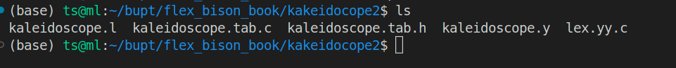

1. 学习flex&bison  书籍上的bison部分， 书上的例子都跑一边。

2. 写flex的代码

   ```flex
   %{
   #include <stdio.h>
   #include <stdlib.h>
   #include "kaleidoscope.tab.h"
   
   #define MAX_IDENTIFIER_LENGTH 100
   %}
   
   %option noyywrap
   
   %{
   // 符号表结构
   struct Symbol {
       char name[MAX_IDENTIFIER_LENGTH];
       double value;
       struct Symbol* next;
   };
   
   struct Symbol* symbol_table = NULL; // 符号表头指针
   %}
   
   %%
   [a-zA-Z][a-zA-Z0-9]* {
       yylval.identifier = strdup(yytext);
       return IDENTIFIER;
   }
   
   [0-9]+(\.[0-9]+)? {
       yylval.number = atof(yytext);
       return NUMBER;
   }
   
   [ \t]           ; // 忽略空格和制表符
   
   [\n]            { return EOL; }
   
   .               { return yytext[0]; }
   %%
   
   int yywrap() {
       return 1;
   }
   ```

3. 写bison部分的代码

   ```bison
   %{
   #include <stdio.h>
   #include <stdlib.h>
   #include <string.h>
   #include "kaleidoscope.tab.h"
   
   struct Symbol {
       char name[MAX_IDENTIFIER_LENGTH];
       double value;
       struct Symbol* next;
   };
   
   extern struct Symbol* symbol_table;
   
   struct ASTNode {
       char* identifier;
       double number;
       struct ASTNode* left;
       struct ASTNode* right;
   };
   
   struct ASTNode* create_identifier_node(char* identifier) {
       struct ASTNode* node = (struct ASTNode*)malloc(sizeof(struct ASTNode));
       node->identifier = identifier;
       node->left = NULL;
       node->right = NULL;
       return node;
   }
   
   struct ASTNode* create_number_node(double number) {
       struct ASTNode* node = (struct ASTNode*)malloc(sizeof(struct ASTNode));
       node->number = number;
       node->left = NULL;
       node->right = NULL;
       return node;
   }
   
   void print_symbol_table() {
       struct Symbol* symbol = symbol_table;
       printf("Symbol Table:\n");
       while (symbol != NULL) {
           printf("  %s = %g\n", symbol->name, symbol->value);
           symbol = symbol->next;
       }
   }
   
   void yyerror(const char* msg) {
       printf("语法错误: %s\n", msg);
   }
   %}
   
   %union {
       char* identifier;
       double number;
       struct ASTNode* node;
   }
   
   %token <identifier> IDENTIFIER
   %token <number> NUMBER
   %token EOL
   
   %left '+' '-'
   %left '*' '/'
   
   %type <node> expr identifier_expr function_definition declaration arg_list
   
   %start program
   
   %%
   
   program:
       | program definition EOL { print_symbol_table(); }
       ;
   
   definition:
       function_definition { /* do nothing */ }
       | declaration { /* do nothing */ }
       ;
   
   function_definition:
       IDENTIFIER '(' arg_list ')' '{' expr '}' {
           struct Symbol* symbol = (struct Symbol*)malloc(sizeof(struct Symbol));
           strcpy
           (symbol->name, $1);
           symbol->value = $6->number;
           symbol->next = symbol_table;
           symbol_table = symbol;
           $$ = create_identifier_node($1);
       }
       ;
   
   declaration:
       IDENTIFIER '=' expr {
           struct Symbol* symbol = (struct Symbol*)malloc(sizeof(struct Symbol));
           strcpy(symbol->name, $1);
           symbol->value = $3->number;
           symbol->next = symbol_table;
           symbol_table = symbol;
           $$ = create_identifier_node($1);
       }
       ;
   
   arg_list:
       /* empty */
       | IDENTIFIER { $$ = create_identifier_node($1); }
       | arg_list ',' IDENTIFIER {
           struct ASTNode* temp = create_identifier_node($3);
           temp->left = $1;
           $$ = temp;
       }
       ;
   
   expr:
       identifier_expr { $$ = $1; }
       | NUMBER { $$ = create_number_node($1); }
       | expr '+' expr {
           struct ASTNode* node = create_identifier_node("+");
           node->left = $1;
           node->right = $3;
           $$ = node;
       }
       | expr '-' expr {
           struct ASTNode* node = create_identifier_node("-");
           node->left = $1;
           node->right = $3;
           $$ = node;
       }
       | expr '*' expr {
           struct ASTNode* node = create_identifier_node("*");
           node->left = $1;
           node->right = $3;
           $$ = node;
       }
       | expr '/' expr {
           struct ASTNode* node = create_identifier_node("/");
           node->left = $1;
           node->right = $3;
           $$ = node;
       }
       | '(' expr ')' { $$ = $2; }
       ;
   
   identifier_expr:
       IDENTIFIER {
           struct Symbol* symbol = symbol_table;
           while (symbol != NULL) {
               if (strcmp(symbol->name, $1) == 0) {
                   $$ = create_number_node(symbol->value);
                   return;
               }
               symbol = symbol->next;
           }
           printf("变量 %s 未定义\n", $1);
           exit(1);
       }
       ;
   
   %%
   
   int main() {
       yyparse();
       return 0;
   }
   
   ```

4. 编译

   

   