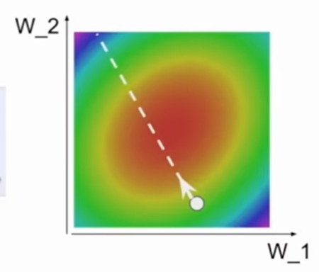
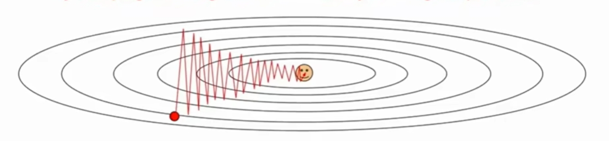
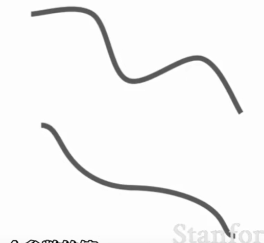
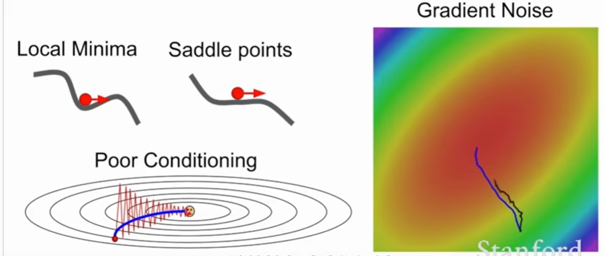
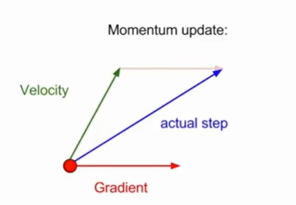
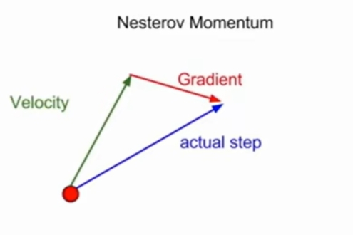

## More powerful optimization

```python
while true
	weights_grad = evalutate_gradient(loss_fun, data, weights)
    weights += -step_size*weights_grad
```



## Optimization: Problems with SGD

1. 如果梯度在一个方向上变化很快而在另一个方向上变化慢怎么办？ 

   梯度下降时怎样做的？损失函数具有较大的条件数，即Hessian矩阵中的最大与最小奇异值之差较大。

2. 如果损失函数有一个局部极小值或者鞍点呢？

   

3. 我们的梯度来自小批量，所以会有一定的噪音产生。

### 解决办法 SGD+Momentum

1. SGD
   $$
   x_{t+1} = x_t-\alpha\nabla f(x_t)
   $$

   ```python
   while True:
       dx = compute_gradient(x)
       x+= learning_rate * dx
   ```

2. SGD+Momentum
   $$
   v_{t+1} =\rho \  v_t + \nabla f(x_t) \\
   x_{t+1} = x_t + \alpha v_{t+1} \\
   typically \ \rho = 0.9\ or \ 0.99
   $$
   

   ```python
   vx = 0
   while True:
       dx = compute_gradient(x)
       vx = rho * vx  + dx
       x+= learning_rate*vx
   ```

      

   有效解决小batchsize 噪音的问题。

   

   ### Nesterov Momentum

   
   $$
   v_{t+1} = \rho v_t\ - \alpha   \nabla f(x_t+\rho v_t) \\
   x_{t+1} = x_t + v_{t+1}                            
   $$

   ## AdaGrad

   ```python
   grad_squared = 0
   while True:
       dx = compute_gradient(x)
       grad_squard += dx * dx
       x -= learning_rate * dx / (np.sqrt(grad_squard)+1e-7)
   ```

   增加了基于每个维度的历史平方和的梯度的逐元素缩放。对凸函数很有效果，但是非凸函数会困在某一点。

   ## RMSProp

   ```python
   grad_squared = 0
   while True:
       dx = compute_gradient(x)
       grad_squared = decay_rate * grad_squared + (1-decay_rate)*dx*dx
       x -= learning_rate * dx / (np.sqrt(grad_squared) + 1e-7)
   ```

## Adam almost

```python
first_moment = 0
second_moment = 0 
    first_comment = beta1 * first_moment + (1-beta1) *dx
    second_moment = beta2 * second_moment + (1-beta2) * dx * dx
    first_unbias = first_moment / (q- beat1 ** t)
    second_unbias = second_moment / (1-beat2 ** t)
    x -= learning_rate * first_moment / (np.sqrt(second_moment) + 1e-7)
```

## Learning rate

所有的这些优化算法都将学习率看作是一个超参数

学习率随着时间的推理而衰减

衰变步

例如，学习率每隔几个周期衰减一半

指数衰减
$$
\alpha = \alpha _{0} e^{-kt}
$$
1/t 衰减
$$
\alpha =\frac{\alpha_{0}}{(1+kt)}
$$

## Model Ensembles 模型的集合体

1. 训练多个独立模型
2. 在测试时平均他们的结果

享受2%的额外性能

## Regularization 正则化

如何提高单个模型的性能？

https://www.bilibili.com/video/BV1nJ411z7fe?t=35.7&p=16