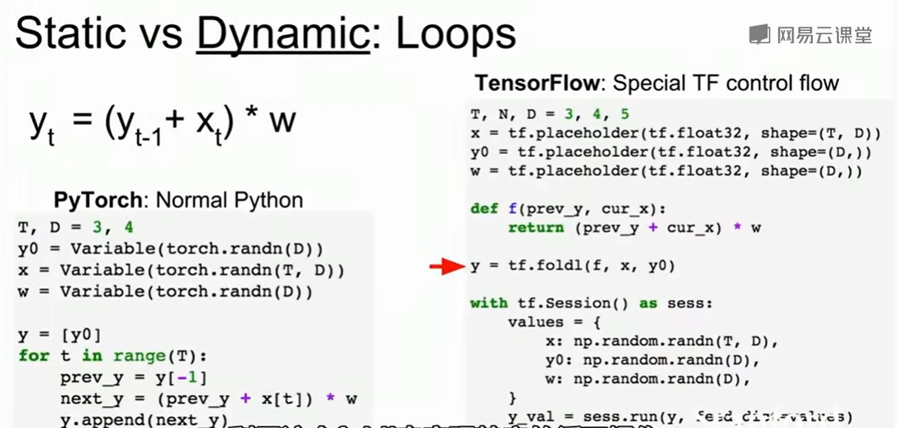

# Deep Learning Software

## Programming GPUs


## Deep Learning Software

1. 很容易去写一个计算图
2. 容易计算梯度
3. 运行高效

### Computational Graphs

1. numpy

```python
import numpy as np
np.random.seed(0)
N, D = 3, 4

x = np.random.randn(N, D)
y = np.random.randn(N, D)
z = np.random.randn(N, D)

a = x*y
b = a+z
c = np.sum(b)

grad_c = 1.0
grad_b = grad_c * np.ones((N, D))
grad_a = grad_b.copy()
grad_z = grad_b.copy()
grad_x = y*grad_a
grad_y = x*grad_a
```


2. Tensorflow

   ```python
   # Basic computational graph
   import numpy as np
   np.random.seed(0)
   import tensorflow as tf
   
   N, D = 3, 4
   x = tf.placeholder(tf.float32)
   y = tf.placeholder(tf.float32)
   ```

   ## Static graphs vs Dynamic graphs

   > Tensorflow: Build graph once, the run many times(static)
   >
   > 
   >
   > PyTorch: Each forward pass defines a new graph. Dynamic

   

   使用静态图，框架可以在运行之前做优化图

   

   ### Static vs Dynamic: Serialization 执行序列化

   1. 静态

      一旦构建了图形，就可以序列话它并运行它，而不需要构建图形的代码
      
   2. 动态
   
      图的构建和执行是交织在一起的，所以总是需要保留代码
   
   ### static VS Dynamic : Conditional
   
   
   
   ### Static vs Dynamic: Loops
   
   

 