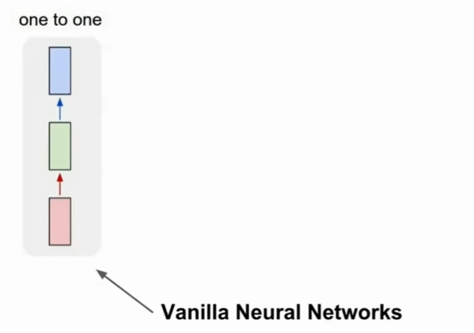
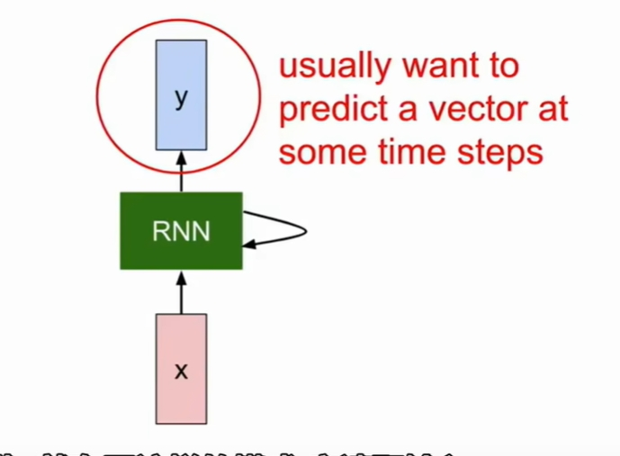
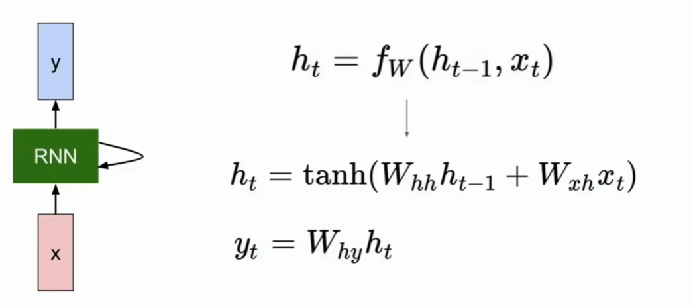
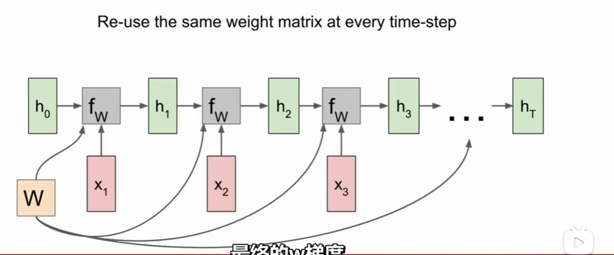
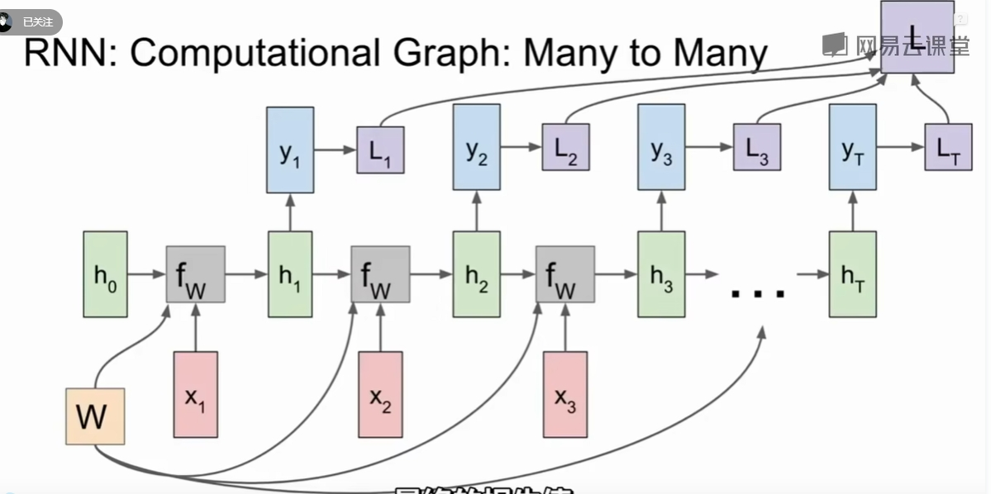
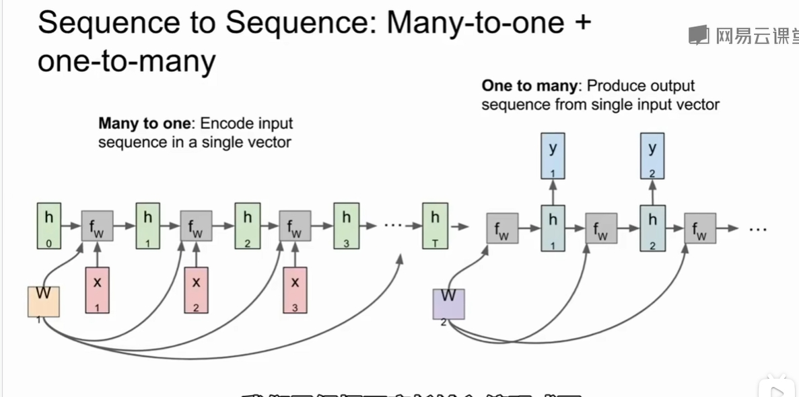
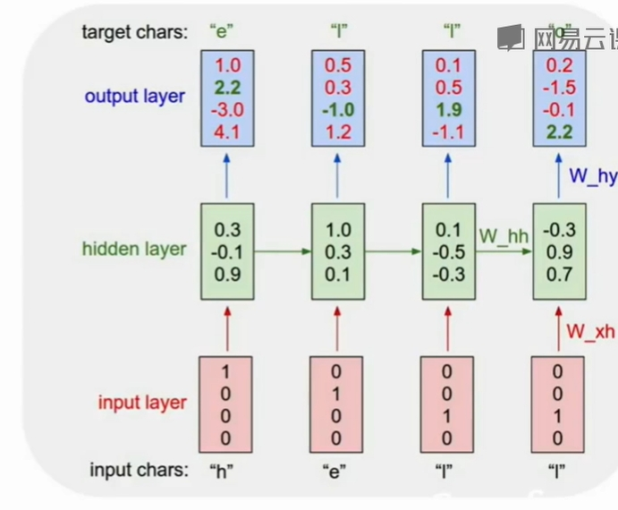

# RNN

## Vanilla Neural Network

## Recurrent Neural Networks

我们可以通过在每个时间步上应用递归公式来处理向量序列x
$$
h_{t} = f_{w}(h_{t-1}, x_t) \\
h_{t}: \ \ new state \\
f_{w} \  \ \ some function with parameters W \\
H_{t-1}:\ \  old state \\
x_{t}: \ \ 时间间隔输入向量
$$
Notice: the same function and the same set of parameters are used at every time step.

 

https://www.bilibili.com/video/BV1nJ411z7fe?t=9.8&p=22