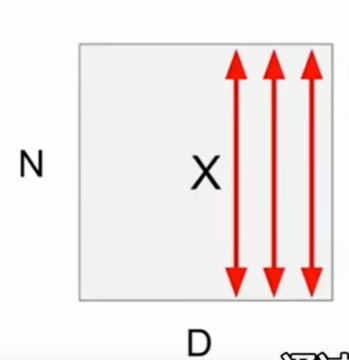
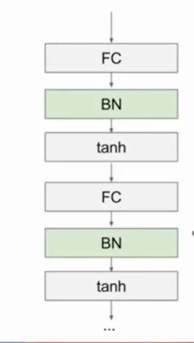
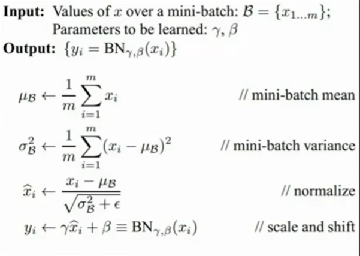
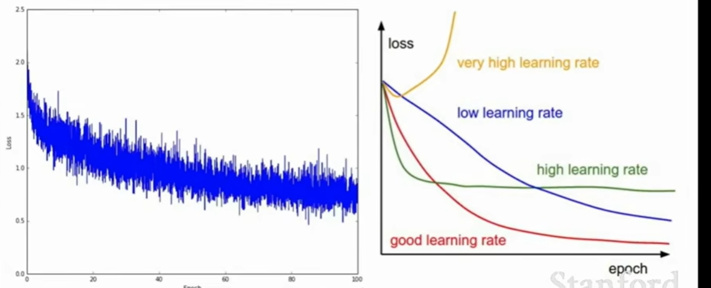

## Batch Normalization

考虑在某个层上的一批激活，要使得每个维度单位为高斯，使用
$$
\hat{x}^{(k)} = \frac{x^{(k)} - E[x^{(k)]}}{\sqrt{Var[x^{(k)}]}}
$$
这是一个普通的可微函数。

假设我们当前的批处理中有N个训练样本， 每个批次是D维度， 将对**每个维度**独立计算经验均值和方差



1.  计算每个维度的经验均值和独立方差

2. Normalize
   $$
   \hat{x}^{(k)} = \frac{x^{(k)} - E[x^{(k)]}}{\sqrt{Var[x^{(k)}]}}
   $$

**经常插入在全链接网络和卷积层之后，非线性层之前。**





注意： 在test时， BatchNorm层的功能不同

在测试阶段不用重新计算，直接使用训练阶段的均值和方差即可。

### Double check that the loss is reasonable.

```python
model = init_two_layer_model(32*32*3, 50, 10)
loss, grad = two_layer_net(X_train, model, y_train, 0.0)
print loss
```

## Hyperparameters to play with

- Network architecture

- learning rate, its decay schedule, update type

- Regularization L2/Dropout strength

  

  