# Convolutional Netural Networks

## Fully Connected Layer

32*32*3 image --> stretch to 3072 x 1

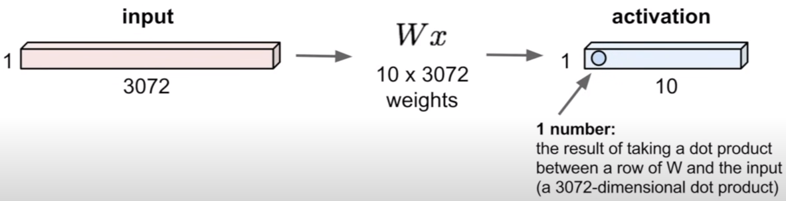

## Convolution Layer

32x32x3 image --> preserve spatial structure. 保留空间信息

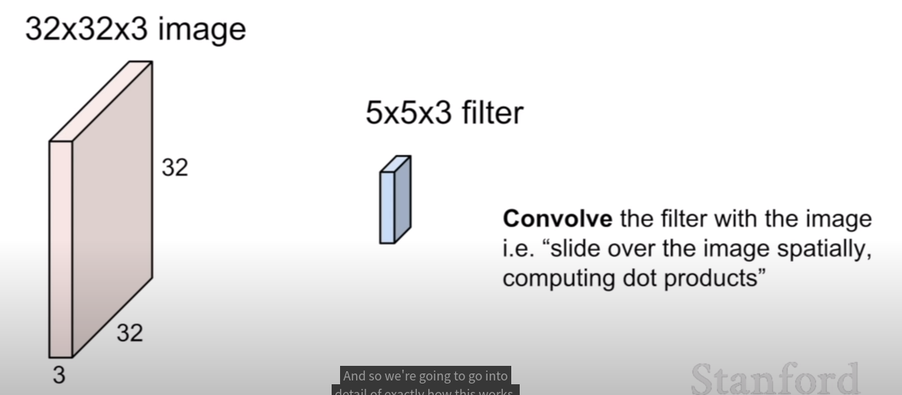

通过增加一个过滤器实现增加一层activation maps的效果.

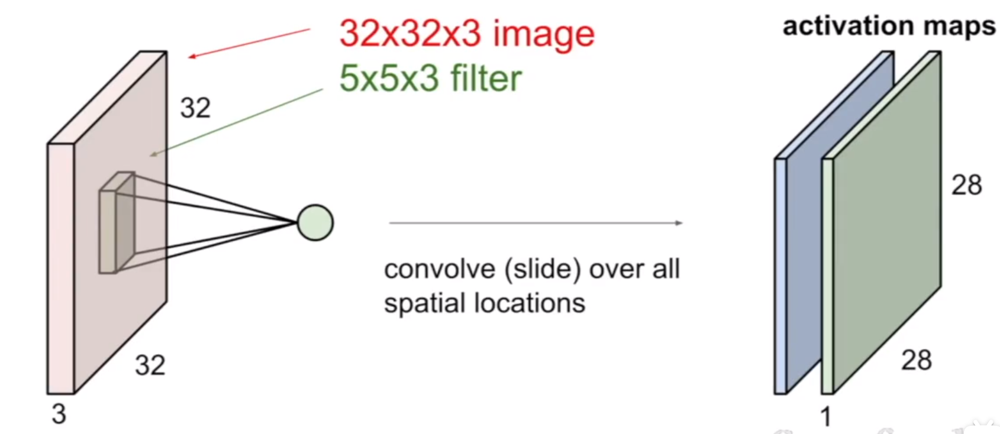

Preview: ConvNet is a sequence of Convolutional Layers, interspersed with activation functions.

预览：ConvNet是一系列卷积层，中间穿插着激活函数

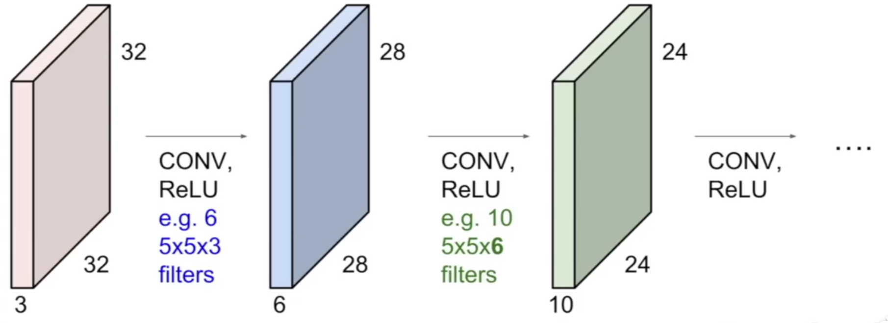

### 计算activation maps的shape

1. No padding

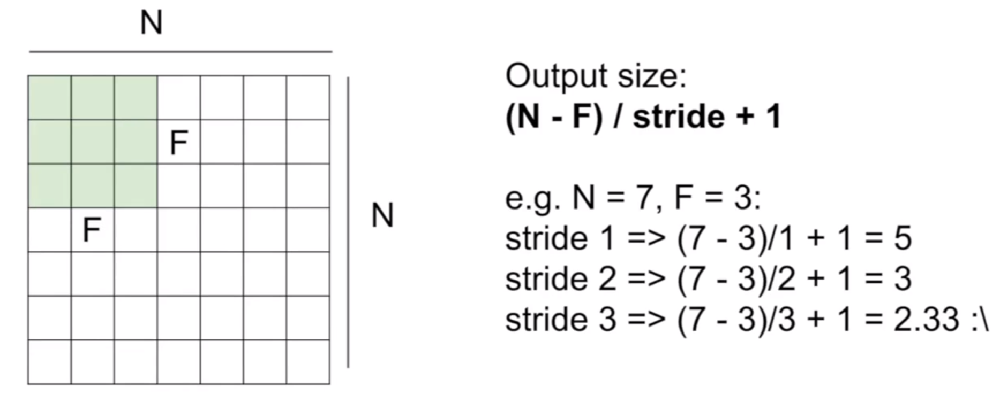

2. Padding

   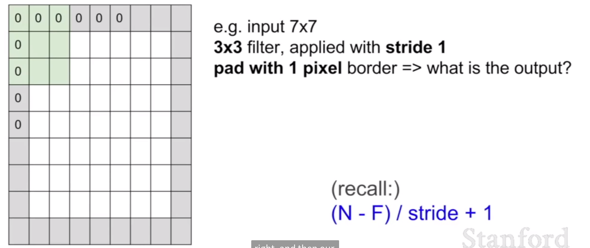

Rember back to ...

32x32 input convolved repeatedly with 5x5 filters shinks volumes spatially! shrinking too fast is not good, does not work well.

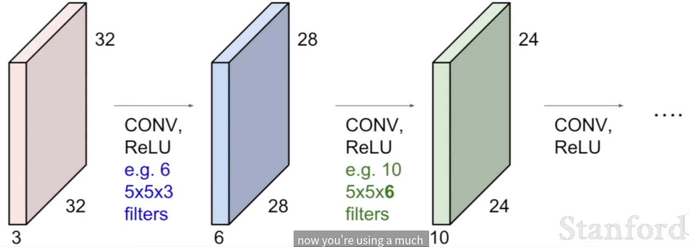

### Summary 

To summarize, the conv layer

- Accepts a volume of size 
  $$
  W_1\ *\ H_1\ *\ D_1
  $$

- Requires four hyperparameters

  - Number of fileters K.
  - their spatial extent F
  - the stride S
  - the mount of zero padding P

- Produces a volume of size 

  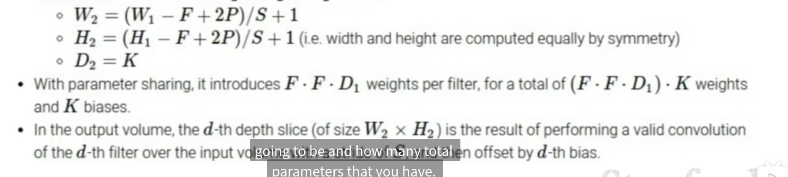

## Pooling layer

- make the representations smaller and more manageable

- operates over each activation map independently.

  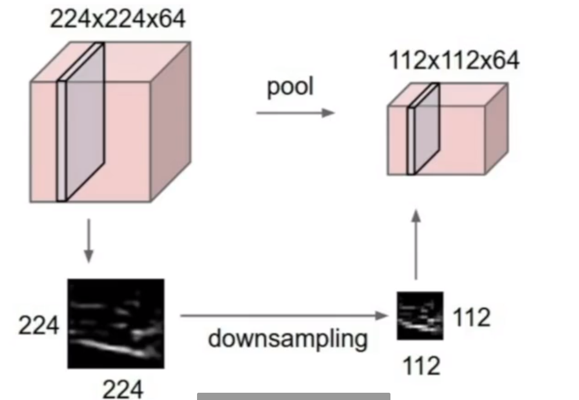

  **它只是简单的下采样.** 长宽变化, channel 不变.

  ### Max pooling 

  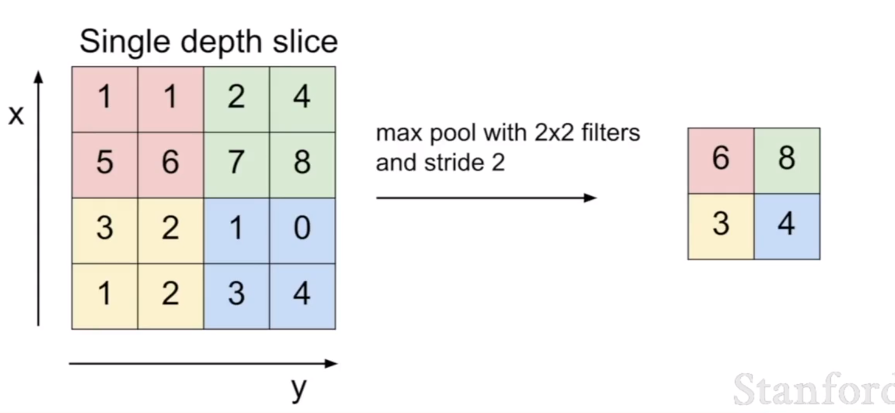

  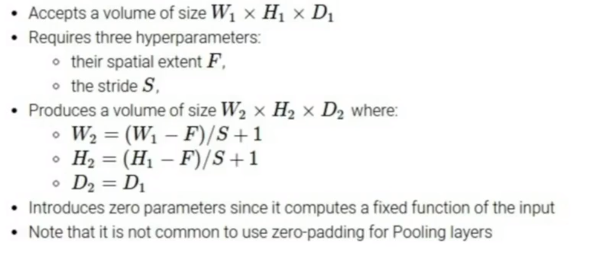

## Fully Connected Layer (FC layer)

