## Image Classification Pipeline

### 作业

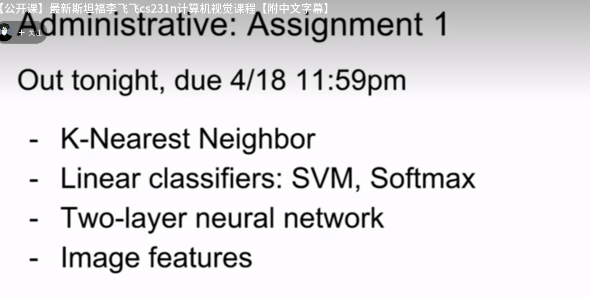

### Image Classification:

计算机视觉的核心任务

识别一张图片是不是猫?

#### 挑战

1. 拍摄的角度变化. All pixels change when camera moves.

2. 照明问题. Illumination

   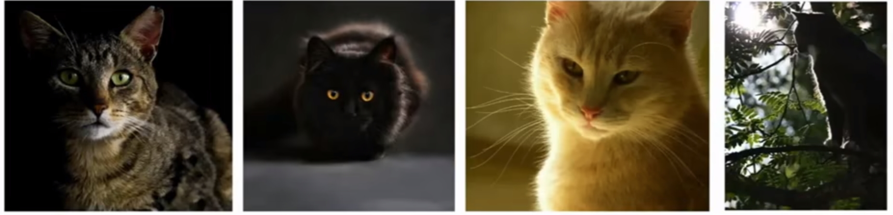

3. 变形的情况

   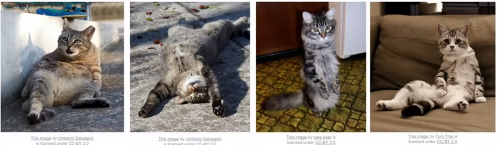

4. 遮挡的问题

   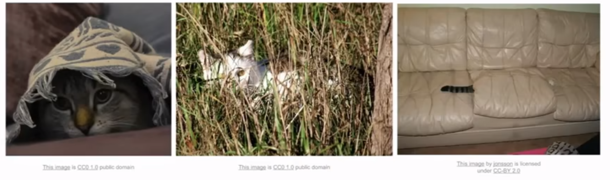

5. Background Clutter 猫的纹理与背景相似

   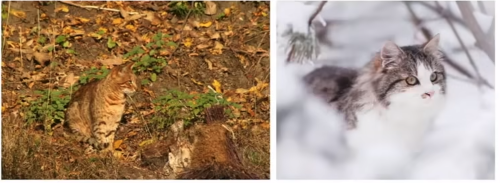

6. Intraclass variation 类内差异, 年龄\外形\大小

   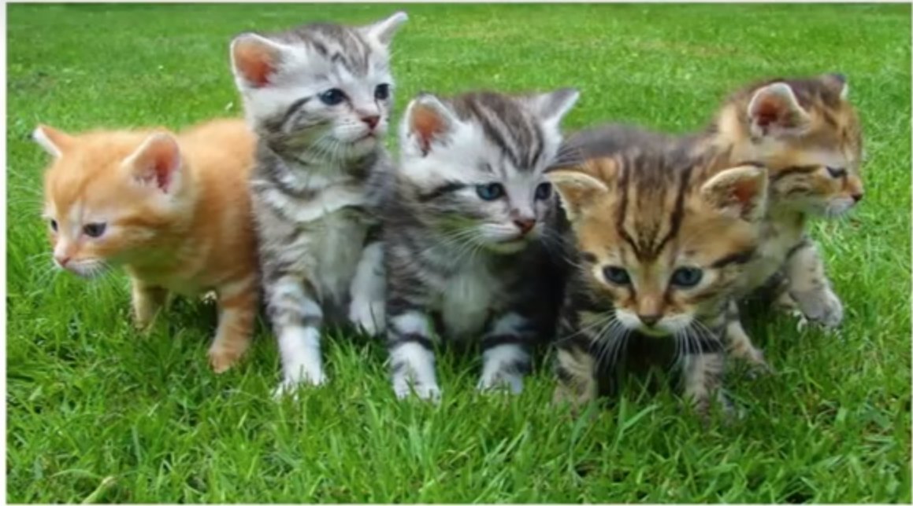

### An image classifier 图像分类器

```python
def calssify_image(image):
    # Some magic here?
    return class_label
```

#### 尝试使用硬编码的方法

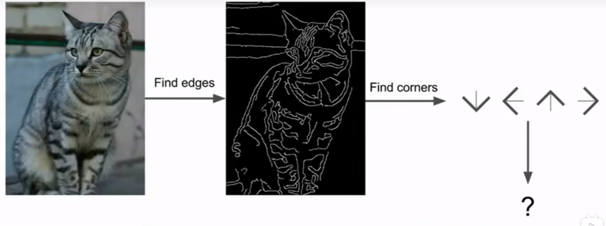

这种硬编码的方法只适合对某一种类物体(如猫)进行分类, 如果换了一个要识别的物体(如狗)则重新需要进行编码工作, 不是一种可推演的方法.

#### Data-Driven Approach

1. Collect a dataset of images and labels.
2. Use Machine Learning to train a classifier
3. Evaluate the classifier on new images.

```python
def train(images, labels):
    # Machine learning!
	return model
```

```python
def predict(model, test_images):
    # Use model to predict labels
    return test_labels
```

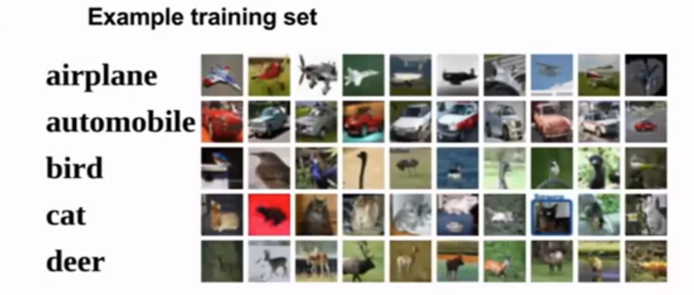

## First Classifier: Nearest Neighbor

```python
def train(images, labels)
	# Machine learning method
    return model
```

最近邻在训练阶段就是记住所有的图像数据和标签.

```python
def predict(model, test_image):
    # Use model to predict labels
    return test_labels
```

最近邻在预测阶段预测出和训练数据最接近的图片, 以这张图片的标签作为预测标签.

## 数据集 CIFAR10

> 10 classes
>
> 50, 000 张训练图片
>
> 10, 000 张测试图片

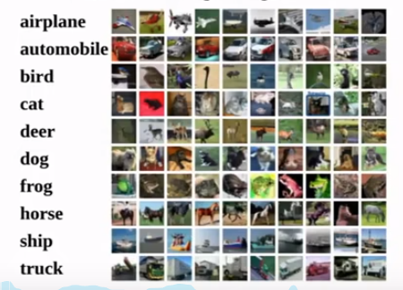

最近邻的预测

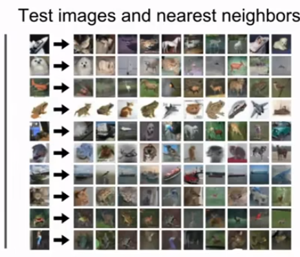

### Distance Metric 距离衡量方法

1. L1 distance 曼哈顿距离
   $$
   d_{1}(I_{1}, I{2}) = \sum_{p}|I_{1}^{p} - I_{2}^{p}|
   $$
   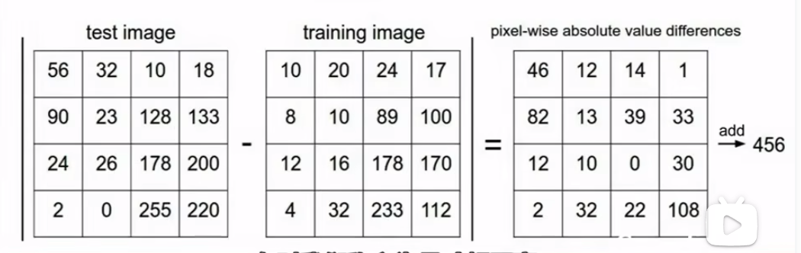


### 最近邻分类器的复杂度

$$
Train\ O(1) \\
Predict\ O(n)
$$

这是非常坏的情况,我们希望预测的时候特别快,训练的时候可以容忍慢.

### K-Nearest Neighbors

Instead of copying label from nearest neighbor, take majoruty vote from K closest points.

### K-Nearest Neighbors:Dsitance Metric

#### L1 (Manhattan) distance

$$
d_{1}(I_{1}, I_{2}) = \sum_{p}|I_{1}^{p} - I_{2}^{p}|
$$

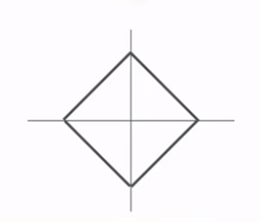

#### L2 (Euclidean) distance

$$
d_2(I_1, I_2) = \sqrt{\sum_{p}(I_{1}^{p} - I_{2}^{p})^2}
$$

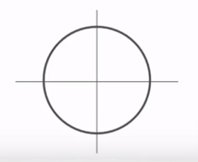

#### KNN Distance Metric

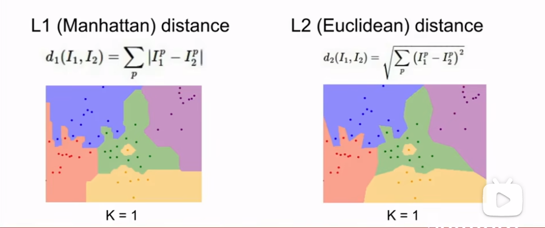

#### Hyperparameters

1. What is the best value of k to use?

2. What is the best distance to use

   These are hyperparameters: choices about the algorithm that we set rather than learn.

> Very problem-dependaent .Must try them all out and see what works best.

#### Setting Hyperparameters

1. Choose hyperparameters that work best on the data

   > Bad: K = q always works perfectly on training data
   >
   > 我们在乎的是模型在未见过的数据上的表现能力, 而不是尽力拟合训练集.

   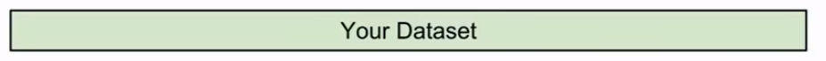

2. Split data into train data and test, choose hyperparameters that work best on test data.

   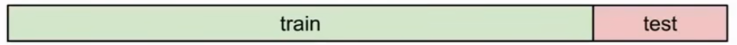

   > BAD: No idea how algorithm will perform on new data.

3. Split data into train, val, and test; choose hyperaprameters on val and evaluate data.

   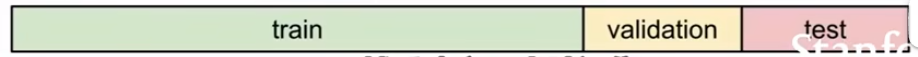

   https://www.bilibili.com/video/BV1nJ411z7fe?t=631.1&p=5


