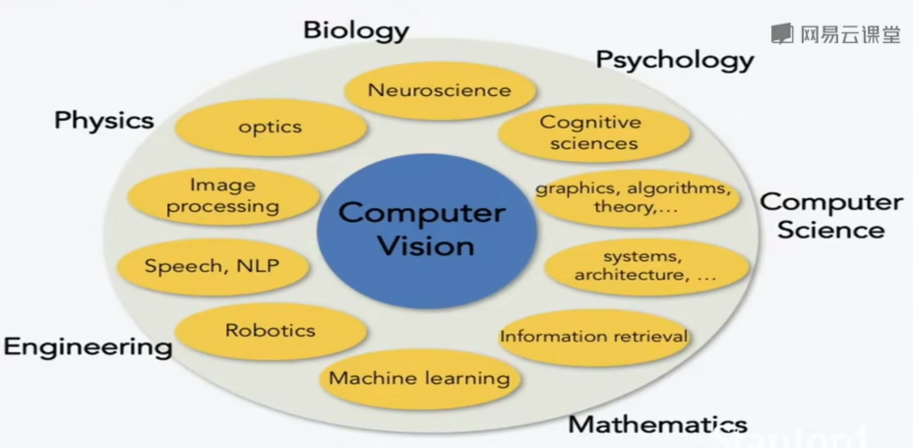
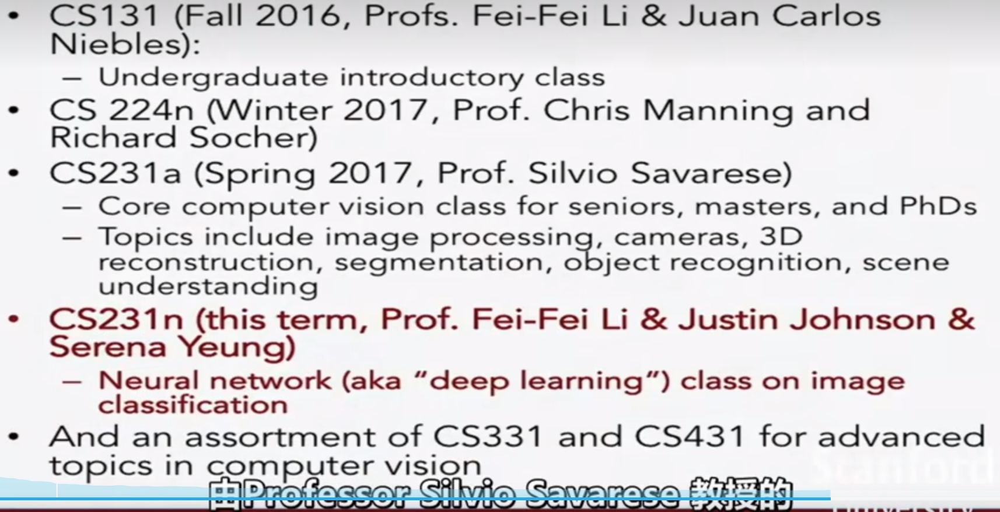
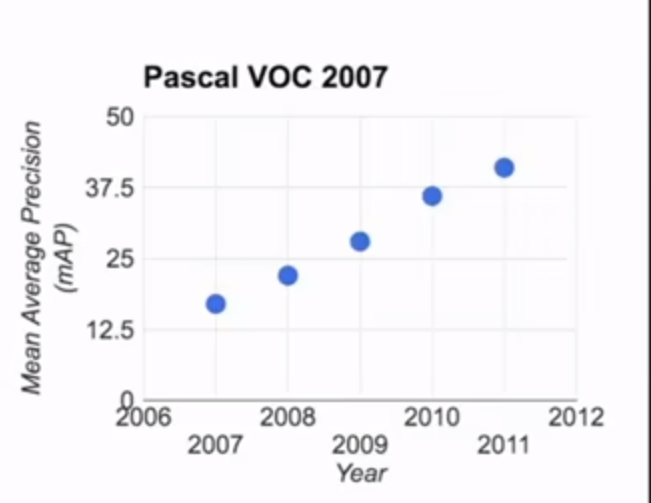
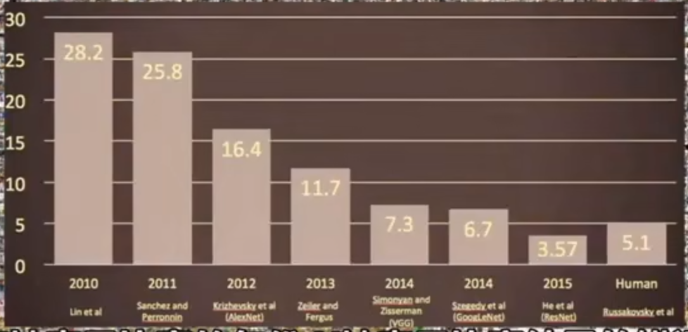

## Introduce CNN

### Why Deep Learning is important?

1. The mount of visual data exploded.
2. The visual data is really hard to understand.

### Interdisciplinary Field

### Related Course

### A brief history of computer vision

1. history of vision can go back about 543 million years ago.
2. The first animals developed eyes and the onset of vision about 540 millions years ago.
3. Camera Obscura.1545
4.   Block world Computer vision

In 2000s, we began to have benchmark data set that can enable us to measure the progress if object recongnition.

- PASCAL Visual Object Challenge: 20 object classes.

  

- Imagenet 22K categories and 14M images. 

   2009年开始ImageNet 团队组织了一场国际比赛

  筛选出更为严格的测试集: 140万张图像, 1000种类别

  如果一个算法, 能够输出最大的5个类别,其中有正确的对象,就认为识别成功.

  

