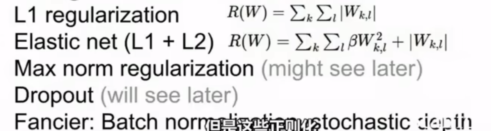
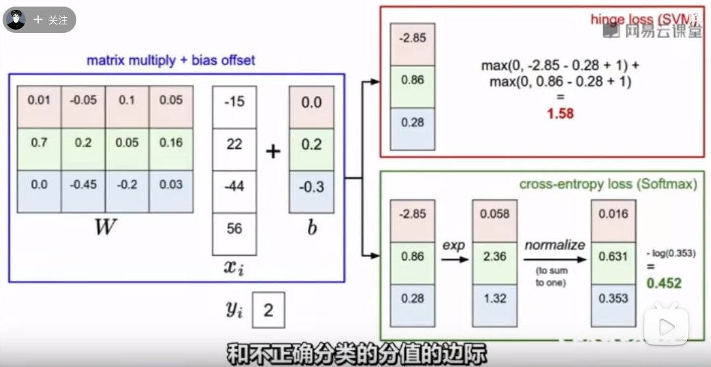

# Loss functions and optimization

## Loss function

Tells how good our current classifier is.

Given a dataset of examples
$$
\{(x_i, y_i)\}_{i=1}^{N}
$$
where xi is image and yi is integer label.

Loss over the dataset is a sum of loss over example.
$$
L = \frac{1}{N}\sum L_i(f(x_i, W), y)
$$

### Multiclass SVM loss

$$
L_i = \sum_{j不等于y_i}max(0, s_j - s_{y_{i}} + 1)
$$

$$
s代表经过分类器预测的分数\\
s_{y_{i}} 的意思是训练集的第i个样本的真实分类的分数\\
s_j代表预测出来的第i类的分数.
$$

> 思考:
>
> 损失函数的最大为无限大, 最小为0;
>
> 如果稍微修改汽车的分数, 损失函数的值可能不变.有一定的稳定性
>
> 所有的分类都近乎等于0, 并且分数差不多相等, 损失函数的值为分类数-1

---

## Data Loss and Regularization

$$
\begin{aligned}
L(W) = \frac{1}{N}\sum_{i = 1}^{N}L_{i}(f(x_{i}, W), y_{i}) +\lambda R(W)\\
\end{aligned}
$$

Data loss: Model predictions should match training data

Regularization: Model should be simple, so it works on test data.

> Occam's Razor
>
> "Among competing hypotheses"
>
> the simplest is the best.

*In common use*

1. L2 regularization
   $$
   R(W) = \sum_k\sum_l W_{k, l}^{2}
   $$

2. L1 regularization
   $$
   R(W) =\sum_k\sum_l |W_{k, l}|
   $$
   

### Softmax Classifier(Multinomial Logistic Regression)

$$
scores = unnormalized\ log\ probabulities\ of the\ classes\\
P(Y=k|X=x_i) = \frac{e^{s_k}}{\sum_{j} e^{s_j}} \\
where\ s = f(x_i; W)
$$

Want to maximize the log likehood, or for a loss function to minimize the negative log lokelihood of the correct class;
$$
L_i = -log\ P(Y=y_i| X=x_i)
$$

> Softmax classifier损失值是0, 最大为无穷大.
>
> 概率之和为1

