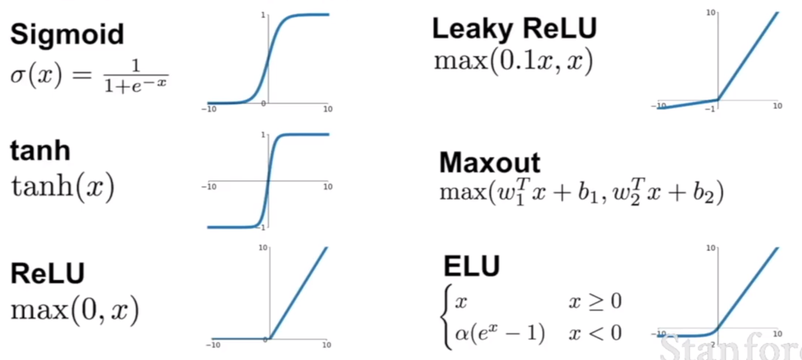
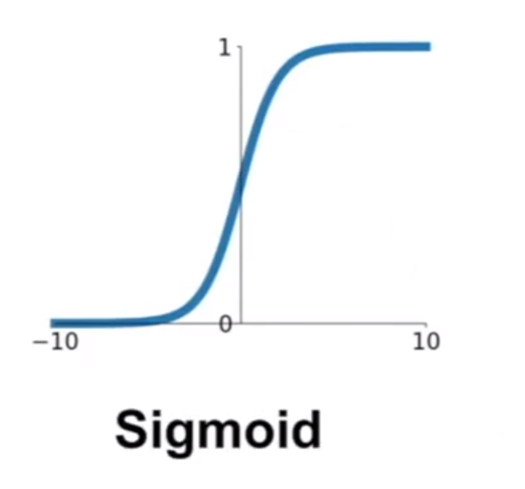
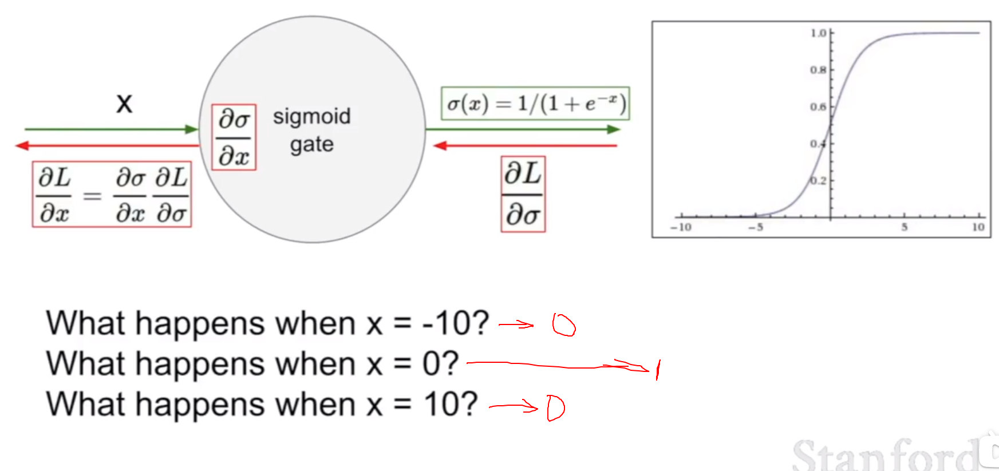
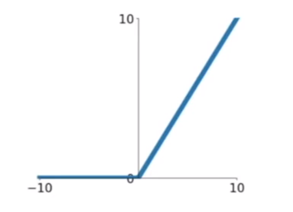
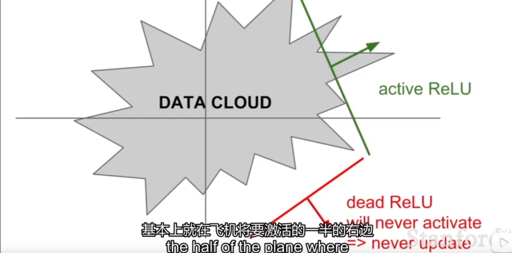
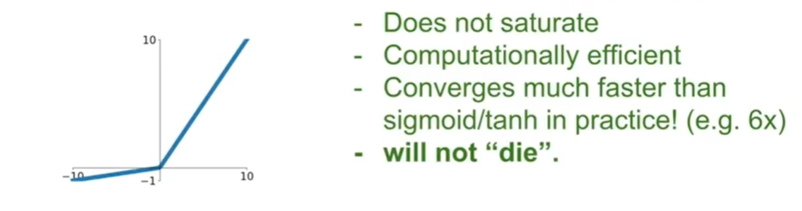
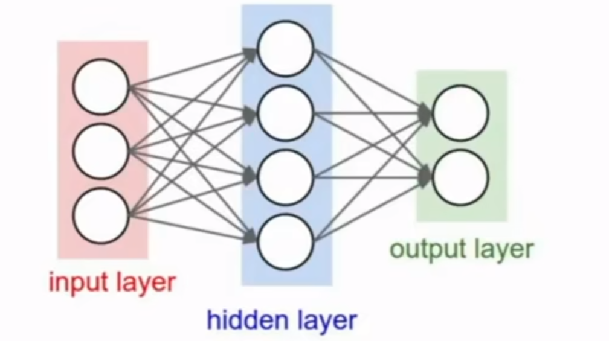
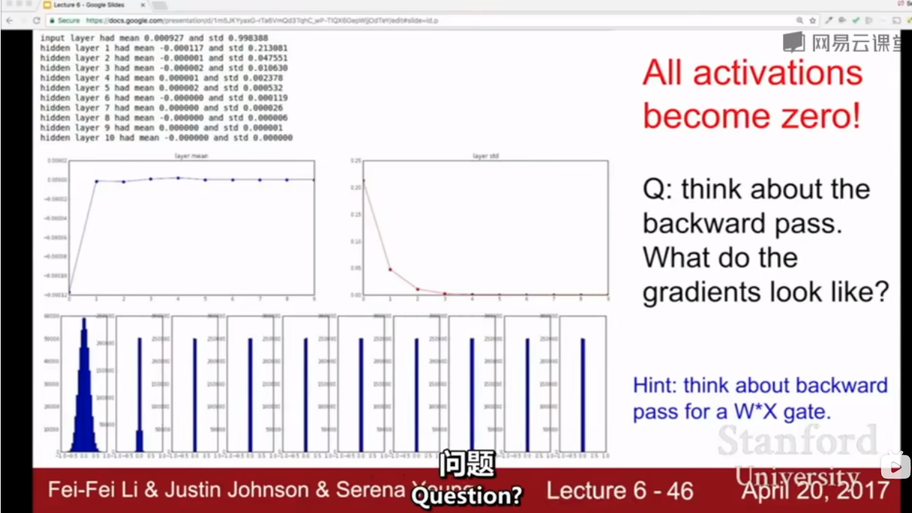
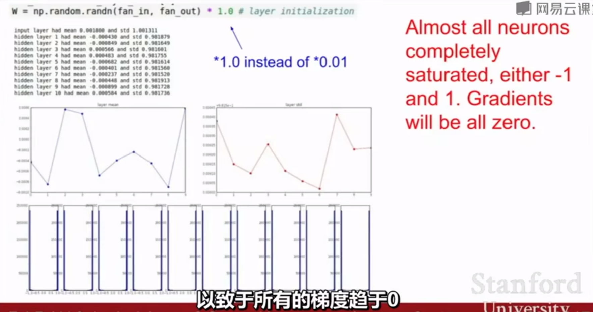
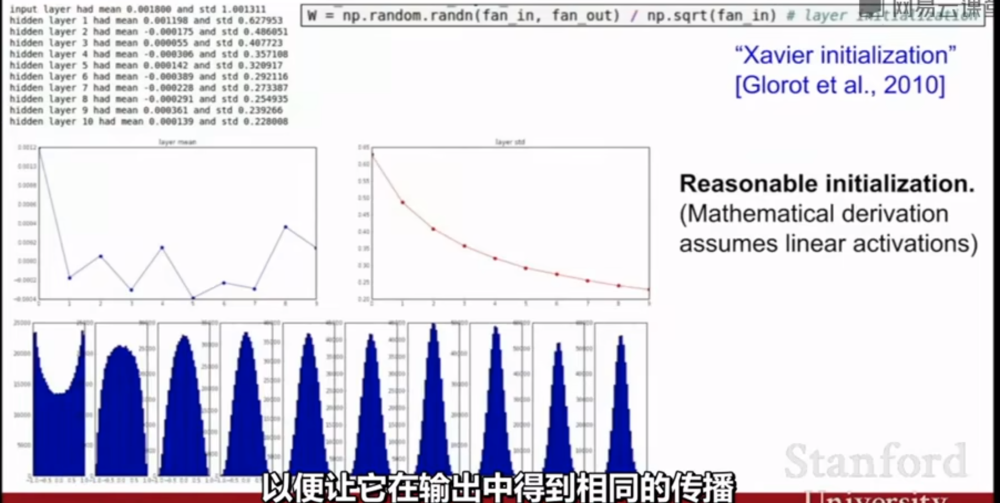

# Training Neural Networks

## Activation Functions

### sigmoid 

$$
\sigma(x) = \frac{1}{1+e^{-x}}
$$

- 将数字约束到[0, 1]范围内
- 历史上很流行，因为有很好的生物学解释。

Problems

1. 饱和神经元杀死了梯度

   

2.  Sigmod 的输出不是以0为中心的

   想一想，如果输入总是正直，那么会有什么问题呢？

   Always all positive or all negative:

3. exp() is a bit compute expensive.

### tanh

- 输出约束到[-1, 1]的范围
- 输出以0为中心
- 在饱和时仍旧杀死梯度。

### ReLU Rectified Linear Unit

$$
f(x) = max(0, x)
$$

- 在+区域不再饱和
- 计算简单
- 在实践中，收敛速度比sigmod/tanh快得多， 约6倍。
- 实际上，比sigmod在生物学上更合理。

Problems

1. 不是以0为中心的，
2. 当 -区域的时候，饱和且梯度为0。

第四像限是Dead ReLu区域， 这里的参数永远不会更新。

### Leaky ReLU

$$
f(x) \ = max(0.01x, x)
$$

- 不会饱和
- 计算高效
- 收敛速度比sigmod/tanh，实验数据快6倍
- 不会存在Dead区域

### PReLU Parametric Rectifier

$$
f(x) \ = max(\alpha x, x)
$$

### Exponential Linear Units(ELU)

$$
f(x) = \begin{cases} 
x & \text{if } x > 0 \\
\alpha(exp(x) - 1) & \text{if } x \leq 0 \\
\end{cases}
$$

## Data Preprocessing

### TLDR In practice for Image: Center only.

Consider CIFAR-10 example with [32, 32, 3] images

- 减去平均图像， 平均图像=[32, 32, 3]的array 例如AlexNet

- 减去每个通道的平均值。例如VGGnet

  mean along each channel = 3 numbers

*训练集和测试集的预处理方法必须相同*

## Weight Initialization

- Q what happens when W =0 init is used?

  这些神经元将做相同的事情， 由于权重是0， 给定一个输入，每个神经元都将有相同的梯度，所以所有的权重都是相同的。没有打破对称性。

  > First Idea： Small random numbers
  >
  > gaussian with zero mean and 1e-2 standard deviation
  > $$
  > W = 0.01*np.random.randn(D, H)
  > $$
  > Works _okay for small networks, but problems with deeper networks_

  

> 如果权重过大
>
> 权重将会变成饱和， 不是-1， 就是1 
>
> 

### 最好的是Xavier 权重初始化方法

