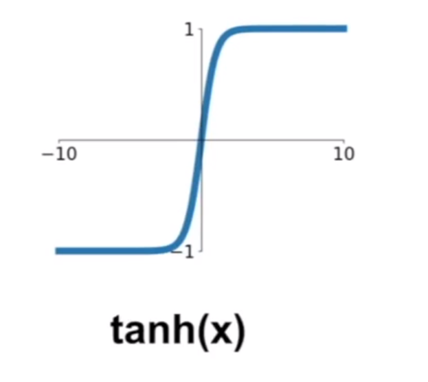

# Training Neural Networks

## Activation Functions

### sigmoid 

$$
\sigma(x) = \frac{1}{1+e^{-x}}
$$

- 将数字约束到[0, 1]范围内
- 历史上很流行，因为有很好的生物学解释。

Problems

1. 饱和神经元杀死了梯度

   

2.  Sigmod 的输出不是以0为中心的

   想一想，如果输入总是正直，那么会有什么问题呢？

   Always all positive or all negative:

3. exp() is a bit compute expensive.

### tanh

- 输出约束到[-1, 1]的范围
- 输出以0为中心
- 在饱和时仍旧杀死梯度。

### ReLU Rectified Linear Unit

$$
f(x) = max(0, x)
$$

- 在+区域不再饱和
- 计算简单
- 在实践中，收敛速度比sigmod/tanh快得多， 约6倍。
- 实际上，比sigmod在生物学上更合理。

Problems

1. 不是以0为中心的，
2. 当 -区域的时候，饱和且梯度为0。

