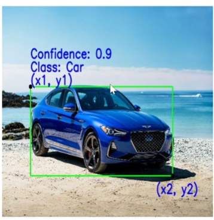
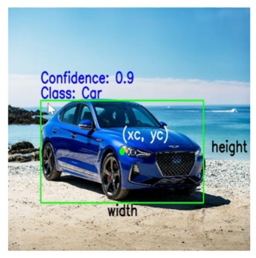
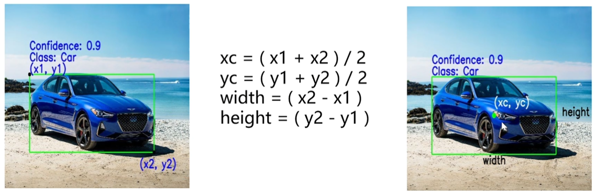
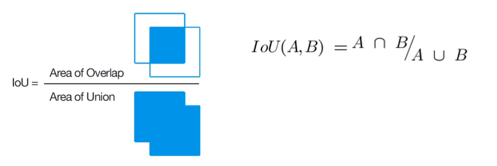

# 有三AI培训

## 学Yolo之前需要掌握的知识

### Bounding Box

边界框是一个围绕物体的矩形， 它指定了物体的位置、类别（例如， 汽车， 人）和置信度（它在该位置的可能性有多大）

表示边界框时主要的两种约定：

1. 根据其左上角和右下角的坐标来指定框

   

2. 根据其中心以及狂赌和高度来制定框

   

   根据遵循的约定，以下是指定边界框的主要参数

   - 类别 class 盒子里面的对象是什么， 例如卡车， 人， 等

   - （x1, y1） 对应的矩阵的左上角的x和y坐标

   - （x2, y2） 对应的矩阵的右下角的x和y坐标

   - （xc, yc)     对应边界框中心的x和y坐标

   - 宽度 width 代表边界框的宽度

   - 高度 Height 代表边界框的高度

   - 置信度 Confidence 表示对象实际在改边界框中出现的可能性。

     例如0.9 的置信度表示物体实际存在于该框中的概率为90%

   ### 两种不同的约定可以相互转换

   

## IOU 交并比

描述两个框重叠程度的术语。重叠区域越大， IOU就越高

https://www.bilibili.com/video/BV1tw411y7p3?t=2234.3

