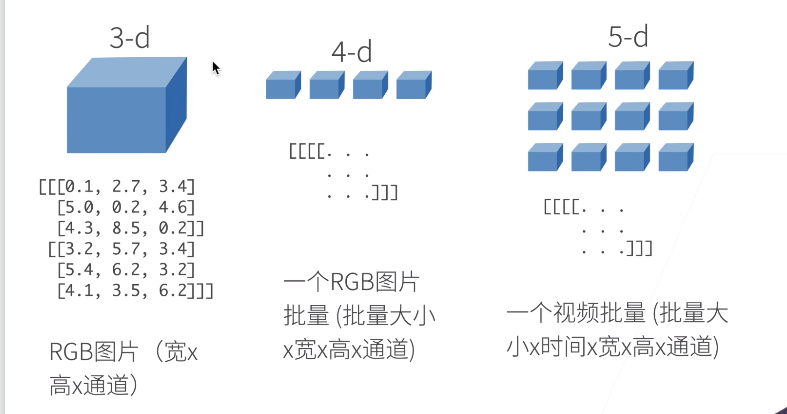

# 第2章 预备知识

## 资源

- 课程主页 https://courses.d2l.ai/zh-v2
- 教材 https://zh-v2.d2l.ai/
- Pytorch论坛 https://discuss.pytorch.org/

## 数据操作

- N 维数组样例
> N 维数组是机器学习和神经网络的主要数据结构
>
> 
>
> 
>
> 
>
> 

## 重要点1

> 1. 运行一些操作可能会导致为新结果分配内存
>
> 
>
> 
>
> 2. id() 告诉我们object 在python 中的唯一的标识号
> 3. Z(:) = X + Y 其实就是指定Z中的每个元素都是有Z改写的，故而Z的id不会改变。
>
> 

## 重要点2

## 重要点3

