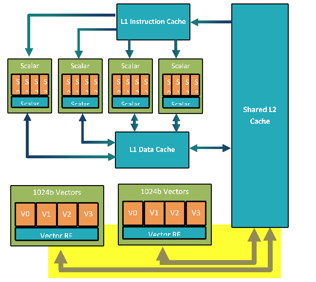

# Hexagon SDK overview 5.3.0.0

## 术语

**ALU operation**

ALU is the short of Aricthmetic Logic Unit(算术逻辑单元)；ALU是计算机处理器中的一个关键组件，负责执行各种算术和逻辑运算。ALU可以执行包括加法、减法、乘法、除法、位移、逻辑与、逻辑或、逻辑非等操作。它接收输入数据，并根据指令对数据进行操作，然后生成输出结果。

## SDK components

├── addons
├── build
├── docs
├── examples	   Code examples
├── incs				Public header files needed to access system-level software libraries
├── ipc				  Inter-processor communication libraries providing [FastRPC](software/ipc/rpc.html) support
├── libs				 System-level software libraries and Hexagon libraries
├── readme.txt
├── rtos				[Real-time DSP OS](pdf/80-VB419-178_B_QuRT_User_Guide.pdf)
├── setup_sdk_env.source
├── tools			  Development tools (see ***Tools\*** tab)
└── utils			   Helper scripts to automate tasks commonly performed by developers

### cDSP

**Hexagon Core**

Hexagon Core 由多个DSP硬件线程组成，大多数的cDSP有4-6个线程。每个DSP硬件线程都可以访问Hexagon标量指令，这些指令在32位寄存器上执行定点和浮点运算，可以是单个或一对寄存器。

每个数据单元能够进行最多64位宽的加载或存储，或者进行32位标量ALU操作。

每个执行单元能够进行16/32/64位矢量乘法、ALU运算、位操作、移位或浮点运算。

在V66之前，标量浮点和乘法资源由所有执行单元共享。这意味着所有组合的硬件线程每个处理器周期最多执行一次每个操作。从V66开始，每个簇都有自己的浮点和乘法资源。

如上图所示，簇指的是一对线程（线程0和1，线程2和3）。在一个簇内，这两个线程通常在交替的时钟周期上提交指令包，因为大多数指令需要至少两个时钟周期来完成。在最佳情况下，每个簇在每个DSP时钟周期内完成一个指令包，只要避免停顿，就可以获得（2 * DSP时钟）每秒的总吞吐量。（有关最小化延迟的指南，请参阅关于DSP优化技术的讨论。）

**Hexagon HMX unit**

Hexagon HMX单元 HMX是在Lahaina中引入的矩阵引擎，用于提供卷积操作的非常高的吞吐量。

该SDK不直接暴露HMX指令。HMX加速仅通过机器学习库和工具（如QNN SDK）提供，该工具允许神经网络在Lahaina上运行，并广泛使用HMX引擎

### Memory subsystem

The following diagram provides an overview of the DSP memory subsystem.

cDSP拥有一个两级缓存内存子系统。L1仅对标量单元可访问，使得L2成为标量单元的第二级内存和HVX协处理器的第一级内存。

L1只支持写入操作，这使得缓存可以实现硬件一致性。为了保持一致性，如果HVX存储命中L1，则会使L1行无效。向量单元支持各种加载/存储指令，包括对非对齐向量和按字节条件存储的支持。

为了让HVX硬件读取L2内容并隐藏L2读取延迟，使用了一个流水线化的向量FIFO。有关内存延迟的更详细讨论，请参阅优化指南中的内存部分。

cDSP还包括一个紧密耦合的存储器（TCM），称为VTCM（Vector TCM）。VTCM是一种低功耗存储器，提供了大约是L2带宽的两倍，并减少了存储到加载的延迟。VTCM在执行分散-聚集查找操作和使用HMX引擎时是必需的。

## Setup

