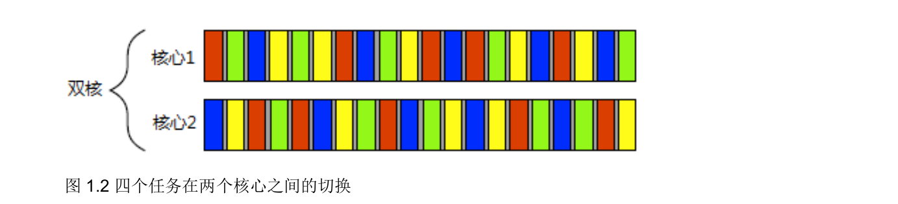

## 你好，并发世界




### 1.1.2 并发方式

- 多进程并发

  是将应用程序分为多个独立的进程同时运行,就像同时进行网页浏览和文字处理一样。如图1.3所示,独立的进程可以通过进程间的通信渠道传递讯息(信号、套接字、文件、管道等等)。不过,这种进程间的通信通常非常复杂,或是速度很慢。这是因为操作系统对进程进行保护,以避免一个进程去修改另一个进程的数据。还有一个缺点是运行多个进程的固定开销:需要时间启动进程,操作系统需要资源来管理进程等等。

  

- 多线程并发

  并发的另一个方式,在单进程中运行多个线程。线程很像轻量级的进程:每个线程相互独立运行,并且可以在不同的指令序列中运行。不过,进程中的所有线程都共享地址空间,并且能访问到大部分数据———全局变量仍然是全局的,指针、对象的引用或数据可以在线程之间传递。虽然,进程之间通常共享内存,但同一数据的内存地址在不同的进程中不相同,所以这种共享难以建立和管理。图1.4展示了一个进程中的两个线程,正在通过共享内存进行通信。

  

  **优点**

  地址空间共享,以及缺少线程间的数据保护,使得操作系统记录的工作量减小,所以使用多线程的开销远远小于多进程。

  **缺点**

  如果多个线程访问数据,那么必须确保每个线程所访问到的数据一致,这就需要对线程通信做大量的工作。

  ### 1.1.3 并发与并行

  - 分离关注点

    编写软件时,分离关注点是个好办法。通过将相关的代码与无关的代码分离,可以使程序更容易理解和测
    试,从而减少出错的可能。即使一些操作需要同时进行,依旧可以使用并发,分离不同的功能区域。若不显
    式地使用并发,就得编写一个任务切换机制,或者在操作中主动地调用一段不相关的代码。

  - 性能

    1. 将一个单个任务分成几部分并行运行,从而降低总运行时间,这就是任务并行(task parallelism)。
    2. 是利用并行来解决更大的问题:每次只处理一个文件,不如处理2个、10个或20个。

  ## 1.4 入门

  ```c++
  #include <iostream>
  #include <thread> // 1
  void hello() // 2
  {
  				std::cout << "Hello Concurrent World\n";
  }
  int main()
  {
  std::thread t(hello); // 3
  t.join(); // 4
  }
  ```

  ```cmake
  cmake_minimum_required(VERSION 3.23)
  project(code)
  
  set(CMAKE_CXX_STANDARD 17)
  
  set(CMAKE_CXX_FLAGS ${CMAKE_CXX_FLAGS} "-pthread")
  
  add_executable(code main.cpp)
  
  ```

  