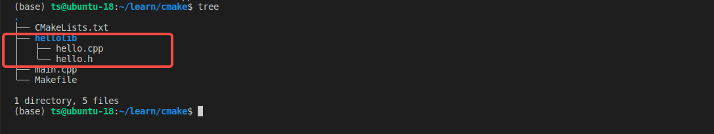

## Cmake

## 静态库

之所以称之为【静态库】，是因为在链接阶段，会将汇编生成的目标文件.o 与 引用的库一起链接到可执行文件中。对应的链接方式称为 静态链接。如果多个进程需要引用到【静态库】，**在内存中就会存在多份拷贝**。

```cmake
add_library(hellolib STATIC hello.cpp)
```

静态库是直接打包进可执行程序内，对可执行程序进行链接分析，可以看出，在没有链接到静态库


## 动态库

在程序编译时并不会链接到目标代码中，而是在运行时才被载入。不同的应用程序如果调用相同的库，那么在内存中只需要有一份该共享库的实例，**避免了空间浪费问题。同时也解决了静态库对程序的更新的依赖，用户只需更新动态库即可**。

```cmake
add_library(hellolib SHARED hello.cpp)
```


---

## Cmake的子模块

复杂的工程中， 我们需要划分子模块，通常是一个库一个目录



要在根目录中使用子模块， 我们可以通过

```cmake
add_subdirectory(子目录)
```

添加子目录，子目录下必须也要有CMakeLists.txt文件

这样会面对两个问题

1. 找子模块的库

   可以在父CMakeLists.txt中添加

   ```cmake
   target_link_libraries(a.out PUBLIC hellolib)
   ```

2. 找子模块的头文件

   - 可以在父CMakeLists.txt中添加

     ```cmake
     target_include_directories(a.out PUBLIC hellolib)
     ```

   - 也可以在子CMakeList.txt中添加

     ```cmake
     target_include_directories(hellolib PUBLIC .)
     ```

     需要注意的是这种方式是在PUBLIC下的， PUBLIC的意思是只要子模块有的库或者文件，link的父模块也可以拥有对应的库和头文件。

---

## 目标的一些其他的选项

```cmake
target_include_directories(myapp PUBLIC /usr/include/eigen3) # 添加头文件搜索目录
target_link_libraries(myapp PUBLIC hellolib)										# 添加要链接的库
target_add_definitions(myapp PUBLIC MY_MACRO=1) 					# 类似于在代码中添加一个宏定义#define MY_MACRO 1
target_add_definitions(myapp PUBLIC -DMY_MACRO=1) 				 #与MY_MACRO=1等价
target_compile_options(myapp PUBLIC -fopenmp)							# 添加编译器命令行选项
target_sources(myapp PUBLIC hello.cpp other.cpp) 						# 添加要编译的源文件
```

### 以及下面的指令， 不推荐使用，把选项加到所有接下来所有的目标中去

```cmake
include_directories(/opt/cuda/include) 					# 添加头文件搜索路径
link_directories(/opt/cuda)												# 添加库文件的搜索路径
add_compile_options(-fopenmp)								# 添加编译器命令行选项
```

