# CUDA 开启的GPU编程

https://www.bilibili.com/video/BV16b4y1E74f?t=9.8

书籍:


利用CMake中进行开发cuda程序.

## CUDA 编译器兼容C++17

1. Cuda 的语法完全兼容C++, 包括C++17的特性

   很方便的重用C++现有的任何代码库, 引用C++头文件等.

2. host和device代码写在同一个文件内, 这是OPENCL做不到的.

### 编写一段在GPU上运行的代码

- 定义函数kernel,前面加上\_\_global\_\_修饰符, 即可让他在GPU上运行.

- 这里的kernel函数在GPU上运行,称为核函数. 用\_\_global\_\_修饰的就是核函数.

  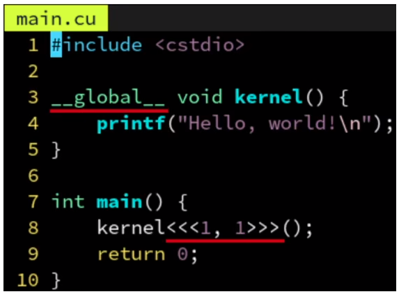

  上面的代码并不会打印出 hello world.

  > 这是因为GPU和CPU之间的通信,为了高效, 是__异步__的. 这也就是说CPU调用kernel函数后,CPU并不会等待GPU执行完毕, 再返回; 实际上值是把kernel这个任务推送到GPU的执行队列上, 然后立即返回, 并不会等待执行完毕.

  解决办法:

  > 可以调用cudaDeviceSynchronize(), 让cpu陷入等待, 等GPU完成队列的所有任务后再返回.

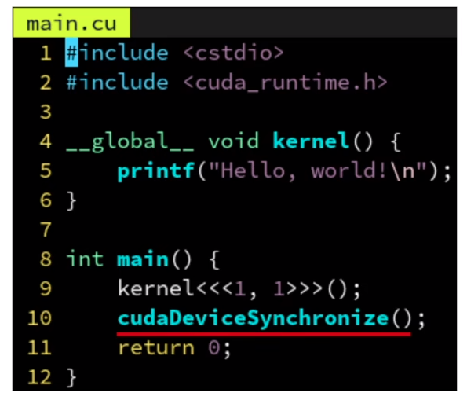

### 定义在GPU上的设备函数

- \_\_global\_\_ 用于定义核函数, 他在GPU上执行, 从CPU端通过三重尖括号语法调用,可以有参数,不可以与欧返回值.
- *\_\_device\_\_*  用于定义设备函数, 他在GPU上执行, 但是从GPU上调用, 而且不需要三重尖括号,和普通函数用起来一样,可以有参数,有返回值.
- host 函数可以调用global函数, global函数可以调用device函数, device函数可以调用device 函数.

## inline关键字

- inline 在现代c++中的效果是声明一个函数为weak符号, 和性能优化意义的内联无关.
- 优化意义的内联指把函数体至解放到调用者那里去.
- CUDA编译器提供了\_\_inline\_\_关键字, 来声明__一个函数为内联__, 不论是CPU函数还是GPU都可以使用, 只要你用的是CUDA编译器,GCC中与\_\_inline\_\_对应的是\_\_attribute\_\_(("inline"))
- 注意声明成\_\_inline\_\_并__不保证内联__, 函数太大的话,编译器会放弃掉内联化;
- CUDA提供了\_\_forceinline\_\_ 这个关键字来强制一个函数为内联; GCC与之对应的是\_\_attribute\_\_(("always_inline"))
- 此外还有\_\_noinline\_\_来进制内联优化.

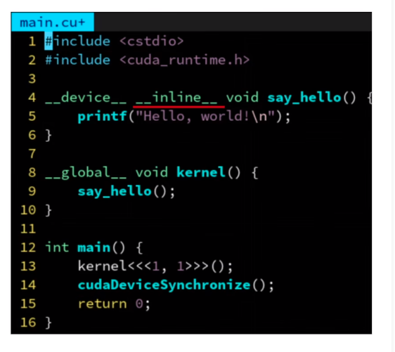

## 定义在CPU上的主机函数

\_\_host\_\_将函数定义在CPU上.

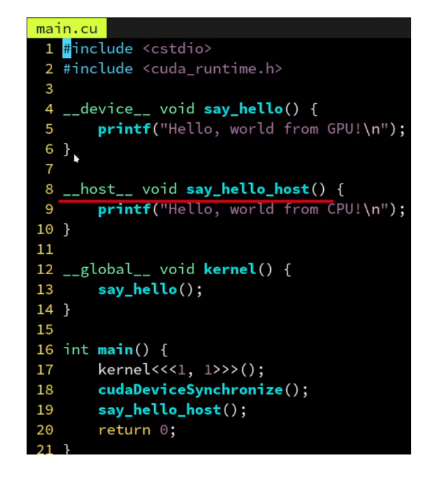

### 同时定义在CPU和GPU上

- 通过\_\_host\_\_ \_\_device\_\_ 这样双重修饰符, 可以把函数同时定义在CPU, GPU上.

### constexpr 函数自动变成CPU和GPU都可以调用.


```cmake
add_executable(main main.cu)
target_compile_options(main PUBLIC $<$<COMPILE_LANGUAGE:CUDA>:--expt-relaxed-constexpr>)>)
```

- 这样相当于把constexpr函数自动变成\_\_host\_\_, \_\_device\_\_, 从而两边都可以调用.

- 因为constexpr通常是一些可以内联的函数,数学表达式之类,一个一个加上太累了, 所以产生了这个需求

- 在constexpr中不能调用printf, 也不能调用_\_syncthreads\_\_ 之类的GPU特有的函数, 因此不能完全代替.

  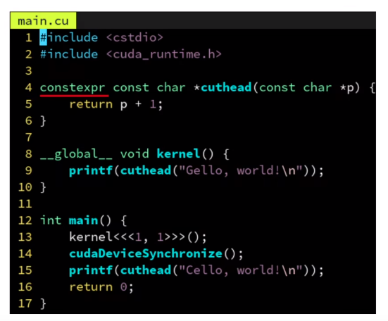

  ### 通过#ifdef 指令针对CPU和GPU生成不同的代码

  - CUDA编译器有多段编译的特点

    1. 一个代码会先送到CPU上的编译器 通常是系统自带的编译器, 比如GCC和msvc, 生成CPU部分的代码.
    2. 送到真正的GPU编译器上生成GPU指令码.
    3. 最后链接成一个文件, 看起来好像编译了一次,实际上代码会多次处理.

  - GPU编译模式下会定义_\_CUDA_ARCH__ 这个宏, 通过#ifdef判断该宏是否定义,可以判断当前是否处理GPU模式, 从而实现一个函数针对GPU和CPU生成的两份源码级不同代码.

    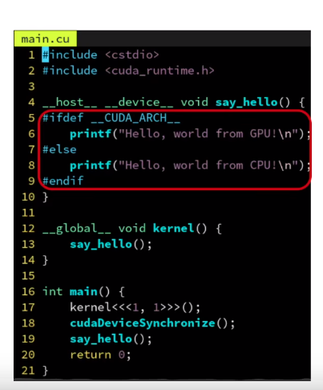

  ## 三重尖括号的数字代表什么意思

  代表要启动的线程的情况.

  ### 注意不要混淆

  1. threadIdx 当前线程在板块中的编号.
  2. blockIndx 当前线程所在的板块的编号
  3. blockDim 当前板块中线程的数量
  4. gridDim 总的版本的数量

  从属关系 线程 < 板块 < 网格

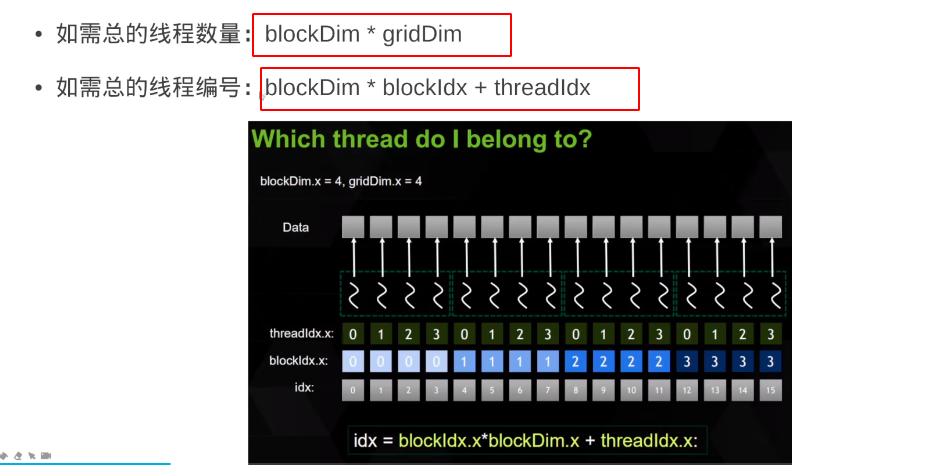

### 三维的板块和线程编号

- CUDA 也支持三维的板块和线程区间

- 只要在三种尖括号内指定参数改为dim3类型即可，dim3的构造函数就是接受三个无符号整数的。

- dim(x, y, z)

- 这样在核函数里就能通过threadIdx.y获得y方向的线程编号，以此类推

  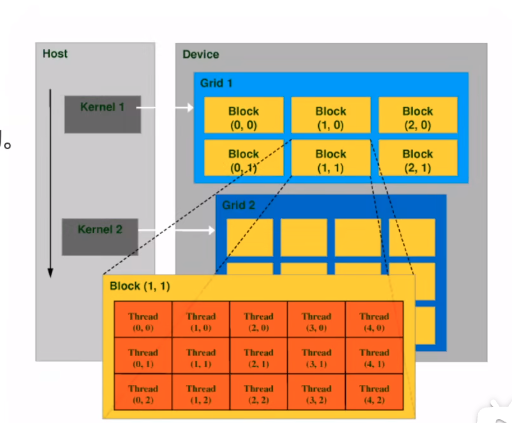

## 分离 _\_device__ 函数声明和定义

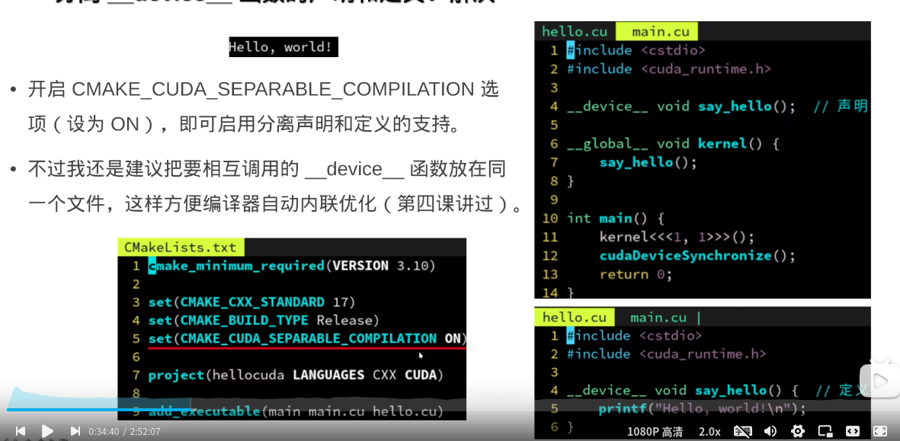

## 核函数调用核函数

- 从Kelper架构开始， \__global__ 里面可以调用\_\_global__ 函数, 并且三重尖括号里面的板块数目和线程数目可以动态指定，先传回到CPU再进行调用。
- 通常用于，需要从GPU端动态计算出blockDim和gridDim,而又不希望导回数据到CPU导致强制同步造成的性能损失。

## 如何从核函数里返回数据？

- CPU和GPU各自使用着独立的内存， CPU的内存称为主机内存， GPU上的内存称为设备内存，

- 不论是栈还是malloc分配的堆都是在CPU上的内存，所以自然GPU访问不到

- 在显存上可以用cudaMalloc分配GPU的显存， 用cudaFree释放

- cudaMalloc的返回值是错误代码， 所以返回指针智能通过&pret二级指针。

- cudaMemcpy(dst, src, size_t, kind)

  cudaMemcpyDeivceToHost

  cudaMemcpyDeviceToDevice

  cudaMemcpyHostToDevice

  cudaMemcpy会自动进行同步操作

### 统一内存地址技术

在比较新的显卡上是支持同一内存地址的；

只需要将cudaMalloc 变成 cudaMallocManaged即可。 释放也是通过cudaFree;

这样分配出来的地址，不论是在CPU还是GPU上都是一模一样的吗都可以访问， **拷贝也会按需自动进行**，无序再次调用cudaMemcpy.

需要手动同步一下。

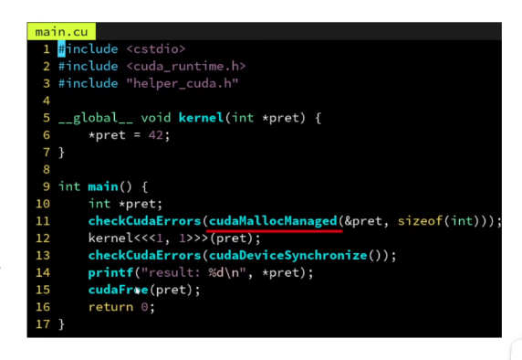

## 数组

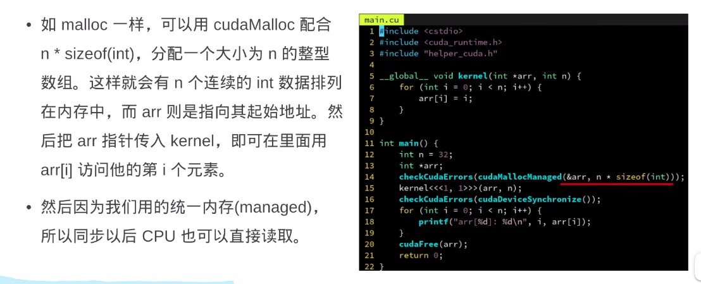


