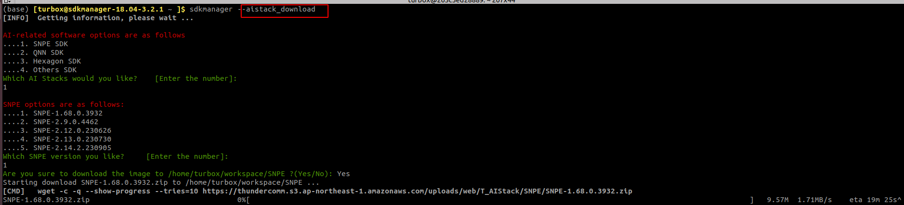
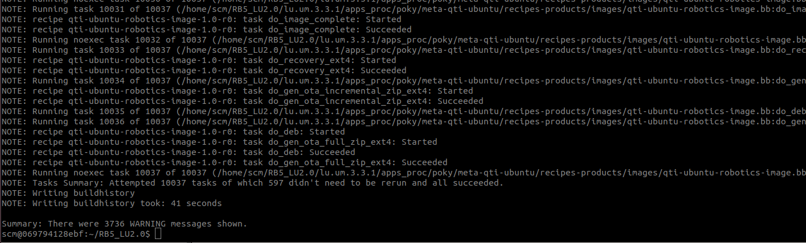

## SNPE Docker

1. 编写代码，使得sdkmanager app能够支持根据需求下载相应的SNPE、QNN、Hexagon SDK, 实现效果如下：

   

2. 进行简单的测试

> 1. 测试搭建的环境能够下载各个SDK包， 能够正常的进行解压操作； 使能环境后，能够快速验证SOM板子的是否支持SNPE（利用的inceptionv3模型，其他模型的后续会验证）

   ## RB5 gstreamer

拉取RB5 LU代码，在docker内进行编译，能够成功编译。

