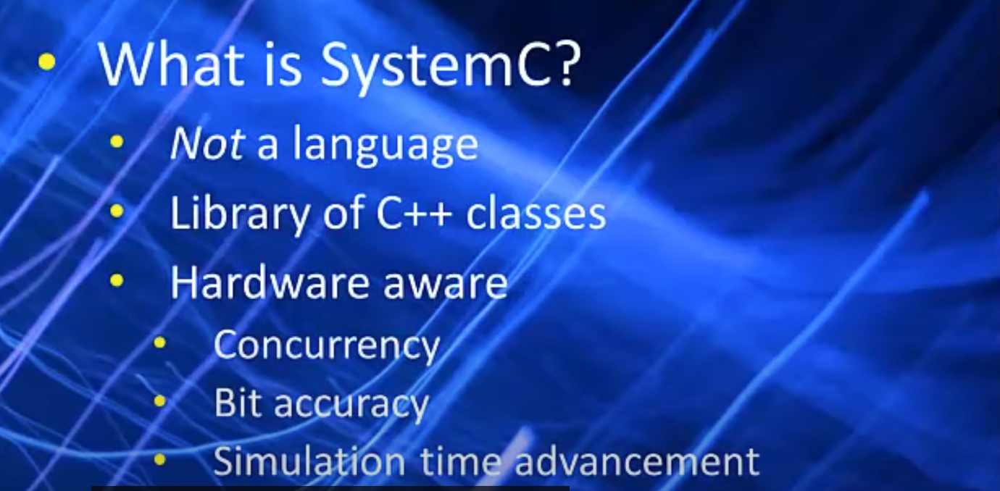
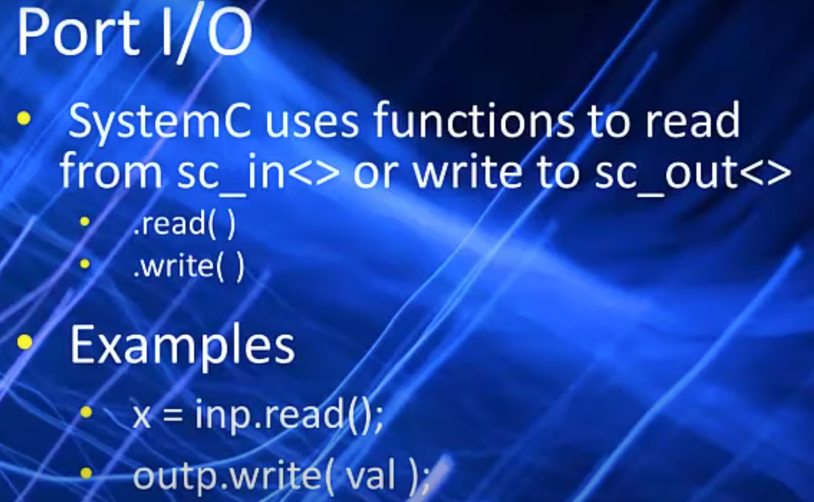
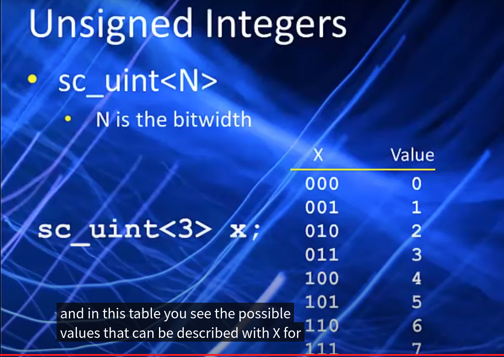
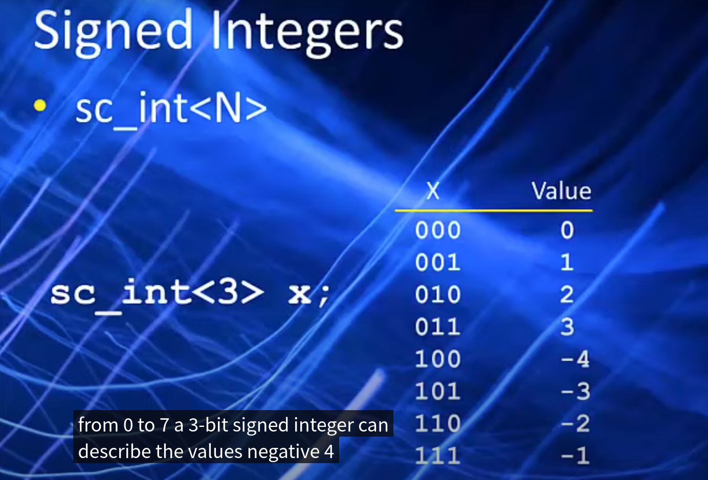
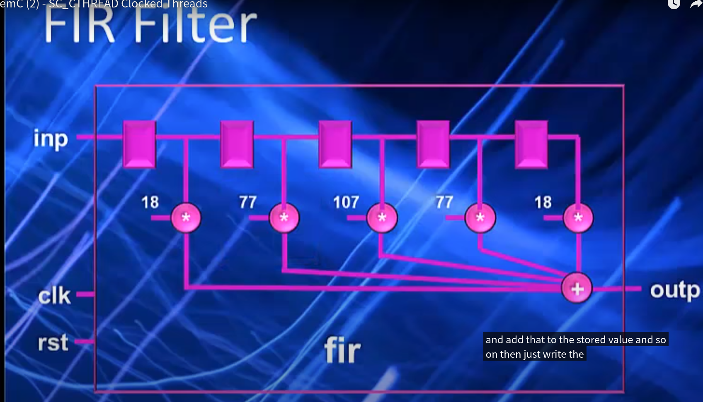

## SystemC 

### Introduction




### Lets Get started

```SystemC
#include <systemc.h>

template<typename DT>
SC_MODULE(and2){
    sc_in<DT> a;
    sc_in<DT> b;
    sc_out<DT> f;

    void func() {
        f.write(a.read(), b.read());
    }

    SC_CTOR(and2) {
        
    }
};
```

#### Port I/O



#### Threads

A thread is a function made to act like a hardware process.

- Run concyrrently
- Sensitive to sigbals, clock edges or fixed amounts of simulation time.
- Not called by the user, always active.

SystemC supports three kinds of threads.

- SC_METHOD()

  Executes once every sensitivity event.

  Runs continuously

  Analogous to a Verilog @alwys block

  Synthesizable

  - Useful for combinational expressions or simple sequential logic.

- SC_THREAD()

  Runs once at start of simulation, then suspends itself when done.

  Can contain an infinite loop to execute code at a fixed rate of time.

  Similar to a Verilog @initial block.

- SC_CTHREAD()

  Means "clocked thread"

  Runs continuously

  References a clock edge/

  Synthesizable

  Can take one or more clock cycles to execute a sigle iteration.

  Used in 99% of all high-level behavioral designs.

#### Integer Datatypes

- SystemC has bit-accurate versions of the integer datatype.

  - Datatypes have a fixed width
  - Unlike C int type, always 32 bits.

- Unsigned and signed

  - sc_uint<N>
  - sc_int<N>

  

  

  

  #### SC_CTHREAD

  - SC_METHODS
    1. Limited to one cycle.
    2. Fine for counters or simple sequential designs.
    3. Not much different than hand code RTL
    4. Can not handle multucycle algorithms.
  - SC_CTHREAD
    1. SC_CTHREADs
       1. Not limited to one cycle
       2. Can contain continuous loops
       3. Can contain large blocks of code with operations or control
       4. Great for behavioral synthesis.

  

### Test Environment


 

### Handshaking


