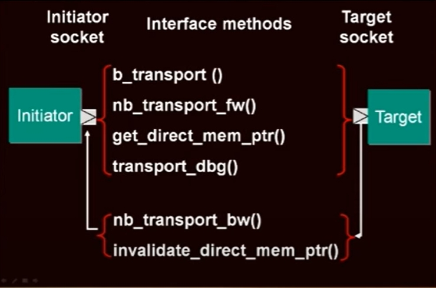

# TLM2.0 - Base Protocol Checker

## Loosely timed

1. 快
2. 在足够的时间细节来引导O/S和运行多核系统
3. 进程可以在模拟时间之前运行（时间解耦）temporal decoupling（目的减少上下文切换）
4. 每个事务在一个函数调用中完成
5. 使用直接内存接口 DMI

## Approximately-timed

1. 精确到足以进行性能建模
2. 又名 周期近似或周期计数精确
3. 足以进行架构探索
4. 进程与模拟时间同步银杏
5. 每个事务有四个时间点可扩展

## TLM2.0 Interoperability 互操作性

