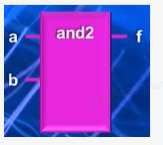
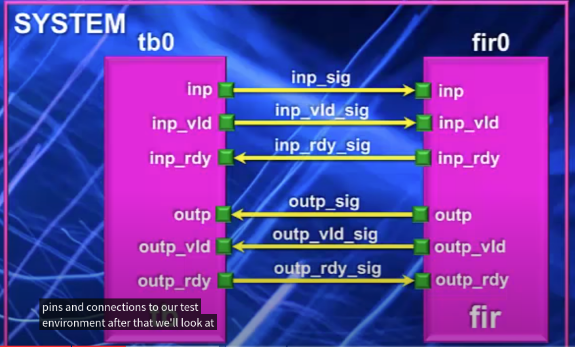
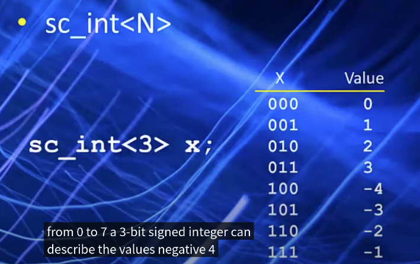
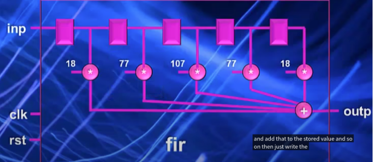
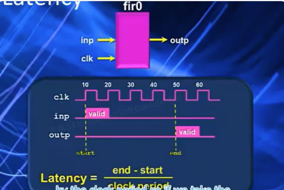
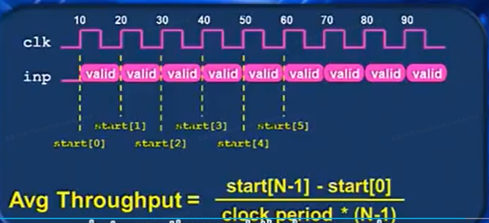
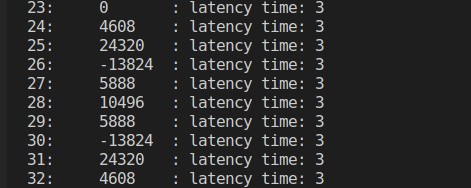

## 下周计划

### RTL TLM 模式

1. 上周的例子搞明白模块和port之间的关系
2. 加法器的例子搞明白
3. 把systemc关键元素之间的关系搞明白，写自己话，

---

SystemC --> IR

---

### 本周总结

1. SystemC中常见概念的梳理
2. 结合代码讲不同模块之间进行通信的例子(几乎包含了所有的SystemC中的概念)

## SystemC中的概念

1. 模块（Module）：模块是SystemC中的基本构建单元，用于表示系统中的一个组件或子系统。模块可以包含其他模块或子模块，并通过信号进行通信。

   

   ```c++
   #include <systemc.h>
   SC_MODULE(and2) {
       sc_in<DT> a;
       sc_in<DT> b;
       sc_out<DT> f;
       
       void func() {
           f.write(a.read() & b.read());
       }
       
       SC_CTOR(and2) {
           SC_METHOD(func);
           sensitive << a << b;
       }
   }
   ```

2. 通道（Channel）：通道是模块之间进行通信的方式。它可以是一个FIFO缓冲区、信号线、总线或其他形式的通信介质。

3. 端口（Port）：端口用于在模块之间进行输入和输出的连接点。模块可以通过端口发送和接收信号或数据。

4. 进程（Process）：进程是描述模块行为的基本单位。进程是一个函数或方法，它可以是线程（线程进程）或协程（协程进程）。进程可以对输入事件做出响应，执行一些操作，并生成输出事件。

   功能的基本单位称为进程。在典型的编程语言中，当控制从一个函数转移到另一个函数时，函数是顺序执行的。这对于系统的顺序行为建模很有用。然而，电子系统本质上是并行的，许多活动同时发生。进程提供了模拟并发行为的机制。进程必须包含在模块中——它被定义为模块的成员函数，并在模块的构造函数中声明为SystemC进程。

   - SC_METHOD() 每个事件发生时,都执行一次.
   - SC_THREAD() 在模拟时运行一次,然后完成后暂停自己.
   - SC_CTHREAD() “时钟线程”连续运行参考时钟边缘Synthesizable可以使用一个或多个时钟周期来执行单个迭代

5. 事件（Event）：事件表示系统中发生的某个时间。它可以是一个信号的变化、计时器的触发等。事件驱动是SystemC中的一种常见的建模方式。

6. Sensitivity

   - Static Sensitivity

     在模拟之前, 计算的响应事件就已经确定了,且在整个模拟过程中,计算的响应事件不会再改变.

     sensitivity >> a >> b;

   - Dynamic Sensitivity

     在模拟过程中，线程进程可以挂起自己，并指定一个特定的事件e作为进程希望等待的当前事件.

     用到的是wait(e);
     
     如何映射到IR 层面？？？

---

## 代码讲解部分

### models



```c++
SC_MODULE(SYSTEM) {
    //MODULE declarations
    tb      *tb0;
    fir     *fir0;

    //Local signal declaration
    sc_signal< sc_int<16> >     inp_sig;
    sc_signal< bool >           inp_vld_sig;
    sc_signal< bool >           inp_rdy_sig;
    sc_signal< sc_int<16> >     outp_sig;
    sc_signal< bool >           outp_vld_sig;
    sc_signal< bool >           outp_rdy_sig;
    sc_signal< bool >           rst_sig;
    sc_clock                    clk_sig;

    SC_CTOR(SYSTEM) : clk_sig ("clk_sig", 10, SC_NS)
    {
        tb0 = new tb("tb0");
        tb0->clk(clk_sig);
        tb0->rst(rst_sig);
        tb0->inp(inp_sig);
        tb0->inp_val(inp_vld_sig);
        tb0->inp_rdy(inp_rdy_sig);
        tb0->outp(outp_sig);
        tb0->outp_val(outp_vld_sig);
        tb0->outp_rdy(outp_rdy_sig);

        fir0 = new fir("fir0");
        fir0->clk(clk_sig);
        fir0->rst(rst_sig);
        fir0->inp(inp_sig);
        fir0->inp_vld(inp_vld_sig);
        fir0->inp_rdy(inp_rdy_sig);
        fir0->outp(outp_sig);
        fir0->outp_vld(outp_vld_sig);
        fir0->outp_rdy(outp_rdy_sig);
    }

    ~SYSTEM() {
        //Destructor
        delete tb0;
        delete fir0;
    }
};
```

```c++
SC_MODULE(fir) {
    sc_in< bool >               clk;
    sc_in <bool >               rst;

    sc_in< sc_int<16> >        inp;
    sc_in< bool >               inp_vld;
    sc_out<bool>                inp_rdy;

    sc_out< sc_int<16> >       outp;
    sc_out< bool >              outp_vld;
    sc_in <bool>                outp_rdy;

    void fir_main();
    // Coefficients for each FIR

    SC_CTOR(fir) {
        SC_CTHREAD(fir_main, clk.pos() );
        reset_signal_is(rst, true);
    }
};
```

```c++
SC_MODULE(tb) {
    sc_in<bool>             clk;
    sc_out<bool>            rst;

    sc_out< sc_int<16> >    inp;
    sc_out<bool>            inp_val;
    sc_in<bool>             inp_rdy;

    sc_in< sc_int<16> >     outp;
    sc_in<bool>             outp_val;
    sc_out<bool>            outp_rdy;

    void source();
    void sink();

    FILE *outfp;

    sc_time start_time[64], end_time[64], clock_period;

    SC_CTOR(tb) {
        SC_CTHREAD(source, clk.pos());
        SC_CTHREAD(sink, clk.pos());
    }
};
```





| 输入 | ARRAY                   | 和     | 和的表示                   | 补码                | 实际输出 |
| ---- | ----------------------- | ------ | -------------------------- | ------------------- | -------- |
| 256  | [256, 0, 0 ,0, 0]       | 4068   | 0000 1111 1110 0100        | -                   | 4068     |
| 256  | [256, 256, 0, 0, 0]     | 24320  | 0101 1111 0000 0000        | -                   | 24320    |
| 256  | [256, 256, 256, 0, 0]   | 51712  | 1100 1010 0000 0000        | 1011 0110 0000 0000 | -13824   |
| 256  | [256, 256, 256, 256, 0] | 71,424 | (0001) 0001 0111 0000 0000 | 0001 0111 0000 0000 | 5888     |
|      |                         |        |                            |                     |          |

### Performance metrics

  #### Latency

对于处理模块而言, 从收到数据到处理完数据并输出的事件称为Latency



#### Throughput




### Result


