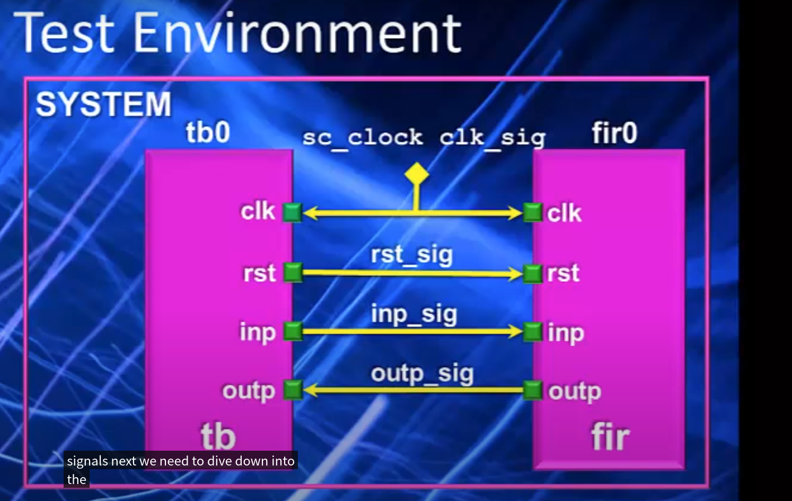
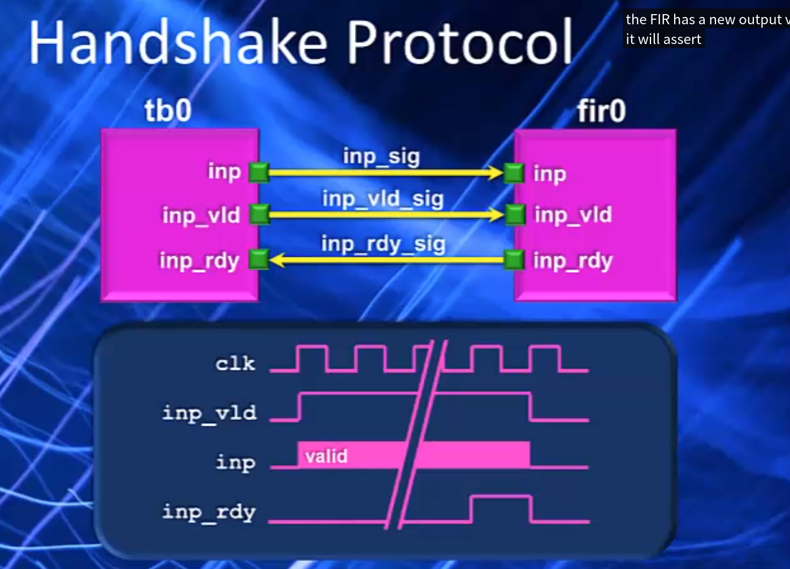

# 0817周报

1. SystemC 环境搭建
2. System design with SystemC 第二章
3.  根据SystemC官方的教学视频, 编写一个SystemC 模块之间通信的代码实例.
[toc]
## SystemC环境搭建
https://www.accellera.org/downloads/standards/systemc
```
./configure
make
```
测试

```cmake
cmake_minimum_required(VERSION 3.12)
project(HelloWorld)

set(CMAKE_BUILD_TYPE Debug)
set(CMAKE_CXX_FLAGS_DEBUG "${CMAKE_CXX_FLAGS_DEBUG} -g")

# 设置SystemC库的路径
set(SYSTEMC_HOME "/home/ts/software/systemc-2.3.3")
set(SystemC_INCLUDE_DIRS "${SYSTEMC_HOME}/include")
set(SystemC_LIBRARY_DIRS "${SYSTEMC_HOME}/lib-linux64")
set(SystemC_LIBRARIES "-lsystemc")

# 添加可执行文件
add_executable(demo main.cpp)

# 设置编译器选项和库路径
target_include_directories(demo PRIVATE ${SystemC_INCLUDE_DIRS})
target_link_directories(demo PRIVATE ${SystemC_LIBRARY_DIRS})
target_link_libraries(demo PRIVATE ${SystemC_LIBRARIES})
```

```c++
#include <systemc.h>

// HelloWorld模块
SC_MODULE(HelloWorld) {
    SC_CTOR(HelloWorld) {
        // 在构造函数中输出Hello World!
        cout << "Hello World!" << endl;
    }
};

// 主函数
int sc_main(int argc, char* argv[]) {
    // 创建HelloWorld实例
    HelloWorld hello("hello");

    // 运行仿真
    sc_start();

    return 0;
}

```


## 02. Fundamentals of SystemC

### 2.1 Introduction

1. 建模

   1. 寄存器传输抽象级别的建模
   2. RTL（Register Transfer Level）建模

2. 挑战
	系统设计中使用广泛的计算和通信模型，抽象级别的方法和方法论是创建系统仿真的主要难题。
	
3. SystemC方案
- 分层的方法： 方便引入新的，高级别结构
- 共用模拟引擎
- 事件驱动的模拟内核


### 2.2 SystemC中的时间模型

时间分辨率： 小于时间分辨率的要进行四折五入。默认为1 皮秒，

```c++
sc_se_time_resolution(10, SC_PS);
sc_time t1（3.1416, SC_NS);
```

`sc_se_time_resolution` 设置时间分辨率，必须要在设置任何时间对象之前进行设置。

上面的两行代码表示： 设置时间分辨率为10皮秒， 创建一个t1的是对象，为3.1416纳秒，但是已经设置了时间分辨率为10皮秒，所以实际上t1的时间为3140皮秒。

### 2.3 模块

模块是划分设计的基本块。运行设计者将复杂的系统分解成更小、更易于管理的部分，并对其他模隐藏内部数据表示和算法。

典型的包括：

1. ports, 系统通过端口与环境进行通信
2. processes: 描述模块的功能过程
3. Inter data 和 chanels： 用于维护模型的状态和模型进程之间通信
4. 同层次上的其他模块

模块使用SC_MODULE宏描述的，模块的主体用大括号括起来。

```c++
SC_MODULE(Adder){
    // ports, processes, internal data, etc
    SC_CTOR(Adder) {
        // 模块的构造器主体
        // 过程的声明
    }
}
```

### 2.4 接口、端口和通道

SystemC 使用接口、端口和通道来提供更高抽象级别的进程之间通信和同步的媒介。

通道用来保持和传输数据

接口是进入通道的“窗口”，接口描述了一系列的操作和子集。

端口是便于接口访问的代理。

#### Interface

接口包含一组操作，指定了函数名和函数参数，以及返回名。

在SystemC中所有的接口都必须直接或者间接的从sc_interface 类中派生。这个基类提供了一个虚函数register_port(), 当端口连接到通道时（通过接口），虚函数register_port()将会被调用。这个函数的参数是： 一个port对象的引用，port对象期望的接口的类型名字。The type name 源自动态类型信息，这个信息能保证端口绑定到通道的合法性。

#### Port

良好的设计实践建议, 模型应该与其环境交互,通过定义良好的边界进行交互.


上图展示的是类之间的集成关系, Italic字体表示的是抽象类和虚函数. 从途中可以看出, 基类 sc_interface 应为虚类 ,  这样的话,能够实现虚继承.

SystemC为模块提供了连接和与周围环境通信的端口. 我们用对象表示端口, 而不是简单的指针或者引用. 

- 可读性强
- 简化用户操作
- 不需要在实例化时绑定端口, 也不需要在构建模块函数时将端口传入构造函数.
- 与指针和引用相比,不会带来性能开销.
- 缺点: 不能在编译期间对端口绑定进行正确性检查.

## FORTE DESIGN SYSTEMS 

## Learning SystemC 

### Introduction


### Lets Get started

```SystemC
#include <systemc.h>

template<typename DT>
SC_MODULE(and2){
    sc_in<DT> a;
    sc_in<DT> b;
    sc_out<DT> f;

    void func() {
        f.write(a.read(), b.read());
    }

    SC_CTOR(and2) {
        
    }
};
```

#### Port I/O


#### Threads

A thread is a function made to act like a hardware process.

- Run concyrrently
- Sensitive to sigbals, clock edges or fixed amounts of simulation time.
- Not called by the user, always active.

SystemC supports three kinds of threads.

- SC_METHOD()

  Executes once every sensitivity event.

  Runs continuously

  Analogous to a Verilog @alwys block

  Synthesizable

  - Useful for combinational expressions or simple sequential logic.

- SC_THREAD()

  Runs once at start of simulation, then suspends itself when done.

  Can contain an infinite loop to execute code at a fixed rate of time.

  Similar to a Verilog @initial block.

- SC_CTHREAD()

  Means "clocked thread"

  Runs continuously

  References a clock edge/

  Synthesizable

  Can take one or more clock cycles to execute a sigle iteration.

  Used in 99% of all high-level behavioral designs.

#### Integer Datatypes

- SystemC has bit-accurate versions of the integer datatype.

  - Datatypes have a fixed width
  - Unlike C int type, always 32 bits.

- Unsigned and signed

  - sc_uint<N>
  - sc_int<N>

  

  

  

  #### SC_CTHREAD

  - SC_METHODS
    1. Limited to one cycle.
    2. Fine for counters or simple sequential designs.
    3. Not much different than hand code RTL
    4. Can not handle multucycle algorithms.
  - SC_CTHREAD
    1. SC_CTHREADs
       1. Not limited to one cycle
       2. Can contain continuous loops
       3. Can contain large blocks of code with operations or control
       4. Great for behavioral synthesis.

  

### Test Environment



 

### Handshaking Signals





### TB Measurements


### Compiling and Running Simulations

#### SystemC Compilation

C++ class library

- Build simulation executable with a C compiler
- GNU C Compiler (gcc)
  - Found on most any workstation

SystemC Compilation

- gcc needs

  - Executable name

    - -o switch

  - List of source files

  - Include directories

    - Location of design source 

    - Location of SystemC source

      -I switch

  - Library directory
  
    - Location of SystemC archive.
  
      -L  switch
  
  - Libraries to link
  
    - SystemC, standard C++ and math
    - -l switch