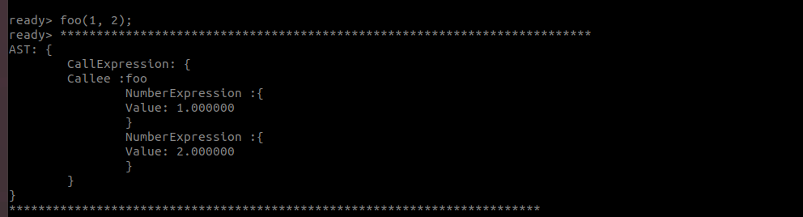

# 0511 周报

[toc]

## 进展0511

### 打印AST

代码路径:/home/ts/bupt/workspace/Kaleidoscope/Chapter4

- 函数打印:

  ```python
  def foo(a b) a *b +  2;
  ```

  

- 调用函数

  ```
  foo(1, 2);
  ```

  

- 表达式

  ```
  1+3*4*5-2;
  ```

  

- extern

  

---

### Flex 和 Bison

1. 编译运行袁昊同学提供给我的Flex和Bison demo程序.

   

2. 学习Flex的词法说明和Bison的语法说明.


## 下周计划

1. 梳理代码流程,修改代码,使其能够打印出test程序的AST.
2. 深入了解Flex 和Bison 使用方法.
