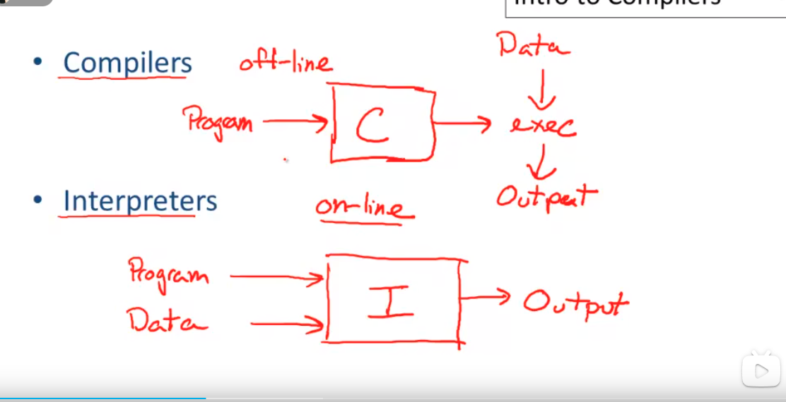
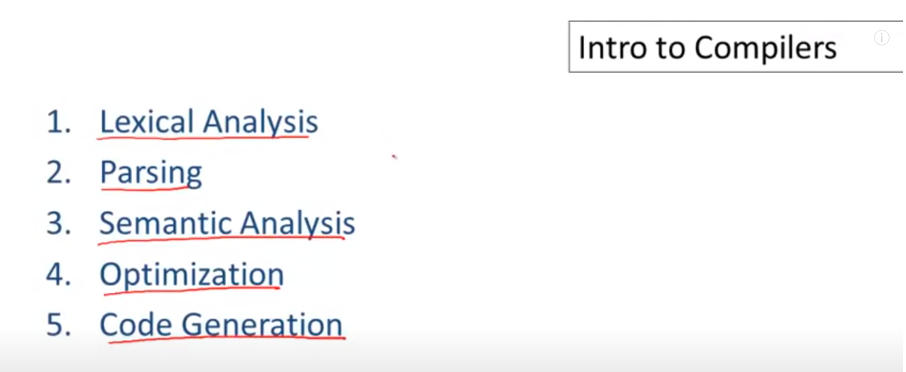
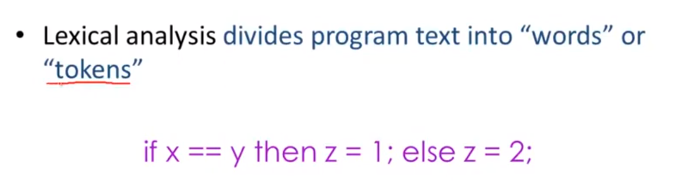
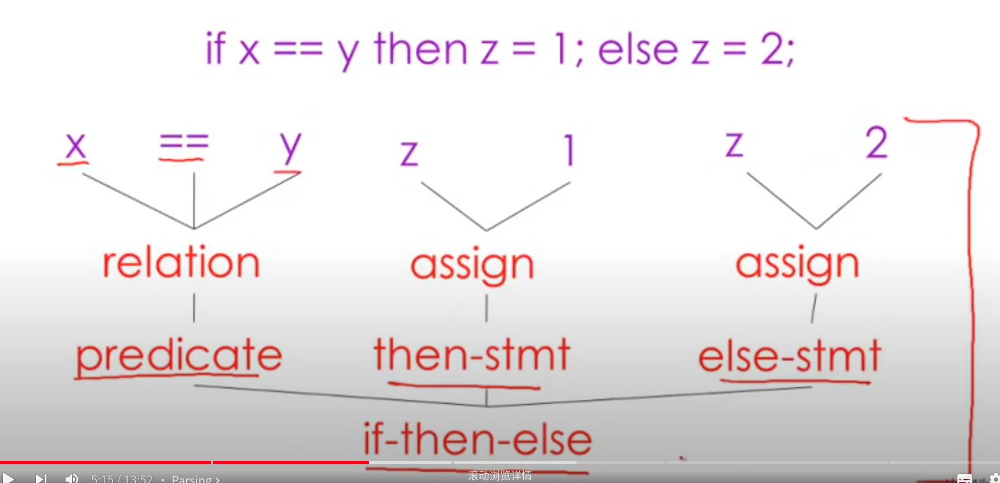
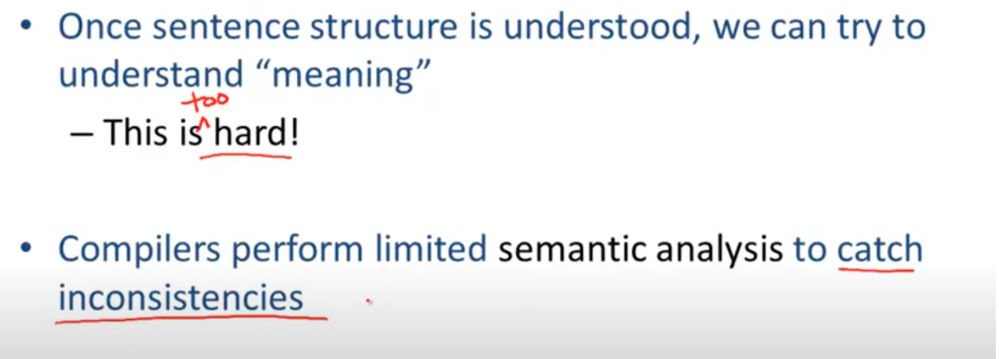
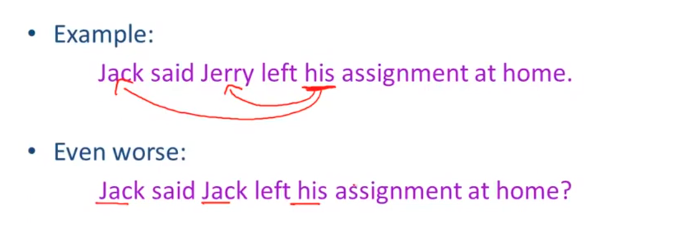
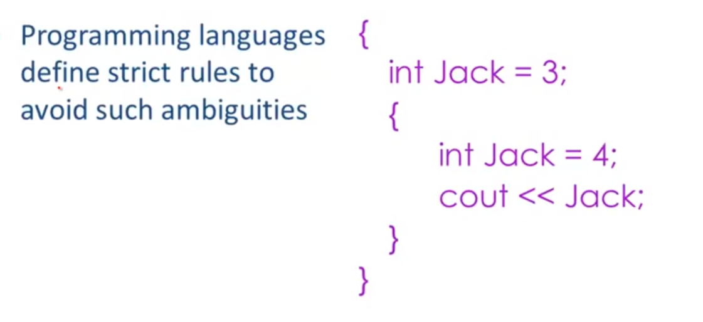
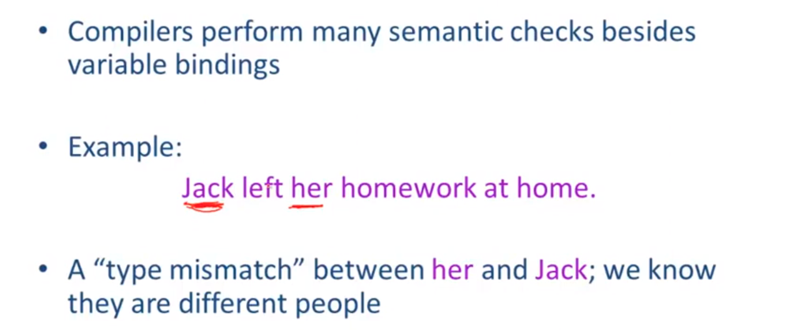
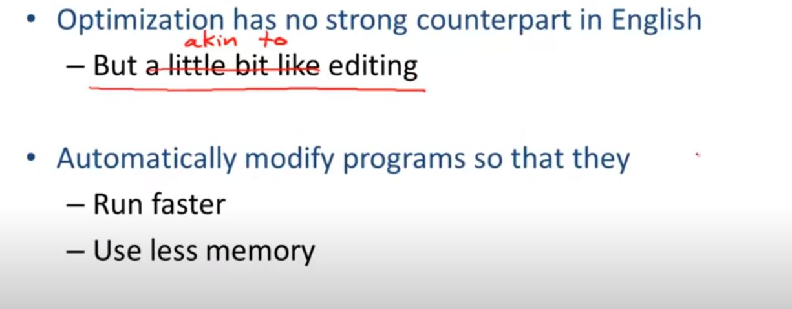
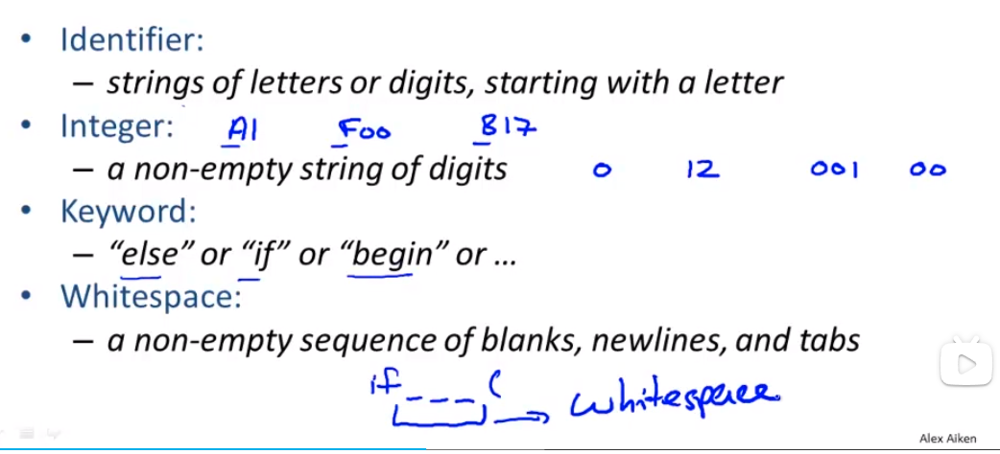

# Week 1

## 编译器和解释器







### First Step： Recongnize words

- Smallest unit above letters













  







---


## The economy of programming lanaguage?

- Why are there so many programming languages?
  - Application domains have distinctive/conflicting needs.
    - Scientific computing : good FP; good arrays; parallelism
    - Business applications: Persistence; report generation; data analysis;
    - System programing: control of resources, real time constraints.

- Why are there new programming lanaguages?
  - Programmer training is the dominant cost for a programming language.
    - Widely used languages are slow to change .
    - Easy to start a new lanaguage: Zero training cost.
  - New languages tend to look like old language.
- What is a good programming language?
  - There is no universally accepted metric for lanaguage design.


## COOL overview

- a complete compiler

  - Cool -> MIPS assembly lanaguage.

- In 5 programming assignments(PAs)

  - Write a cool program
  - Lexical analysis
  - Parsing
  - Semantic analysis
  - Code generation

  https://www.bilibili.com/video/BV1NE411376V?t=34.1&p=5


## Lexical Analysis 词汇分析

```shell
if (i == j)
	z = 0;
else
	z = 1;
```


Token Class (or Class)

- In EngList

  Noum, verb, adjective, ...

- In a programming language

  Identifier, Keywords, "(" , ',' ")", nembers

  

  

- Token Class correspond to sets of strings.

  

- 


