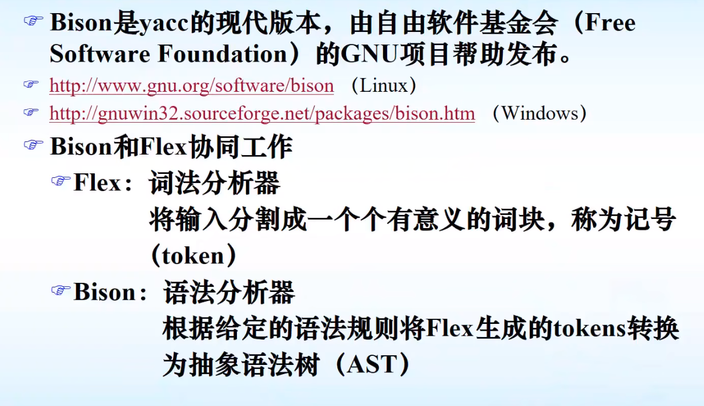

[toc]

# Flex - 快速的词法分析器生成工具

- Flex 是一种用于生成词法分析器的工具，支持通过正则表达式来对词法单元的模式进行描述。
- Flex（Flex编译器）将输入模式转换成一个状态转换图，并声称相应的代码**（核心是yylex()函数）**， 存放到文件lex.yy.c中。

- Flex的输入是后缀为.ll的文件， 该文件按照Flex语言进行编写，用以描述要生成的词法分析器。


## Flex源程序的结构

**一个Flex源程序的一般形式**


### 声明


```lex
%{ /* -*- C++ -*- */
# include <cerrno>
# include <climits>
# include <cstdlib>
# include <cstring> // strerror
# include <string>
# include <algorithm>
# include <iostream>
# include <map>
# include "demoDriver.h"
# include "demoParser.h"
%}

%{
#if defined __clang__
# define CLANG_VERSION (__clang_major__ * 100 + __clang_minor__)
#endif

// Clang and ICC like to pretend they are GCC.
#if defined __GNUC__ && !defined __clang__ && !defined __ICC
# define GCC_VERSION (__GNUC__ * 100 + __GNUC_MINOR__)
#endif

// Pacify warnings in yy_init_buffer (observed with Flex 2.6.4)
// and GCC 6.4.0, 7.3.0 with -O3.
#if defined GCC_VERSION && 600 <= GCC_VERSION
# pragma GCC diagnostic ignored "-Wnull-dereference"
#endif

// This code uses Flex's C backend, yet compiles it as C++.
// So expect warnings about C style casts and NULL.
#if defined CLANG_VERSION && 500 <= CLANG_VERSION
# pragma clang diagnostic ignored "-Wold-style-cast"
# pragma clang diagnostic ignored "-Wzero-as-null-pointer-constant"
#elif defined GCC_VERSION && 407 <= GCC_VERSION
# pragma GCC diagnostic ignored "-Wold-style-cast"
# pragma GCC diagnostic ignored "-Wzero-as-null-pointer-constant"
#endif

#define FLEX_VERSION (YY_FLEX_MAJOR_VERSION * 100 + YY_FLEX_MINOR_VERSION)

// Old versions of Flex (2.5.35) generate an incomplete documentation comment.
//
//  In file included from src/scan-code-c.c:3:
//  src/scan-code.c:2198:21: error: empty paragraph passed to '@param' command
//        [-Werror,-Wdocumentation]
//   * @param line_number
//     ~~~~~~~~~~~~~~~~~^
//  1 error generated.
#if FLEX_VERSION < 206 && defined CLANG_VERSION
# pragma clang diagnostic ignored "-Wdocumentation"
#endif

// Old versions of Flex (2.5.35) use 'register'.  Warnings introduced in
// GCC 7 and Clang 6.
#if FLEX_VERSION < 206
# if defined CLANG_VERSION && 600 <= CLANG_VERSION
#  pragma clang diagnostic ignored "-Wdeprecated-register"
# elif defined GCC_VERSION && 700 <= GCC_VERSION
#  pragma GCC diagnostic ignored "-Wregister"
# endif
#endif

#if FLEX_VERSION < 206
# if defined CLANG_VERSION
#  pragma clang diagnostic ignored "-Wconversion"
#  pragma clang diagnostic ignored "-Wdocumentation"
#  pragma clang diagnostic ignored "-Wshorten-64-to-32"
#  pragma clang diagnostic ignored "-Wsign-conversion"
# elif defined GCC_VERSION
#  pragma GCC diagnostic ignored "-Wconversion"
#  pragma GCC diagnostic ignored "-Wsign-conversion"
# endif
#endif
%}

%option noyywrap nounput noinput batch debug

/**/
%{
  // Code run each time a pattern is matched.
  # define YY_USER_ACTION  loc.columns(yyleng);
%}

/* Regex abbreviations: */

Identifier          [_a-zA-Z][a-zA-Z0-9_]*
OctConst            ("0"[0-7]*)
DecConst            ([1-9][0-9]*)
Blank               [ \t\r]
NewLine             [\n]

%%
```


### 转换规则


```flex
%%
 /* keyword */
int         {return yy::demoParser::make_INT(loc);}
return      {return yy::demoParser::make_RETURN(loc);}
void        {return yy::demoParser::make_VOID(loc);}

[+]         {return yy::demoParser::make_PLUS(loc);}
[-]         {return yy::demoParser::make_MINUS(loc);}
[*]         {return yy::demoParser::make_MULTIPLY(loc);}
[/]         {return yy::demoParser::make_DIVIDE(loc);}
[%]         {return yy::demoParser::make_MODULO(loc);}
[=]         {return yy::demoParser::make_ASSIGN(loc);}
[;]         {return yy::demoParser::make_SEMICOLON(loc);}
[,]         {return yy::demoParser::make_COMMA(loc);}
[(]         {return yy::demoParser::make_LPARENTHESE(loc);}
[)]         {return yy::demoParser::make_RPARENTHESE(loc);}
[{]         {return yy::demoParser::make_LBRACE(loc);}
[}]         {return yy::demoParser::make_RBRACE(loc);}


{Blank}+                {loc.step();}
{NewLine}+              {loc.lines(yyleng); loc.step();}
{DecConst}              {
                            std::string dec = yytext;
                            unsigned sum = 0;
                            int len = dec.size();
                            for(int i = 0;i < len;i++){
                                auto a = dec[i];
                                sum = sum * 10 + a - 48;
                            }
                            return yy::demoParser::make_INTCONST(int(sum),loc);
                        }
{OctConst}              {
                            std::string oct = yytext;
                            unsigned sum = 0;
                            int len = oct.size();
                            for(int i = 1;i < len;i++){
                                auto a = oct[i];
                                sum  = sum * 8 + a - 48;
                            }
                            return yy::demoParser::make_INTCONST(int(sum),loc);
                        }
{Identifier}            {return yy::demoParser::make_IDENTIFIER(yytext, loc);}
<<EOF>>                 {return yy::demoParser::make_END(loc);}
.                       {std::cout << "Error in scanner!" << '\n'; exit(1);}
```


### 辅助部分


```
%%

int yyFlexLexer::yylex() {
    std::cerr << "'int yyFlexLexer::yylex()' should never be called." << std::endl;
    exit(1);
}

```


## Flex中定义的一些常用变量


## Flex 如何处理二义性模式


 

# 正则表达式


 


# Bison

## Bison简介和工作原理




## Bison的输入


