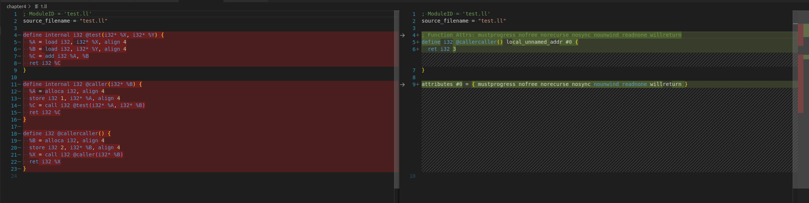

# Chapter 04 Basic IR Transformations

很多的优化是发生在IR。

1. IR is retargetable and the same set of the optimizations would be valid for a number of targets.It reduces the effort of writring the same optimizations for every target. they happend in DAG level.
2. LLVM IR is in SSA form.

## Opt Tool

Opt 是LLVM的优化器和分析器，在LLVM IR上运行去分析和优化IR。

优化等级：O0（优化粒度最小），O1，O2（优化粒度最大）,Oz or Os (deal with space optimization)

```ll
define internal i32 @test(i32* %X, i32* %Y) {
  %A = load i32, i32* %X
  %B = load i32, i32* %Y
  %C = add i32 %A, %B
  ret i32 %C
}

define internal i32 @caller(i32* %B) {
  %A = alloca i32
  store i32 1, i32* %A
  %C = call i32 @test(i32* %A, i32* %B)
  ret i32 %C
}

define i32 @callercaller() {
  %B = alloca i32
  store i32 2, i32* %B
  %X = call i32 @caller(i32* %B)
  ret i32 %X
}

# command
opt -O0 -S test.ll > 0.ll
opt -O1 -S test.ll > 1.ll
opt -O2 -S test.ll > 2.ll
```



O2中的代码优化很多的部分，直接返回3这个结果； O2优化始终于运行内联传递，**该传递内敛所有函数函数，将所有的调用函数串成一个大的函数，然后对这个函数的所有全局变量合并成一个常量。** 并消除全部或部分冗余指令。

## Pass and Pass Manager

LLVM 利用Pass机制运行许多分析和优化传递。传递的起点是Pass类，是所有Pass的超类，我们需要从一些预定义的子类中进行集成，并考虑我们的实现。

- ModulePass 通过继承这个类，我们能够一次性分析模块的全部。这个模块内的函数，可能不能按照特定的顺序引用。集成这个类需要重写runOnModule这个函数。

  pass 类的三个虚函数：

  - doInitialization: 执行不依赖当前正在处理函数的初始化操作。
  - runOn{Passtype}: 通过这个类实现pass功能。
  - doFinalization: 当runOn{Passtype} 执行完毕后，将调用此函数。

- FunctionPass 在模块中的每个函数上执行，独立于模块中的其他函数。没有定义执行顺序，不允许修改模块中的函数，要实现这个子类，需要重写上面提到的三个函数。

- BaicBlockPass: 这些函数在基本的代码块上执行。不允许增加或者删除块，也不允许修改CFG。不允许做任何ModulePass不能做的事情。要实现这个子类，需要重新FunctionPass 类的doInitializaiton 和doFinalization。

- LoopPass ....

### Using other Pass info in current Pass

为了让Pass manager 更好的工作，知道每个pass之间的依赖关系是非常重要的： 每个pass都可以自己定义他们的依赖，在执行这个pass之前，首先需要先执行analysis 

### instruction simplification example
如何在LLVM中将指令折叠成更简单的形式。不会创建新的指令。code lib/Analysis/InstructionSimplify.cpp
例如
```shell
sub i32 2, 1 -> 1
# 32位2， 1相减得到1
```


