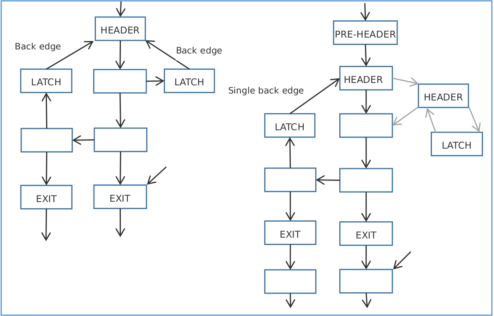

## Advanced IR Block Transformations

之前的优化是基于指令级别的优化，本章将讲述在块级别的优化， 也就是将块转换成一个更简单的形式。

### Loop Processing

CFG(Control Flow Graph)控制流图： 如何通过各个基本块来执行程序； 在CFG中，通过dominance 信息，可以看到各个基本块之间的关系。

**在CFG中，在CFG中，如果通过n的每条路径（从输入到输出）也必须通过d，则节点d支配节点n。这用d->n表示。图G=（V，E），其中V是基本块的集合，E是在V上定义的支配关系，称为支配树。**

例子：

```c++
void func() {
    int iter a, b;
    for(iter = 0; iter < 10; iter++) {
        a = 5;
        if(iter == 5)
            b = 2;
        else
            b = 5;
    }
}
```

LLVM中的所有循环优化和转换都源于位于lib/Analysis中的LoopPass.cpp文件中实现的loop pass类。LPPassManager类负责处理所有循环过程。

开始循环处理最重要的类是LoopInfo类，它用于识别代码中的自然循环，并了解CFG中各种节点的深度。自然环是CFG中的循环结构。要在CFG中定义自然循环，我们必须知道什么是后边缘：它是CFG中源主导目标的边缘。自然循环可以由定义CFG的子图的后边缘A->d来定义.

我们可以在上图中看到，后边缘6->2形成了一个由节点2、3、4、5和6组成的自然循环。

下一个重要步骤是循环简化，将循环转换为规范形式，其中包括在循环中插入一个预标头，这反过来确保循环标头有一个从循环外部进入的入口边缘。它还插入循环出口块，以确保循环中的所有出口块只有循环中的前置块。这些预头和出口块的插入有助于以后的循环优化，例如循环独立代码运动。

**循环简化还确保循环将只有一个后边缘，也就是说，如果循环标头具有两个以上的前置器。**

现在，在从LoopInfo获得所需信息并将循环简化为规范形式之后，我们**将研究一些循环优化**。

主要的循环优化之一是循环不变码运动（LICM）优化。这个过程试图从循环的主体中删除尽可能多的代码。删除代码的条件是，这段代码在循环内是不变的，也就是说，这部分代码的输出不依赖于循环执行，它将保持在循环的每次迭代中都是一样的。这是通过在preheader块中移动这段代码或将代码移动到退出块来完成的。此过程在lib/TransformsScalar/LICM.cpp文件中实现。如果我们查看循环的代码，我们会发现它需要在它之前运行LoopInfo和LoopSimplify传递。此外，它还需要AliasAnalysis信息。需要进行别名分析，以将循环不变负载和调用移出循环。如果循环中没有对存储的任何内容进行别名的加载和调用，我们可以将这些内容移出循环。这也有助于内存的标量提升。


这个测试用例有一个由测试代码中的loop块表示的循环，循环条件为br i1%cond，label%Exit，label%loop（循环的Latch部分）。我们可以看到%j值，它被用作归纳变量，是在使用phi指令后导出的。基本上，如果控件来自Entry块，则告诉选择值0；如果控件来自Loop块，则选择%Val。在这种情况下，不变代码可以被视为%loopinvar=mul i32%i，17，因为%loopinval值独立于循环的迭代，并且仅取决于函数参数。因此，当我们运行LICM过程时，我们希望这个值从循环中提升出来，从而防止在循环的每次迭代中进行计算。

```llvm
define void @func(i32 %i) {
Entry:
        br label %Loop
Loop:
        %j = phi i32 [ 0, %Entry ], [ %Val, %Loop ]
        %loopinvar = mul i32 %i, 17
        %Val = add i32 %j, %loopinvar
        %cond = icmp eq i32 %Val, 0
        br i1 %cond, label %Exit, label %Loop
Exit:            
        ret void
}
```

### 简化循环

1. 为循环插入一个前置节点(preheader),使得有一条单独的边从循环外部到循环头节点。为循环插入退出节点,使得所有退出节点的前趋节点(predecessor)都来自循环内部。插入前置节点和退出节点有助于后续的循环优化.
2. 一个循环只有一条回边。如果循环头节点的前趋节点多于两个(来自前置节点和多个循环回路),我们就得调整循环回路。一种方法是插入一个新的节点,所有回边都以它为目标,而这个新节点跳向循环头节点。



### 循环优化 LICM: loop invariant code motion

尽可能多地移出循环体中的代码。移出代码的条件是代码片段在循环中是不变的。

```shell
define void @func(i32 %i) {
Entry:
br label %Loop
Loop:
%j = phi i32 [ 0, %Entry ], [ %Val, %Loop ]
%loopinvar = mul i32 %i, 17 // 移出循环
%Val = add i32 %j, %loopinvar
%cond = icmp eq i32 %Val, 0
br i1 %cond, label %Exit, label %Loop
Exit:
ret void
}
```

## 标量进化 （不太懂）

标量进化的目的是“**一个标量在程序执行过程中如何变化**“。

一个标量由两个元素建立,一个是变量,一个是常数次运算。

常量进化的主要概念,就是观察一个包含编译时未知元素的标量,分析它在程序执行过程中如何进化,寻找可优化之处。

```shell
define void @fun() {
entry:
br label %header
header:
%i = phi i32 [ 1, %entry ], [ %i.next, %body ]
%cond = icmp eq i32 %i, 10
br i1 %cond, label %exit, label %body
body:
%a = mul i32 %i, 5
%b = or i32 %a, 1
%i.next = add i32 %i, 1
br label %header
exit:
ret void
}
```

### LLVM 本质函数

一个本质函数(intrinsic)是编译器内建的函数。编译器知道如何以最优化的方式实现它的功能,为特定的后端(backend)替换之为一组机器指令。经常地,这些机器指令内联地插入到代码中,避免函数调用的开销(在很多情况下,我们确实调用库函数。例如,对于 http://llvm.org/docs/LangRef.html#standard-c-library-intrinsics 列出的函数,我们调用 libc)。对于其它的编译器来说,它们也被称为内建函数(built-in)。在 LLVM 中,这些本质函数是在 IR 层次的代码优化过程中产生的(程序中的本质函数可以由前端(frontend)直接生成)。这些函数的名字以前缀“llvm”开头,这是 LLVM 的保留字。这些函数总是外部的,使用者不能在代码中定义它们的函数体。在我们的代码中,我们只能调用这些本质函数。

