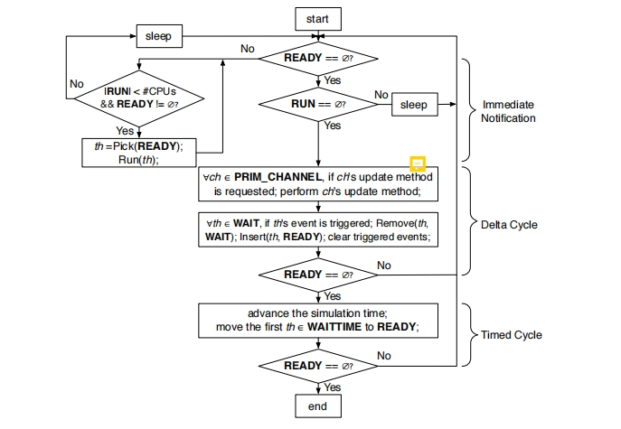
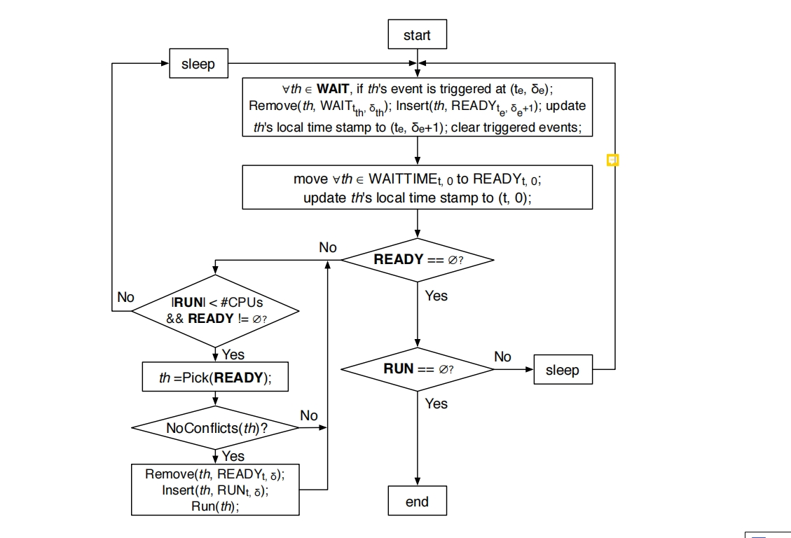

# RISC Compiler and Simualtor

## Parallel Discrete Event Scheduler

与DES相比，常规同步PDES在增量周期内并发地发出多个线程。 然后，这些线程可以在主机的可用处理器上真正的并行执行。

我的理解是：PDES是分批次并发；只有当READY和RUN队列里面的任务都并发执行完成后，才会进行下一批次。

如果一个线程在同一周期内比其他线程早完成，则将一个新的就绪线程分配给空闲的处理器内核，除非ready队列中没有可用的线程，在这种情况下，内核将保持空闲状态，直到下一个增量周期。

应该强调的是，同步pde意味着在每个增量和时间周期的末尾有一个绝对的障碍。所有线程都需要在barrier处等待，直到所有其他可运行线程完成它们当前的计算阶段。只有这样，同步PDES调度器才会恢复并执行更新和通知阶段，最后进入下一个增量或时间周期。

**流程实例执行过程中不会中断。**？？？

## Out-of-Order Parallel Discrete Event Scheduler

在OoO PDES中，我们通过将时间戳定位到每个线程来打破时间顺序（同步障碍）。每个线程都有自己的时间戳，OoO PDES放松了事件和模拟时间更新，允许更多的线程在不同嗯的模拟周期提前并行运行，这能达到更高的并行度，从而提高模拟速度。

与PDES相比，OoO PDES尽可能地将线程从WAIT和WAITTIME队列移动到