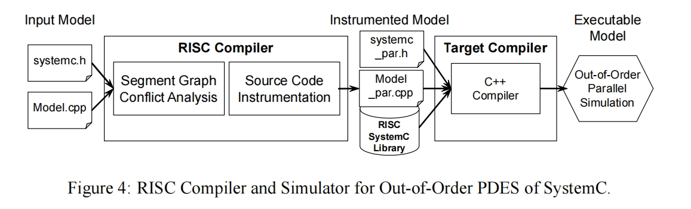

# RISC Compiler and Simualtor

## 术语

1. **Primitive Channel**. 在SystemC中，Primitive Channel（原语通道）是一种基本的通信机制，用于在SystemC模型中传递数据和信号。Primitive Channel提供了一种简单的、直接的连接方式，用于在模型中传输数据。
2. 

## Parallel Discrete Event Scheduler

与DES相比，常规同步PDES在增量周期内并发地发出多个线程。 然后，这些线程可以在主机的可用处理器上真正的并行执行。

我的理解是：PDES是分批次并发；只有当READY和RUN队列里面的任务都并发执行完成后，才会进行下一批次。

如果一个线程在同一周期内比其他线程早完成，则将一个新的就绪线程分配给空闲的处理器内核，除非ready队列中没有可用的线程，在这种情况下，内核将保持空闲状态，直到下一个增量周期。

应该强调的是，同步pde意味着在每个增量和时间周期的末尾有一个绝对的障碍。所有线程都需要在barrier处等待，直到所有其他可运行线程完成它们当前的计算阶段。只有这样，同步PDES调度器才会恢复并执行更新和通知阶段，最后进入下一个增量或时间周期。

**流程实例执行过程中不会中断。**？？？

## Out-of-Order Parallel Discrete Event Scheduler

在OoO PDES中，我们通过将时间戳定位到每个线程来打破时间顺序（同步障碍）。每个线程都有自己的时间戳，OoO PDES放松了事件和模拟时间更新，允许更多的线程在不同嗯的模拟周期提前并行运行，这能达到更高的并行度，从而提高模拟速度。

只有不发生冲突的线程才能转为运行

与PDES相比，OoO PDES尽可能地将线程从WAIT和WAITTIME队列移动到READY队列中，此外在调度流中，不再有用于经典增量周期和时间周期的特定点。增量更新很时间更新都在本地为每个线程执行。 前提是在此执行过程中不存在可能的冲突。

与图2在每个增量周期中在原始通道中执行请求的更新方法不同， 图三不再包含此步骤。由于无序调度和增量周期的中心调度点的消除，当可以服务源语通道请求发生的时候，很难在OoO PDES调度程序中确定一个有效和安全的点。但是 ，当请求基本通道更新时，始终可以安全的返回到同步PDES

请注意图3中显示的NoConficts(th)条件，正如前面提到的同步PDES一样，需要进行详细的依赖性分析，以避免并行线程之间任何共享变量的数据或事件冲突。只有当NoConficts(th)为True时，才会发出一个线程新线程并执行READY队列移动到RUN队列中。

我们将使用高级静态编译时分析来识别所有潜在的冲突，基于这些信息（一个简单的查找表就够了）， OoO PEDS调度器可以在运行时快速确定一组线程之间是否存在冲突。

## RISC Compiler and Simulator

为了实现IEEE SystemC语言中OoO PDES方法，我们现在展示我们的SystemC RISC 重新编码结构，并描述了整体的RISC编译器和模拟器概念验证原型

如图4所示，我们的RISC编译器充当前端，处理输入SystemC模型，并为OoO PDES生成带有特殊工具的中间模型。然后，通过目标编译器(一个普通的c++编译器)将仪器化的并行模型与扩展的RISC SystemC库链接，以产生最终的可执行输出模型。然后通过运行生成的可执行模型来执行OoO PDES。

从用户的角度来看，我们本质上用系统感知的RISC编译器(它反过来调用底层的c++编译器)取代了常规的与系统无关的c++编译器。否则，整个SystemC验证流程与以前保持相同。由于并行模拟，它只是更快。RISC编译器RISC和模拟器的详细Linux手册页见本报告附录A.1]，供参考。在内部，RISC编译器执行三个主要任务，即语义图(SG)构建，冲突分析和源代码检测。

3.1 Segment Graph

RISC依赖于一个由复杂数据结构组成的全面的软件栈，如图所示，

RISC的第一个任务是使用ROSE IR将SystemC输入模型解析为抽象语法树AST。接下来， RISC从AST中创建一个SystemC内部表示，它反映了SystemC模块和通道的层次结构。

在运行时，线程在运行状态（ready 和RUN队列中的线程）和等待状态（在wait和waittime队列中的线程）之间来回切换。在运行时，他们执行特定的代码端。这些代码段构成了段图中的节点，而途中的边表示从一个段到另一个段的可能的切换。换句话说，边反映了模型的控制流抽象。

3.3 冲突分析

SystemC中潜在的冲突包括数据危险，事件危险和时间危险，所有这些都可能存在于考虑并行执行的线程所执行的段中；关于这段危险的详细讨论，如果忽略这些危险，将在运行时称为危险的静态条件

