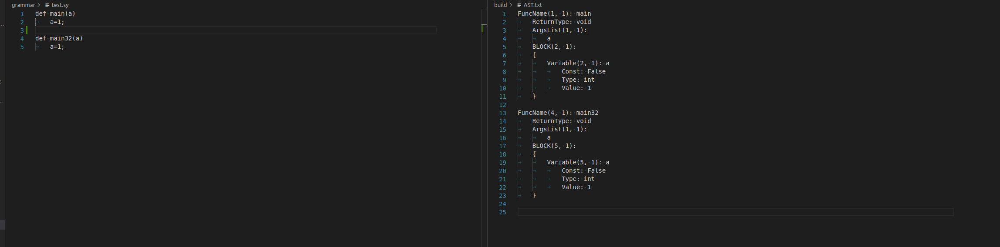
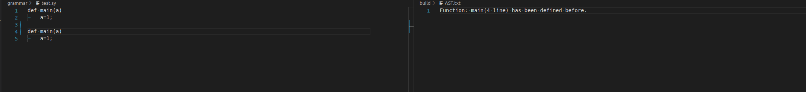
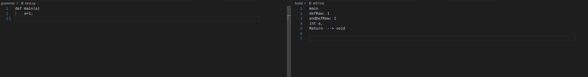

# 0613

1. 将sy格式的语法规则修改成万花筒的语法规则。

   - 支持函数定义
   - 支持函数声明
   - 支持函数调用
   - 支持变量定义， 声明

   

2. 万花筒的语义分析

   - 重复定义，语义分析时提供报错

     
     
   - 语法正常时，给出符号表
   
     
   
3. 利用LLVM 生成中间代码，

   还在做，目前了解了LLVM中间代码的规则。

​     