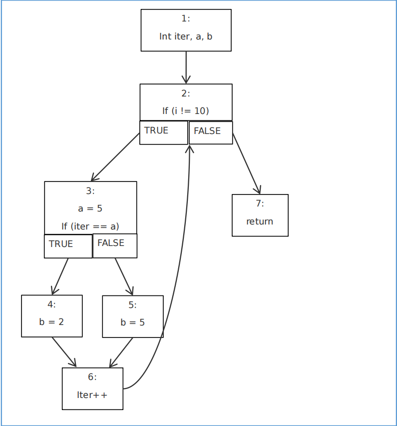
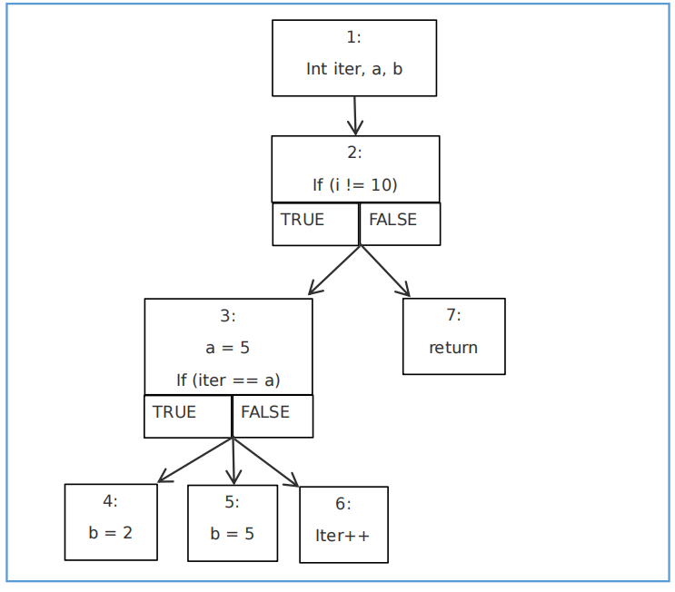

# 0727 周报

1. LLVM essential 例子实现
2. 了解SystemC，找个案例实验一下。

---
线程进行并发， 不同的线程， 存在很多的并发进程。
哪些线程是可以并发的，哪些并发是不能并发的。
通过信道、端口形成消息传递的部分，意味着消息之间要形成同步，
一个线程的端口要收到消息，收不到消息就不能运行下去。

1. 一个systemC 源码-> 源码
2. 目标机器的可执行语言； 
3. resic 系统 oppdes， 架构

## IR

```
def main(a b)
	d = 100
	f = d + 10
	c = 2;

def main2(a b)
	d = 100
	c=1
	main(d c);
```

转换后：

```ll
; ModuleID = 'codegenIR'
source_filename = "codegenIR"

define i32 @main(i32 %a, i32 %b) {
  %d = alloca i32, align 4
  store i32 100, ptr %d, align 4
  %f = alloca i32, align 4
  %1 = add ptr %d, i32 10
  store ptr %1, ptr %f, align 8
  %c = alloca i32, align 4
  store i32 2, ptr %c, align 4
}

define i32 @main2(i32 %a, i32 %b) {
  %d = alloca i32, align 4
  store i32 100, ptr %d, align 4
  %c = alloca i32, align 4
  store i32 1, ptr %c, align 4
  %1 = call i32 @main(ptr %d, ptr %c)
}
```

## LLVM essential

进展： 已看完第六章 ， 中间表示到Selection DAG.

### 第四章 基础转换 （指令级别的简化）

目的： 优化由前端编译器（frontend） 产生的 IR，利用 LLVM Pass 管理器运行一系列分析和转换 Pass。

方法：  LLVM 利用Pass机制运行许多分析和优化传递。传递的起点是Pass类，是所有Pass的超类。

1. 指令简化

   - 常量合并

     sub i32 2, 1 --> 1 

     这里，sub 指令简化成一个常数 1。

     SimplifyBinOp 方法：用于简化二元操作，例如加法，减法，乘法等。

2. 指令结合

   把一组指令序列替换为更高效的指令，消耗的机器周期数量减少，而运算结果不变。

   %Y = add i32 %X, 1

   %Z = add i32 %Y, 1

   %Z = add i32 %X, 2

### 第五章 基本块高级转换

利用 CFG 和支配关系优化循环。在处理循环时，我们将用 到循环简化（LoopSimplify）和循环不变量代码移动优化。

```c++
void fun() { 
int iter, a, b;
for (iter = 0; iter < 10; iter++)
	{ 
	a = 5; 
	if (iter == a)
    	b = 2;
    	else
    		b = 5; 
    }
}
```





回边（backedge）：在 CFG 中一条终点支配起点的边。自然循环可以由回边 a -> d 定义，其中终点 d 是头节点（header node）。

### 循环优化 LICM: loop invariant code motion

尽可能多地移出循环体中的代码。移出代码的条件是代码片段在循环中是不变的。

```shell
define void @func(i32 %i) {
Entry:
br label %Loop
Loop:
%j = phi i32 [ 0, %Entry ], [ %Val, %Loop ]
%loopinvar = mul i32 %i, 17 // 移出循环
%Val = add i32 %j, %loopinvar
%cond = icmp eq i32 %Val, 0
br i1 %cond, label %Exit, label %Loop
Exit:
ret void
}
```

### 第六章 中间表示到Selection DAG

经过一系列的分析和转换 Pass,中间表示最终成为最优化的机器无关代码。然而,它依然是实际机器代码的抽象表示。编译器必须为目标架构生成可执行的机器代码。

LLVM利用DAG，即一种有向无环图表示，实现代码生成。

LLVM 利用 DAG,即一种有向无环图表示,实现代码生成。它的思路是,将中间表示(IR)变换为 Selection DAG,经历一系列的阶段,包括 DAG 结合,合法化,指令选择,指令调度等,最后分配寄存器并输出机器代码。

### 中间代码变换到Selection DAG

```shell
define i32 @test(i32 %a, i32 %b, i32 %c) {
%add = add nsw i32 %a, %b
%div = sdiv i32 %add, %c
ret i32 %div
}
```

LLVM 提供了接口 SelectionDAGBuilder,为 IR 指令创建相应的 DAG 节点。调用：

SelectionDAGBuilder::visit(unsigned Opcode, const User &I)

根据操作码(这里是 Add),将调用相应的访问函数。在这个例子中,将调用 visitAdd(),

它进而调用 visitBinary()函数。visitBinary()函数如下:

SelectionDAGBuilder::visitBinary(const User &I, unsigned OpCode)

### 合法化Selection DAG

整个处理过程并未涉及任何目标架构的信息,而我们是在为它生成代码。对于给定的目标架构,一个 DAG 节点可能是不合法的。例如,X86 架构不支持 sdiv 指令。

### 优化Selection DAG	

LLVM IR 变换为 Selection DAG 之后,可能出现很多优化 DAG 自身的机会。这些优化发生在 DAGCombiner 阶段。这些机会出现的原因在于架构特定的指令集。

```c++
\#include <arm_neon.h> 

unsigned hadd(uint32x4_t a) { 
return a[0] + a[1] + a[2] + a[3]; 
} 
```

它的 LLVM IR 是这样的： 

```shell
define i32 @hadd(<4 x i32> %a) nounwind { 
%vecext = extractelement <4 x i32> %a, i32 3 
%vecext1 = extractelement <4 x i32> %a, i32 2 
%add = add i32 %vecext, %vecext1 
%vecext2 = extractelement <4 x i32> %a, i32 1 
%add3 = add i32 %add, %vecext2
%vecext4 = extractelement <4 x i32> %a, i32 0
%add5 = add i32 %add3, %vecext4
ret i32 %add5 }
```

**上面的过程是一个一个元素增加的，但是对于ARM高级架构，它是可以进行单向量整体加。 为了使用这条指令，需要在Selection DAG中时别这种模式。将这些DAG结合为单个DAG节点。**

这可以在 AArch64DAGToDAGISel 作指令选择时实现。 

```shell
SDNode *AArch64DAGToDAGISel::Select(SDNode *Node) 
{ ... ...case ISD::ADD: if (SDNode *I = SelectMLAV64LaneV128(Node)) 
return I;
if (SDNode *I = SelectADDV(Node)) return I; break; }
```

### 指令选择

Selection DAG 在这个阶段已经被优化和合法化。然而，指令依然不是机器代码形式。这些指令自身需要在 Selection DAG 中被映射为架构特定的指令。TableGen 类帮助选择目标特定的指令。

CodeGenAndEmitDAG()函数调用 DoInstructionSelection()函数，它访问每个 DAG 节点，为它们调用 Select()函数。Select()函数是挂钩函数，指向特定实现，用以选 择节点。它是虚函数，每个目标会实现它。

### 调度和输出机器指令

**目的：将DAG转换成机器指令。**

第一步： 指令调度。线性化DAG。输出指令序列到 MachineBasicBlock。这是由 Scheduler 完成的。

### 寄存器分配

在 LLVM 中，虚拟寄存器的 数量是无限的，而物理寄存器的数量是有限的，根据目标架构确定。因此，通过寄存器分配， 我们的目的是将最多的物理寄存器分配给虚拟寄存器。我们必须明白物理寄存器数量有限， 不总是能够为所有虚拟寄存器分配到物理寄存器。如果在某个点一个变量 V 分配不到可用 的物理寄存器，我们就需要将一个已分配物理寄存器的变量移出到内存，释放这个物理寄存器给变量 V 使用。这个过程，即将变量从物理寄存器移出到内存，称为 spilling。

寄存器分配的另一个重要的任务是解构 SSA 形式。至此在机器指令中的 Phi 指令需要 被替换为常规指令。传统的做法是把它替换为复制指令。

LLVM phi指令是LLVM编译器基础设施中的一种指令，用于实现基本块之间的值传递。

Version:0.9 StartHTML:0000000105 EndHTML:0000000354 StartFragment:0000000141 EndFragment:0000000314

**寄存器分配映射虚拟寄存器到物理寄存器**

- 直接映射

  在合适的位置插入 load 指令从内存读取变量，或者插入 store 指令存储变量到内存。

- 间接映射

  它用 VirtRegMap 类实现插入 load 和 store 指令。它同样需要从内存读取 

  变量，或者存储变量到内存。它用 VirtRegMap::assignVirt2Phys(vreg, preg)函数 

  来映射虚拟寄存器到物理寄存器。