# GPU 基本知识


> CPUs延迟导向设计
>
> 
>
> - 内存大：多级缓存机制
> - 控制复杂
> - - 分支预测
>   - 流水线数据前送
> - 运算单元强大
> - - 整型浮点型复杂运算速度快


> GPUs: 吞吐导向设计
>
> 


## GPU编程

- 计算密集型

  数值计算的比例要远大于内存操作， 因此内存访问的延时，可以被计算覆盖。

- 数据并行

  大任务可以拆解成执行相同指令的小任务，因此对复杂流程控制的需求较低。


# GPU 编程与CUDA

> CUDA(Compute Unified Device Architecture),由英伟达公司2007年开始推出,初衷是为GPU增加一个易用的编程
> 接口,让开发者无需学习复杂的着色语言或者图形处理原语。


> OpenCL(Open Computing Languge)是2008年发布的异构平台并行编程的开放标准,也是一个编程框架。OpenCL
> 相比CUDA,支持的平台更多,除了GPU还支持CPU、DSP、FPGA等设备。


##  CUDA 编程并行计算整体流程

```c++
void GPUKernel(float* A, float* B, float* C, int n)
{
    // 1. Allocate device memory for A, B, and C, 
    // Copy A and B to device memory
    
    // 2. Kernel launch code - to have the device
    // to perform the actual vector addition
    
    // 3. copy C from the device memory 
    // Free device vectors
}
```


## CUDA 编程术语： 硬件


- Device=GPU
- Host = CPU
- Kernel = GPU上运行的函数

## CUDA 编程术语： 内存模型

上面的图可能画得不是很多， 没有画出线程处理器SP 。


- CUDA中的内存模型分为以下几个层次
  - 每个线程处理器(SP)都有自己的registers（寄存器）
  - 每个SP都有自己的local memory局部存储器， register 和local memory 只能被自己的线程访问
  - 每个多核处理器（SM）都哟有自己的shared memory（共享内存），shared memory可以被线程块内所有的线程访问。
  - 一个GPU的所有SM共有一块global memory(全局内存)， 不同线程块的线程可以使用。

## CUDA 编程术语： 软件

-  CUDA中的内存模型分为几个层次
  - 线程处理器（SP）对应线程（thread）
  - 多核处理器（SM）对应线程块（thread block）
  - 设备端（device）对应线程块组合体（grid）
- 一个kernel其实由一个grid来执行。
- 一个kernel一次只能在一个GPU上执行。


## 线程块： 可扩展的集合体

将线程数组分为多个块

- 块内的线程通过共享内存，原子操作和屏障同步进行协作（shared memory, atomic operations and barrier synchronization）
- 不同块中的线程不能协作


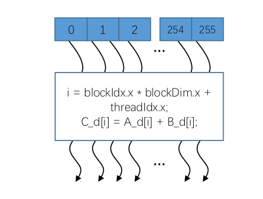


## 网格（grid）: 并行线程块组合

- CUDA 核函数由线程网格（组成）执行

- - 每个线程都有一个索引，用于计算内存地址和做出控制决策。

  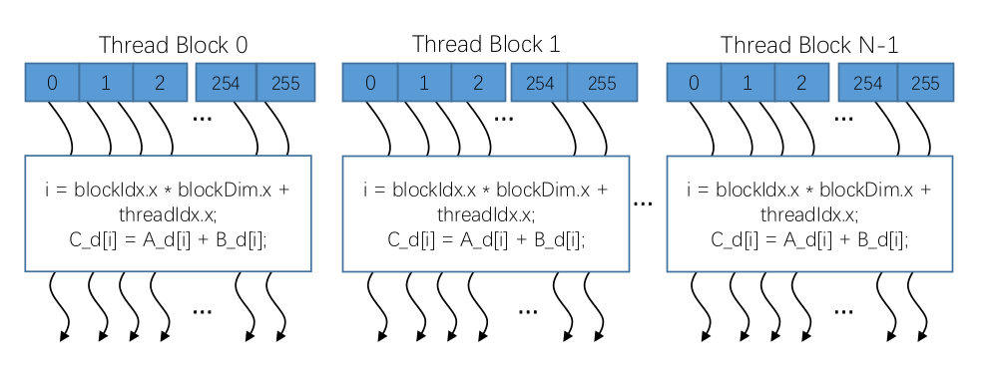

## 线程块id & 线程id： 定位独立线程的门牌号

每个线程使用索引来决定要处理的数据

- blockIdx: 1D, 2D, or 3D
- threadIdx: 1D, 2D, or 3D

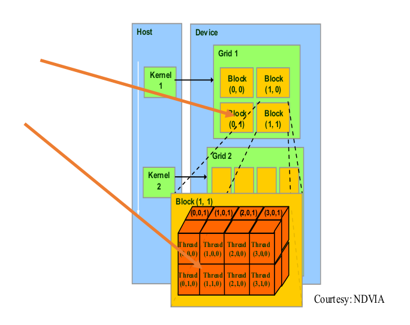

> GPU 上运行函数kernel对应一个Grid，每个Grid内有多个Block， 每个block 里面由多个Thread组成。
>
> 运行方式：
>
> Block中的thread是并行执行的
>
> Grid中的Block是独立执行的， 多个Block可以采用任何顺序执行操作，即并行，随机或者顺序操作，这种方式扩展了我们的操作空间。

## 线程id计算

- dim3 dimGrid(M,N);
- dim3 dimBlock(P, Q, S)

$$
threadId.x = blockIdx.x*blockDim.x + threadIdx.x \\
threadId.y = blockIdx.y* blockDim.y + threadIdx.y
$$

## 线程束 warp

SM 采用的时SIMT（Single-Instruction, Multiple-Thread, 单指令多线程）架构。

warp(线程束)是最基本的执行单元，一个warp包含32个并行的thread， 这些thread以不同数据资源执行相同的指令。

warp 的本质是线程在GPU上运行的最小单元。


当一个kernel被执行时， grid中的线程块被分配到SM上， *一个线程块的thread只能在一个SM上调度*， SM一般可以调度多个线程块，大量的thread可能被分配到不同的SM上。每个thread拥有自己的程序计数器和状态寄存器，并且用该线程自己的数据执行指令，这就是所谓的Single Instruction Multiple Thread(SIMT).


由于warp的大小时32， 所以block所包含的thread的大小一般要设置成32的倍数


## 作业1.2

1. 线程束warp

   GPU 的控制单元与计算单元是如何结合的， 或者说warp线程束是如何在软件和硬件端被执行的， 为什么说线程束是执行核函数的最基本单元？

   

   

2. 线程ID

   计算下图中Thread(3, 0 , 0) 的线程ID

​	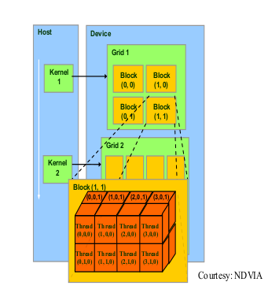


$$
thread.x = 3* 3+ 0 = 9\\
thread.y = 3*2 + 0 = 6
$$

## 并行计算实例

### CPU 加法

```c++
#include <iostream>
#include <cstdlib>
#include <sys/time.h>

using namespace std;

void vecAdd(float* A, float* B, float* C, int n) {
    for (size_t i = 0; i < n; i++)
    {
        C[i] = A[i] + B[i];
    }
}

int main(int argc, char** argv) {

    int n = atoi(argv[1]);
    cout << n << endl;

    size_t size = n * sizeof(float);

    // host memery
    float *a = (float *)malloc(size);
    float *b = (float *)malloc(size);
    float *c = (float *)malloc(size);

    for (size_t i = 0; i < n; i++)
    {
        float af = rand() / double(RAND_MAX);
        float bf = rand() / double(RAND_MAX);
        a[i] = af;
        b[i] = bf;
    }

    struct timeval t1, t2;
    gettimeofday(&t1, NULL);
    vecAdd(a, b, c, n);
    gettimeofday(&t2, NULL);
    double timeuse = (t2.tv_sec - t1.tv_sec) + (double)(t2.tv_usec - t1.tv_usec) / 1000000.0;
    cout<<timeuse<<endl;
    free(a);
    free(b);
    free(c);
    return 0;
}
```

上面的计算具有：

1. 访问内存的次数少
2. 控制简单
3. 计算简单
4. 并行度高

更加适合在GPU上进行计算。

### GPU 加法

```c++
#include<iostream>
#include<cstdlib>
#include<sys/time.h>
#include<cuda_runtime.h>

using namespace std;

__global__
void vecAddKernel(float* A_d, float* B_d, float* C_d, int n) {
    int i = threadIdx.x + blockDim.x * blockIdx.x;
    if (i < n)
    {
        C_d[i] = A_d[i] + B_d[i];
    }
}

int main(int argc, char** argv) {
    int n = atoi(argv[1]);
    cout << n << endl;

    size_t size = n * sizeof(float);
    float *a = (float* )malloc(size);
    float *b = (float* )malloc(size);
    float *c = (float* )malloc(size);

    for (size_t i = 0; i < n; i++)
    {
        float af = rand() / double(RAND_MAX);
        float bf = rand() / double(RAND_MAX);
        a[i] = af;
        b[i] = bf;
    }
    
    float *da = NULL;
    float *db = NULL;
    float *dc = NULL;

    cudaMalloc((void **)&da, size);
    cudaMalloc((void **)&db, size);
    cudaMalloc((void **)&dc, size);

    cudaMemcpy(da, a, size, cudaMemcpyHostToDevice);
    cudaMemcpy(db, b, size, cudaMemcpyHostToDevice);
    cudaMemcpy(dc, c, size, cudaMemcpyHostToDevice);

    struct timeval t1, t2;

    int threadPerBlock = 256;
    int blockPerGrid = (n + threadPerBlock -1) / threadPerBlock;

    gettimeofday(&t1, NULL);
    vecAddKernel <<< blockPerGrid, threadPerBlock >>> (da, db, dc, n);
    // gettimeofday(&t2, NULL);
    cudaMemcpy(c, dc, size, cudaMemcpyDeviceToHost);
    gettimeofday(&t2, NULL);

    double time_use = (t2.tv_sec - t1.tv_sec) + (double)(t2.tv_usec - t1.tv_usec) / 1000000.0;

    cout<<time_use<<endl;

    cudaFree(da);
    cudaFree(db);
    cudaFree(dc);
    return 0;
}
```

---

# CUDA C 编程 矩阵乘法

## 矩阵乘法 原理

$$
C = A*B（A[m, k], B[k, n], C[m, n]）
$$

**一个线程负责计算C中的一个元素**

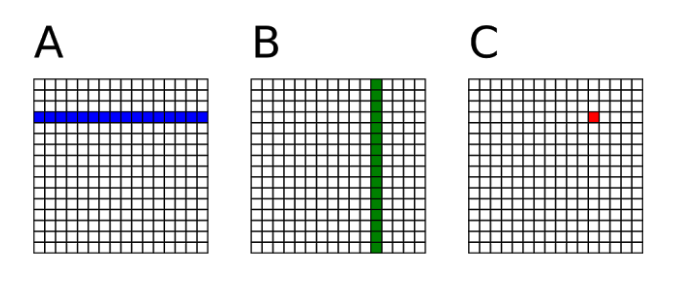

## 矩阵乘法：CPU 实现

```c++
// Matrix multiplication on the CPU host
void main() {
    define A, B, C;
     for i = 0 to M-1 do
         for j = 0 to N -1 do
             /*  compute element C(i, j) */
             for k = 0 to K-1 do
                 C(i, j) <= C(i, j) + A(i, k) * B(k, j)
             end
        end
  end
}
```

## 矩阵乘法： GPU实现

```c++
void main() {
	define A_cpu, B_cpu, C_cpu in the CPU memory;
	define A_gpu, B_gpu, C_gpu in the GPU memory;
	
	memcopy A_cpu to A_gpu;
	memcopy B_cpu to B_gpu;
	
	dim3 dimBlock(16, 16);
	dim3 dimGrid(N/dimBlock.x, M/dimBlock.y);
	
	matrixMul<<<dimGrid, dimBlock>>>(A_gpu, B_gpu, C_gpu, K);
	
	memcopy C_gpu to C_cpu;
}
```


### GPU 实现的核函数

```c++
__global__ void matrixMul(A_gpu, B_gpu, K) {
    
    temp <= 0;
    i <= blockIdx.y * blockDim.y + threadIdx.y
    j <= blockIdx.x * blockDim.x + threadIdx.x
        
   for k = 0 to k-1 do
       accu <= accu + A_gpu(i, k) * B(k,j)
   end
       
  C_gpu(i,j) <= accu
    
}
```


## 矩阵乘法

$$
C = A*B（A[m, k], B[k, n], C[m, n]）
$$

- 一个线程负责计算C中的一个元素
- A中的每一行从全局内存中载入N次
- B中的每一列从全局内存中载入M次。
- 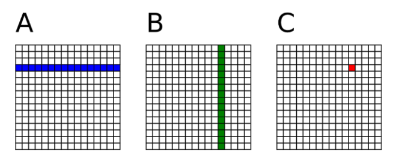

### 问题

1. C =AB的矩阵乘法运算，每个线程需要读取A的一整行和B的一整列。A矩阵中的每个点都需要被读取N次，B矩阵中的每个点都需要被读取M次。
2. 可以将多次访问的数据放到*共享内存*中，减少重复读取的次数，并充分利用共享内存的延迟低优势。

### CUDA内存的读取速度

*每个线程的读取速度对比*

- 各自线程寄存器	～1周期
- 线程块共享内存 ～5周期
- Grid全局内存 ～500 周期
- Grid常量内存 ～5 周期

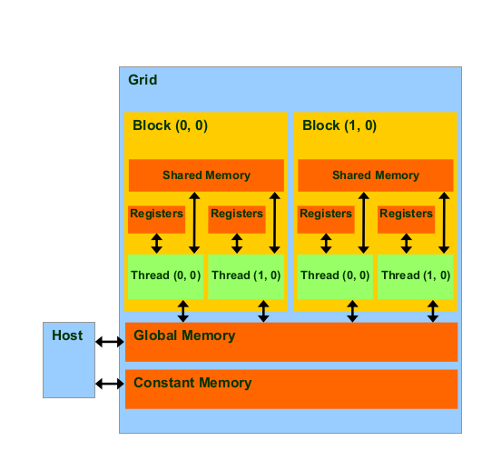

## 线程块的共享内存

- 一种特殊类型的内存， 其内容在源代码中被显式的声明和使用
  - 位于处理器中
  - 以更高的速度访问（延迟&吞吐）
  - 仍然能被内存访问指令访问
  - 在计算机体系机构中常被称为暂存存储器
- 共享内存特点
  - 读取速度等于缓存，在很多的显卡上，缓存和共享内存使用的是同一块物理硬件，并且可以配置大小。
  - 共享内存属于线程块，可以被一个线程块内所有的线程访问。
  - 共享内存有两种申请访问方式： 静态申请和动态申请
  - 共享内存的大小只有几十K， 过度使用贡献内存会降低程序的并行性。

## 共享内存的使用方法

1. 申请

   - \__shared\_\_ 关键字
   - 静态申请
   - 动态申请
2. 使用

   - 将每个线程从全局索引位置读取元素，将它存储到共享内存中
   - 注意数据存在交叉，应该将边界上的数据拷贝进来
   - 块内线程同步： \_\_syncthreads()

### 线程同步函数

- \_\_syncthreads()是cuda的内建函数，用于块内线程通信。
- 可以达到\_\_synctread的线程同步，而不是等待块内所有其他线程再同步。

```c++
__shared__ val[];
if(index < n) {
    if (tid condation) {
        do something with val;
    }
    
    __syncthreads();
    do something with val;
    __syncthreads();
}
```

```c++
__shared__ val[];
if(index < n) {
    if(tid condition) {
        do something with val;
        __syncthreads();
    } else {
        do something with val;
        __suncthreads();
    }
}
```

## 静态申请共享内存

共享内存大小明确

```c++
__global__ void staticReverse(int *d, int n) {
    __shared__ int s[64];
    int t = threadIdx.x;
    int tr = n - t - 1;
    s[t] = d[t];
    __syncthreads();
    d[t] = s[tr];
}

staticReverse<<<1, n>>>(d_d, n);
```

## 动态申请共享内存

共享内存大小不明确

```c++
__global__ void dynamicReverse(int* d, int n) {
	extern __shared__ int s[];
    int t = threadIdx.x;
    int tr = n - t - 1;
    s[t] = d[t];
        __syncthreads();
    d[t] = s[tr];
}

dynamicReverse<<<1, n, n * sizeof(int)>>> (d_d, n);
```

## 思路： 使用共享内存复用全局内存数据

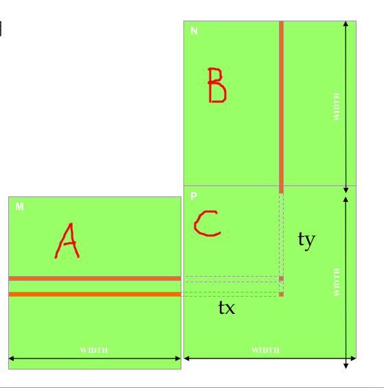

- 每个输入元素被WIDTH个线程读取
- 将每个元素加载到共享内存并让多个线程使用本地版本以减少内存带宽。

### 平铺矩阵乘法

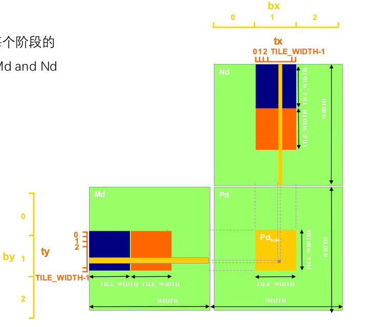

将内核的执行分解为多个阶段，使得每个阶段的数据访问再一个子集上（tile）of Md and Nd.


$$
C\_BLOCK = \sum B\_BLOCK*A\_BLOCK
$$
之前计算C_BLOCK需要读取：
$$
C\_BLOCK\_SIZE ^{2} * K *2
$$
平铺矩阵乘法：
$$
C\_BLOCK\_SIZE * K * 2
$$

### 平铺矩阵的读取

- 第一个平铺矩阵
  - M\[Row]\[tx]
  - N\[ty][Col]
- 下一个平铺矩阵元素
  - M\[Row][1*TILE_WIDTH+tx]
  - N\[1*TILE_WIDTH + ty][Col]


### 理论加速比

理论加速比Block_size


*考虑到同步函数和共享内存的读写，实际的加速比比这个值低。*

## 平铺矩阵乘法核函数

```c++
#include <iostream>
#include <stdio.h>
#include <time.h>
#include <math.h>

#include "cuda_runtime.h"
#include "device_launch_parameters.h"
#include "cublas_v2.h"
using namespace std;

#define M 512
#define K 512
#define N 512

#define BLOCK_SIZE 32   // block size, each thread to calcucate each bloc

void initial(float *array, int size)
{
    for (size_t i = 0; i < size; i++)
    {
        array[i] = (float)(rand() % 10 + 1);
    }
}

void printMaxtrix(float *array, int row, int col)
{
    float *p = array;
    for (size_t y = 0; y < row; y++)
    {
        for (size_t x = 0; x < col; x++)
        {
            printf("10lf", p[x]);
        }
        p = p + col;
        printf("\n");
    }
}

__global__ void multiplicateMatrixOnHost(float *array_A, float *array_B, float *array_C, int M_p, int K_p, int N_p) 
{
    int ix = threadIdx.x + blockDim.x * blockIdx.x; // row number
    int iy = threadIdx.y + blockDim.y * blockIdx.y; // col number

    if (ix < N_p && iy < M_p)
    {
        float sum = 0;
        for (size_t i = 0; i < K_p; i++)
        {
            sum += array_A[iy* K_p + i] * array_B[K_p * ix + i];
        }
        array_C[iy*N_p + ix] = sum;
    }
}

// Compute C = A + B

__global__ void matrixMultiplyShared(float *A, float*B, float*C, 
    int numARows, int numAColums, int numBRows, int numBColums, int numCRows, int numCColums)
{
     // @@ Insert code to implement matrix multiplication here
     // @@ You have to use shared memory for this MP

     __shared__ float sharedM[BLOCK_SIZE][BLOCK_SIZE];
     __shared__ float sharedN[BLOCK_SIZE][BLOCK_SIZE];

     int bx = blockIdx.x;
     int by = blockIdx.y;
     int ty = threadIdx.x;
     int tx = threadIdx.y;

     int row = by * BLOCK_SIZE + ty;
     int col = bx * BLOCK_SIZE + tx;

     float Cstub = 0.0;

     for (size_t i = 0; i < (int)(ceil((float) numAColums) / BLOCK_SIZE); i++)
     {
        if (i * BLOCK_SIZE + tx < numAColums && row < numARows)
        {
            sharedM[ty][tx] = A[row*numAColums + i * BLOCK_SIZE + tx];
        } else {
            sharedM[ty][tx] = 0.0;
        }

        if (i * BLOCK_SIZE + ty < numBRows && col < numBColums)
        {
            sharedN[ty][tx] = B[(i * BLOCK_SIZE +ty) * numBColums + col];
        } else {
            sharedN[ty][tx] = 0.0;
        }

        __syncthreads();

        for (size_t j = 0; j < BLOCK_SIZE; j++)
        {
            Cstub += sharedM[ty][j] * sharedN[j][tx];
        }
        __syncthreads();
     }

    if (row < numCRows && col < numCColums)
    {
        C[row * numCColums + col] = Cstub;
    }
}


int main(int argc, char** argv) {

    clock_t start = 0, finish = 0;
    float time;

    int Axy = M * K;
    int Bxy = K * N;
    int Cxy = M * N;

    float *h_A, *h_B, *hostRef, *deviceRef;
    h_A = (float *) malloc(Axy * sizeof(float));
    h_A = (float *) malloc(Bxy * sizeof(float));

    int nBytes = M * N * sizeof(float);
    
    return 0;
}
```

## CUDA Stream

CUDA stream 是GPU task的执行队列，所有CUDA操作（kernel, 内存拷贝等）都是在Stream上执行的。


CUDA stream有两种，

- 隐式流 又称默认流

  所有的CUDA操作默认运行在隐式流。隐式流里面的GPU task 和CPU端计算是同步的。

  举例： n = 1 这行代码，必须等上面的三行都执行完， 才会被执行。

  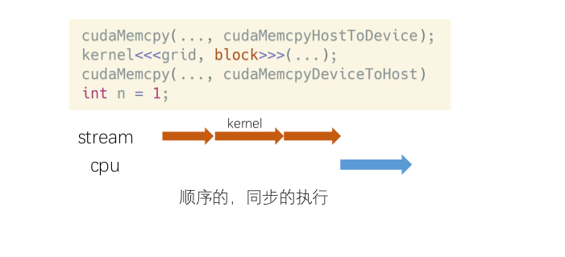

- 显式流

  显式流里的GPU task 和CPU端计算是异步的。不同显式流内GPU task的执行也是异步的。

  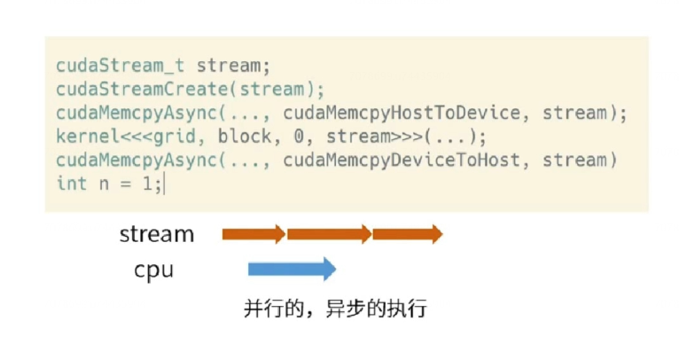


## CUDA Stream API

- 定义

  cudaStream_tstream

- 创建

  cudaStreamCreate(&stream)

- 数据传输

  cudaMemcpyAsync(dst, src, size, type, stream)

- kernel在流中执行

  kernel_name<<<grid, block, shareMemSize, stream>>>(argument list);

- 同步和查询

  cudaError_t cudaStreamSynchronize(cudaStream_t stream)

  cudaError_t cudaStreamQuery(cudaSstream_t stream)

- 销毁

  cudaError_t cudaStreamDestory(cudaStream_t stream)


---

# TensorRT 介绍

## TensorRT 是什么？

1. 高性能深度学习推理优化器和加速库
2. 低延迟和高吞吐量
3. 部署到超大规模数据数据、嵌入式或汽车产品


## TensorRT 工作流程介绍

保存好的TRT模型文件可以从磁盘重新加载到TRT执行引擎中，不需要再次执行优化步骤。


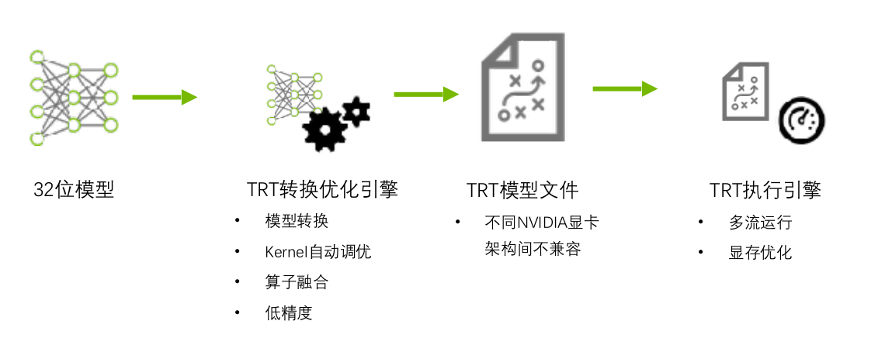

## TensorRT 优化策略介绍

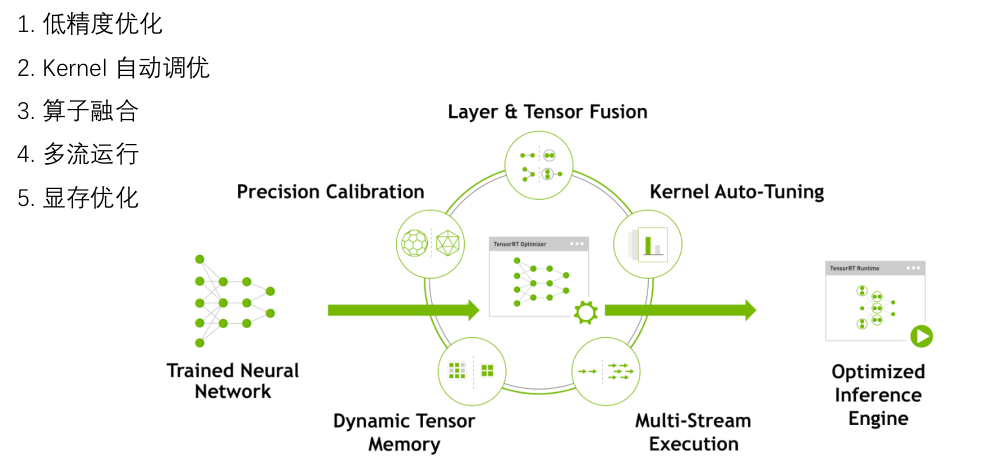

1. 低精度优化

2. Kernel自动调优

   TRT会根据当前的显卡和输入固定选择不同的分支，后续不需要再选择分支。这也解释了为什么不同的NVIDIA显卡架构间不兼容

3. 算子融合

4. 多流运行

   如下面的Google的初始结构


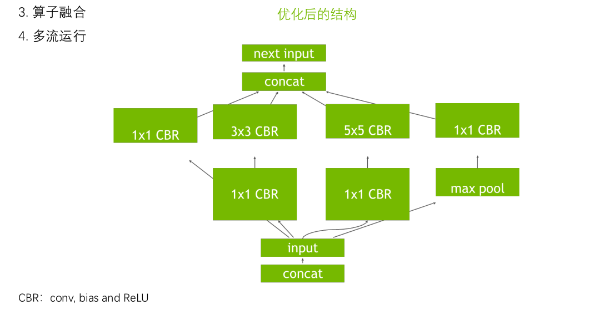


## TensorRT的组成


