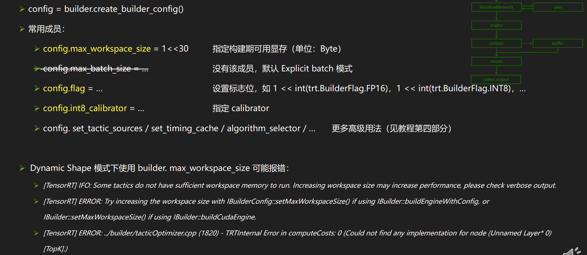

# TensorRT Part 1

## workflow 总揽


> **基本流程：**
>
> - 构建阶段
>   - 建立Logger(日志记录器)
>   - 建立Builder(网络元数据) 和 BuilderConfig(网络元数据的选项)
>   - **创建Network(计算图内容)**
>   - 生成SerializeNetwork(网络的TRT内部表示)
> - 运行阶段
>   - 建立Engine
>   - 创建Context
>   - Buffer准备（Host 端 + Device 端）
>   - Buffer 拷贝 Host to Device
>   - 执行推理
>   - Buffer 拷贝Device to Host
>   - 善后操作


### Logger 记录器

```c++
logger = trt.Logger(trt.Logger.VERBOSE)
```

- 可选参数 VERBOSE， INFO， WARNING， ERROR， INTERNAL_ERROR, 产生不同等级的日志，有详细到简单

  

### Builder 引擎构建器

- <font color=red>以后的版本，Builder仅仅作为构建引擎的入口， 配置的功能逐渐废弃，转由Builder 负责。</font>
- 

### BuilderConfig网络属性选项

- 代码

  ```c++
  config = builder.create_builder_config()
  ```

- 常用成员

  > config.max_workspace_size = 1 << 30						# 指定构建期可用显存（单位：Byte）



### Network网络具体构造

- 代码

  ```python
  network = builder.create_network()
  ```

- 常用参数

  ```python
  1 << int(tensorrt.NetworkDefinitionCreationFlag.EXPLICIT_BATCH) 使用Explicit Batch 模式
  ```

- 常用方法

  ```c++
  network.add_input('oneTensor', trt.float32(3, 4, 5)) 		// 添加网络输入张量
  convLayer = network.add_convolution_nd(xxx)					// 添加各种网络
  network.mark_output(convLayer.get_output(o))			// 标记网络输出
  ```

- 常用获取网络信息的成员

  ```c++
  network.name / network.num_layers/ network.num_inputs/ network.num_outputs
   network.has_implicit_batch_dimension/ network.has_explicit_precision
  ```

> - Explicit Batch 模式 VS Impicit Batch 模式
>   - Explicit Batch 模式是TensorRT主流Network构建方法， 而Implicit Batch模式builder.create_network(0)仅作向后兼容。
>   - 所有张量显示包含Batch维度，比Implicit Batch 模式多一维度
>   - 需要用builder.create_network(1 << int(tensorrt.NetworkDefinitionCreationFlag.EXPLICIT_BATCH))
>   - Explicit Batch 模式能做，但是Implicit Batch 模式不能做的事举例。
>     - Layer Normalization
>     - Reshape/Transpose/Reduce over batch dimension
>     - Dynamic shape模式
>     - Loop结构
>     - 一些Layer的高级用法（如ShufleLayer.set_input）
>   - <font color=RED>从Onnx导入的模型也默认使用Explicit Batch 模式。</font>
>   - 范例代码在01-SimpleDemo 中 TensorRT6和TensorRT7中保留了Implicit Batch 的例子。


> - <font color=yellow>Dynamic Shape 模式</font>
>   - 适用于<font color="red">输入张量形状在推理时才决定的</font>网络
>   - 除了Batch维度，其他维度也可以在推理时才决定
>   - 需要Explicit Batch 模式
>   - 需要Optimazation Profile 帮助网络优化
>   - 需要context.set_binding_shape 绑定实际输入数据形状。


> - Profile指定输入张量大小范围
>
>   代码
>
>   ```c++
>   profile = builder.create_optimization_profile()
>   ```
>
>   - 常用方法
>
>     ```c++
>     profile.set_shape(tensorName, minShape, commonShape, maxShape ) 		// 给定输入张量的大小，最常见，最大尺寸
>     profile.add_optimization_profile(profile)																		// 设置profile传递给config以创建网络
>     ```
>
>   


### Layer 和 Tensor

- 其实是区分计算节点和数据节点

  ```python
  oneLayer = network.add_identity(inputTensor)		# output is a layer
  oneTensor = oneLayer.get_output(0)								# get tensor from the layer
  nextLayer = network.add_indentity(oneTensor)		# take the tensor into next layer
  ```

  

### 从Network中打印所有层和张量的信息

- 从Network中打印所有层和张量的信息

  代码示例：02-API/PrintLayerInfo

  - 外层遍历所有的Layer
  - 内层循环遍历该Layer的所有input/output


### 权重迁移

- 原模型中权重保存为npz， 方便TensorRT读取。

  范例代码： 03-APIModel/TensorFlow 和 03-APIModel/pyTorch

### 逐层搭建

- 注意算法一致性和权重的排列方式

  举例： Tensorflow中LSTM多种实现，各种实现导出权重的排列顺序不同

### 逐层检验输出

- $$
  FP32模式相对误差均值1x10^{-6}; FP16模式的相对误差均值1*10^{-3}
  $$

- 在保证FP32模式结果正确后，逐步尝试FP16和INT8模式


### 常见Layer的使用范例


### FP16 模式

- 范例代码： 04-Parser/TensorFlow-ONNX-TensorRT
- config.flags = 1 << int(trt.BuilderFlag.FP16)
- 建立engine时间比FP32模式更长， 可能在各原节点插入Reformat节点
- Timeline中出现nchwToNchw等Kernel调用
- 部分层可能精度下降导致较大误差
  - 找到误差较大的层（用polygraphy 等工具，见教程第二部分polygraphy）
  - 强制该层用FP32进行计算
    - config.flags = 1 << int(trt.BuilderFlag.STRICT_TYPES)
    - layer.precision = trt.float32

### Int8 ---PTQ

- 代码范例： 04-Parser/pyTorch-ONNX-TensorRT
- 需要有校验集（输入范例的数据）
- 自己实现calibrator （如图）用于计算动态范围
- config.flags = 1 << int(trt.BuilderFlag.INT8)
- config.int8_calibrator = ...

### Int8 ---QAT

- 范例代码： 02-API/Int8-QAT, 04-Parser/pyTorch-ONNX-TensorRT-QAT
- config.flags = 1 << int(trt.BuilderFlag.INT8)
- 在pytorch中网络中插入Quantize/Dequantize层


## TensorRT运行期 （Runtime）


- 生成TRT内部表示

  ```python
  serializedNetwork = builder.build_serialized_network(network, config)
  ```

- 生成Engine

  ```python
  engine =  trt.Runtime(logger).deserialize_cuda_engine(serializedNetwork)
  ```

- 创建Context

  ```python
  context = engine.create_execution_context()
  ```

- 绑定输入输出（Dynamic Shape 模式必须）

  ```python
  context.set_binding_shape(0, [1, 1, 28, 28])
  ```

- 准备buffer

  ```python
  inputHost = np.ascontiguousarray(inputData.reshape(-1))
  outputHost = np.empty(context.get_binding_shape(1), trt.nptype(engine.get_binding_dtype(1)))
  inputDevice = cudart.cudaMalloc(inputHost.nbytes)[1]
  outputDevice = cudart.cudaMalloc(outputHost.nbytes)[1]
  ```

- 执行计算

  

### Engine 计算引擎

 Engine相当于网络计算的可执行程序

```python
serializedNetwork = builder.build_serialized_network(network, config)
engine =  trt.Runtime(logger).deserialize_cuda_engine(serializedNetwork)
```

- 常用成员

  ```python
  engine.num_bindings				# 获取engine绑定的输入输出张量的总数， n+m
  engine.max_batch_size			# 获取engine的最大batch size， Explicit Batch 模式下为1
  engine.num_layers					# 获取engine（自动优化后的）总层数
  ```

- 常用方法

  ```python
  engine.get_binding_dtype(i)			# 第i绑定张量的数据类型， 索引0 ~ (n-1)为输入张量， n ~ (n+m-1) 为输出张量
  engine.get_binding_shape(i)			# 第i个绑定张量的张量形状，Dynamic Shape 模式下结果可能为-1
  engine.bing_is_input(i)						# 第i个绑定张量是否为输入张量
  engine.get_binding_index('n')		# 名字叫n的张量在engine中的绑定索引。
  ```

### binding


### context 推理进程


### cuda 异构计算


### 构建引擎需要时间，如何构建一次，反复使用？

TensorRT 提供了序列化和反序列化技术

- 将SerializedNetwork保存为文件，下次跳过构建直接使用。
- 注意环境统一（硬件环境/ CUDA/cuDNN/TensorRT环境）
  - Engine 包含硬件有关的优化，不能跨平台使用
  - 不同的版本的TensorRT生成的engine不能互相兼容。
  - 同平台环境多次生成的engine可能不同。


# 使用Parser


 


---

# TensorRT Part 2

https://www.bilibili.com/video/BV19T4y1e7XK?t=2.3&p=2