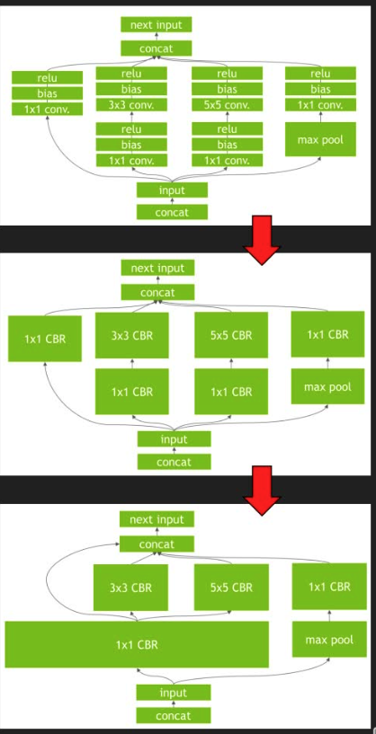

## TensorRT 简介

### TensorRT做的工作

1. 构建期

   `模型解析/建立：` 加载Onnx等其他格式的模型/使用原生API搭建模型

   `计算图优化：` 横向层融合Conv, 纵向层融合（Conv+add+ReLu ...）

   `节点消除：` 去掉无用层，节点变换

   `多精度支持` FP32 / FP16 / INT8/TF32（可能插入reformat节点）

   `优选kernel/format` 硬件有关优化

   `导入plugin` 实现自定义操作

   `显存优化`	显存池复用

2. 运行期

   `运行时环境：` 对象生命期管理，内存显存管理，异常处理

   `序列化反序列化` 推理引擎保存为文件或者从文件中加载

   

