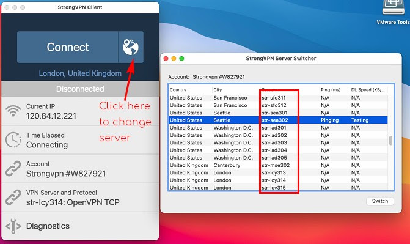
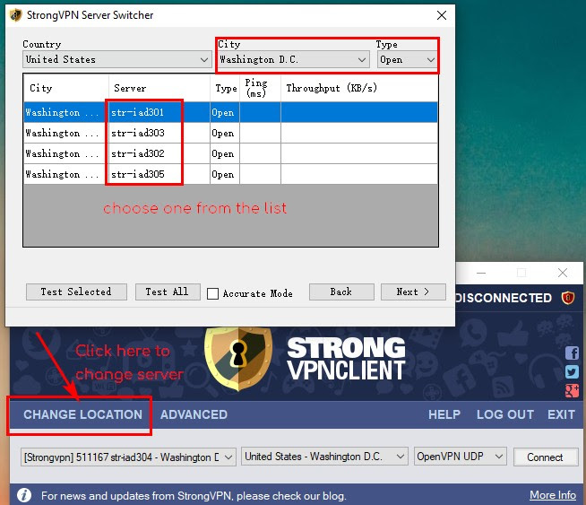
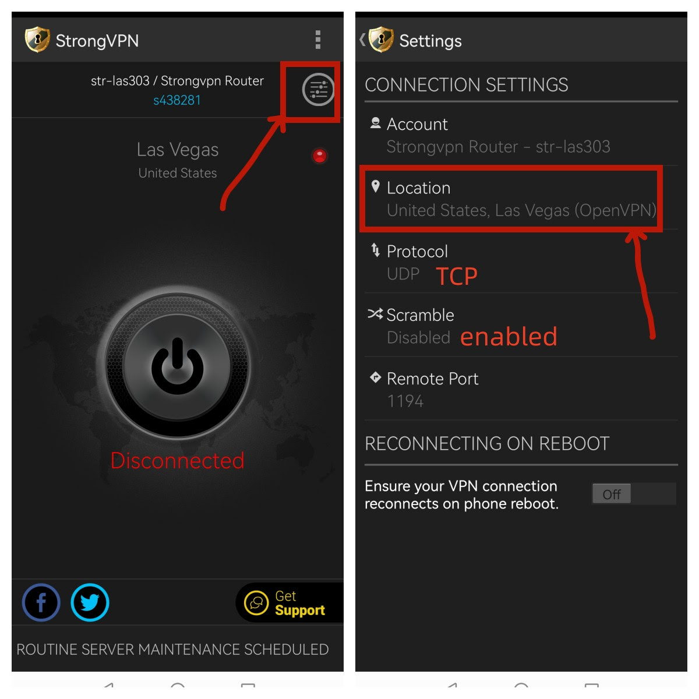

### office 365

a4759@office3-65.nl

ThunderSoft01.

---

### AppleID

3082298291@qq.com ThunderSoft01

jetbrans

menglei@bupt.edu.cn Ml@bupt.

---

### VPN

Chatgpt: menglei0427@proton.me ThunderSoft01.

StrongVPN 官网: https://intranet.strongconnectivity.com 账号 mlei081994@gmail.com  66LEUkveTE

VPN: mlei081994@gmail.com  66LEUkveTE

**如果官网下载的版本APP 无法连接或者不稳定，请下载安装下面我们的 V1 版本的 App:**
Please use our legacy V1 App for connections in China If the version downloaded from the official site is not working or is unstable.

**下载链接 Download Links:**

> **Windows**: https://mirror3.reliablehosting.com/win/StrongVPN_Win-latest.exe
>
> *如果在Windows上安装时出现 "netfx20sp2_x86 download fails" 错误，请开启windows更新，并下载安装微软的 .NET Framework.* [*https://www.microsoft.com/en-us/download/confirmation.aspx?id=21*](https://www.microsoft.com/en-us/download/confirmation.aspx?id=21)
>
> **MacOS:** https://mirror3.reliablehosting.com/mac/StrongVPN_Mac-latest.dmg
> **Android:** https://mirror3.reliablehosting.com/android/1.7.0.apk

**服务器更换：Server Change:**

> 1） Windows 请选择“ Change Location " - "By Server" 并选择 OpenVPN 服务器 进行更换, 请使用TCP protocol。
>
> 2） Mac 请点击 "Connect" 按钮隔壁的地球图示并选择 OpenVPN 服务器进行更换，请使用TCP protocol。
>
> 3）Android 请点击 右上角的 设置 - "Location" 进行更换，请使用 TCP protocol 并开启 Scramble。
>
>  
>
> \1) For Windows, please click the "Change Location" button - "By Server" and select an OpenVPN server to change, please use TCP protocol.
>
> \2) For Mac, please click the globe icon next to the "Connect" button and select an OpenVPN server to change, please use TCP protocol.
>
> \3) For Android, please click ”Settings“ in the upper right corner - "Location" to change a server, please use TCP protocol and enable Scramble.

 

这些服务器允许同时连接 12 个设备.
These servers allow up to 12 simultaneous connections.

> MacOS:
>
> 
>
>  
>
> Windows:
>
> 
>
>  
>
> Android:
>
> 
>
>  