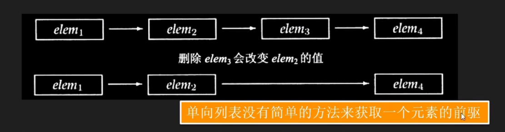
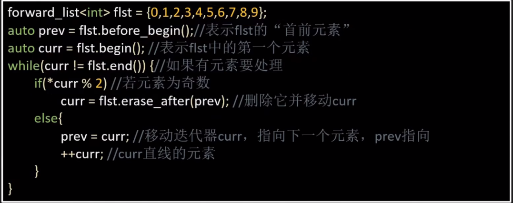

# 第九章 顺序容器

:point_left:[上一节](/ProjectDocs/C++_PRIMER/chap8.md)

## 9.3 顺序容器操作

**顺序容器和关联容器的不同指出在于两者的组织元素的方式。 不同的组织方式，直接影响了容器的存储和增删改查操作。**

**本节讲述顺序容器的所有特有操作。**

### 9.3.1 向顺序容器添加元素

**除了array外， 所有的顺序容器都是支持灵活的内存管理的。在运行时，动态添加删除元素来改变容器的大小。**

| **-**                    | **-**                                                                                                              |
| ------------------------------ | ------------------------------------------------------------------------------------------------------------------------ |
| **forward_list**         | **有自己版本的insert、和emplace**                                                                                  |
| **vector\string**        | **不支持push_front\emplace_front**                                                                                 |
| **c.push_back(t)**       | **在c的尾部创建一个由t创建的元素，返回VOID**                                                                       |
| **c.emplace_back(arg)**  | **在c的尾部创建一个由参数arg创建的元素，返回VOID**                                                                 |
| **c.push_front(t)**      | **在c的头部创建一个由t创建的元素，返回VOID**                                                                       |
| **c.emplace_front(arg)** | **在c的头部创建一个由参数arg创建的元素，返回VOID**                                                                 |
| **c.insert(p, t)**       | **在迭代器p指向元素的前面插入一个由t创建的元素，返回新添加的第一元素的迭代器。**                                   |
| **c.insert(p, arg)**     | **在迭代器p指向元素的前面插入一个由参数arg创建的元素，返回新添加的第一元素的迭代器。**                             |
| **c.insert(p, n, t)**    | **在迭代器p指向元素的前面插入n个由t创建的元素，返回新添加的第一元素的迭代器。**                                    |
| **c.insert(p, b, e)**    | **将迭代器b和e指定范围内的元素插到迭代器p指向的元素之前，b和e中不能指向c中的元素。返回新添加的第一元素的迭代器。** |
| **c.insert(p, il)**      | **il是一个花括号包围的元素值列表。**                                                                               |

#### 使用emplace 操作

新标准引入了三个成员，emplace、emplace_front、emplace_back，这三个函数操作构造函数而不是拷贝元素。对应这操作insert、push_front、push_back.

```C++
// 在c的末尾构造一个Sales_data对象， 
c.emplace_back("1000", 24, 15.99)
    
c.push_back("1000", 24, 15.99)		// 操作，只能操作对象进行拷贝。可以是临时对象
```

### 9.3.2 访问元素

| -        |                              -                               |
| -------- | :----------------------------------------------------------: |
| at       |     适用于string、vector、deque、array 物理空间是连续的      |
| back     |                     不适用于forward_list                     |
| c.font() |         返回c中首元素的引用，若c为空，函数行为未定义         |
| c[n]     | 返回c中下表为n的元素的引用，n是一个无符号整数，若n>=c.size(), 则函数行为未定义。 |
| c.at(n)  | 返回c中下表为n的元素的引用，若下标越界抛出一个out_of_range 异常 |
|          | <font color=red>对空容器调用front和back，就像使用越界的下标一样，是一种严重的程序设计错误，这种行为是未定义的。</font> |


访问成员函数返回的是引用.

<font color=green>使用auto变量保存这些函数的返回值,如果希望使用此变量能够改变元素的值,必须记得定义为引用类型.</font>

```c++
if(!c.empty()) {
    c.front = 42;
    auto& v = c.back();
    v = 1024;  					// 值已经改变
    auto v2 = c.back(); // v2不是一个引用,它是c.back()的一个拷贝
    v2 = 0;						// 未改变c中的值
}
```

### 9.3.3 删除元素

| -              | -                                                            |
| -------------- | ------------------------------------------------------------ |
|                | 删除操作会改变容器的大小,不适合array                         |
| forward_list   | 有特殊版本的erase                                            |
| forward_list   | 不支持pop_back                                               |
| vector, string | 不支持pop_front                                              |
| c.pop_back()   | 删除c中尾部元素, 若c为空,函数行为未定义.函数返回void         |
| c.pop_front()  | 删除c中头部元素, 若c为空,函数行为未定义.函数返回void         |
| c.erase(p)     | 删除迭代器p所指向的元素,返回一个指向被删除元素之后的元素的迭代器.如果p指向尾部元素,返回的是off-the-end迭代器,若p是尾后迭代器, 函数行为未定义. |
| c.erase(b, e)  | 删除迭代器b, e 所指定的范围内的元素.返回的是一个被删除元素的之后的迭代器, 若e本身就是尾后迭代器,函数也返回尾后迭代器. |
| c.clear()      | 删除c中所有的元素,返回void                                   |


 特殊的forward_list操作



> lst.before_begin()			返回指向链表首元素之前不存在的元素的迭代器, 此迭代器不能解引用. cbefore_begin 返回一个const_iterator
>
> lst.insert_after(p, t)		在迭代器p之后插入元素. t是一个对象.
>
> lst.insert_after(p, n,t) 	p后面插入n个t.
>
> lst.insert_after(p, b, e)  插入迭代器b和e之间的所有的元素. 
>
> 返回的是指向最后一个插入元素的迭代器. 如果范围为空, 则返回p; 如果p为尾后迭代器,则函数行为未定义.
>
> 
>
> lst.emplace_after(p, args)
>
> lst.erase_after(p) 删除p后的元素
>
> lst.erase_after(b,e) 删除[b,e ) 之间的元素.




## 9.4 Vector对象是如何增长的

> 为了支持快速访问,Vector是按照元素连续存储的-- 每个元素紧紧挨着.
>
> 如果没有空间容纳新元素, 就必须分配新空间来保存已有元素和新元素.
>
> 如果每添加一个元素,Vector 就执行一次内存的分配和释放,性能会慢到不可接受.
>
> 标准库采用了可以减少容器空间重新分配次数的策略:<font color=red>每次分配的空间大于所需要的空间.</font>


`容器大小管理的操作`

|                   -                    | -                                     |
| :------------------------------------: | ------------------------------------- |
|             shrink_to_fit              | 只适用Vector\string\deque,            |
| capacity 和reserve只适用Vector和string |                                       |
|           c.shrink_to_fit()            | 请将capacity()减少为和size()相同大小  |
|              c.capacity()              | 不重新分配内存的话, c可以保存多少元素 |
|              c.reserve(n)              | 分配至少能容纳n个元素的空间           |

[下次开始的地方](https://www.bilibili.com/video/BV1z64y1U7hs?t=5.9&p=49)

  :point_right:[下一节](/ProjectDocs/C++_PRIMER/chap10.md)

