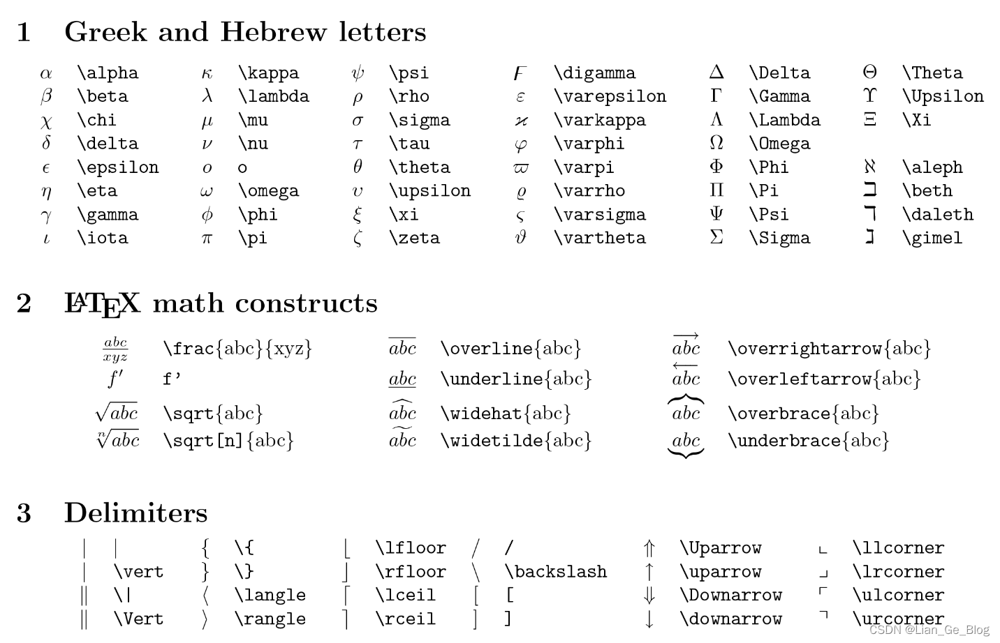
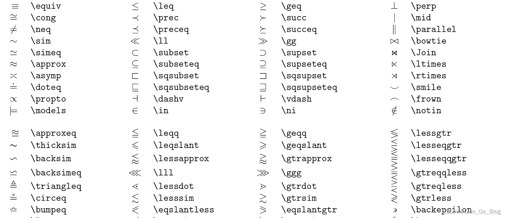
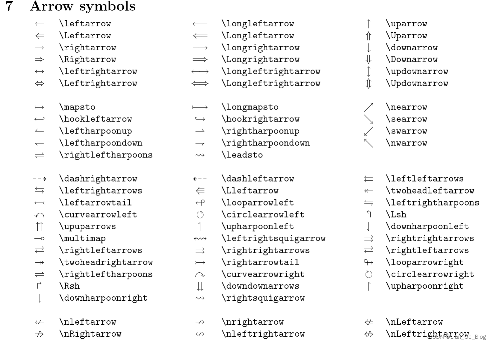
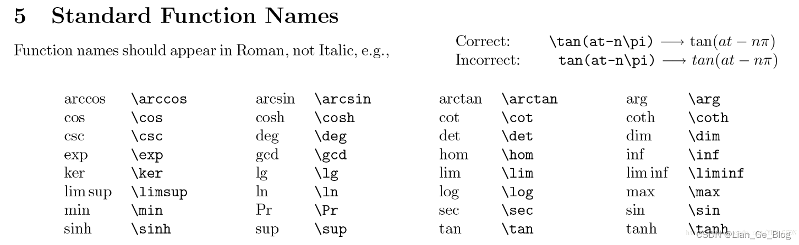
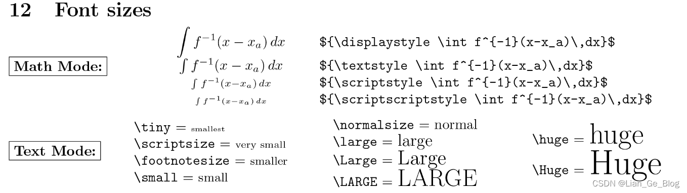

# typora 常见操作

## 2. 矩阵， 分段函数

$$
\left[
\matrix{
  1 & -1 & 1 & 1\\
 0 & 1 & -1 & -1\\
  1 & 1 & -1 & 0\\
  -1 & 0 & 1 & 0\\
  1 & 1 & 1 & -1
}
\right]
$$

$$
T_{1}（x）=\begin{cases} 1，X_{1} < 6.24 \\ -1， X_{1} >= 8.91\end{cases}
$$

## 3.常用符号
$$
\vert\{\}\Vert\langle\rangle\lfloor\rfloor\Uparrow\uparrow\downarrow\Downarrow\bigoplus\bigotimes\bigodot\ast\star\times\div....
\leftarrow\longleftarrow\Leftarrow\Longleftarrow\uparrow\Uparrow\rightarrow\downarrow.....
\leftrightarrow\Longleftrightarrow\nearrow\searrow\swarrow\nwarrow
$$

$$
\cong\equiv\neq\sim\simeq\approx\approxeq (****)
\leq\leqq\ll\lll\geq\geqq\gg\ggg(****)
\supset\supseteq\notin\in\ni\subset\subseteq
$$

$$
\sum_{i+1}^m \prod\coprod\int\oint\iint\oiint.....\infty\nabla\partial\eth\forall\exists\nexists\varnothing\mho
$$

## 4. 三角函数

## 显示字体的大小

$$
hello python \tiny hello python \large hellopython
$$
