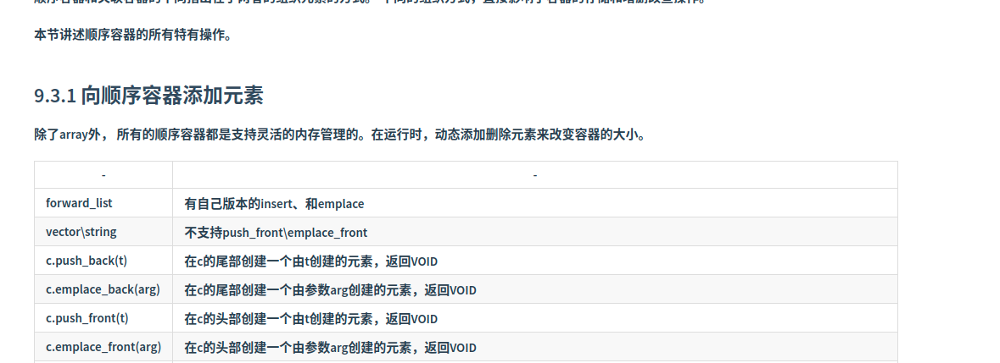

# 第九章 顺序容器

## 9.3 顺序容器操作

**顺序容器和关联容器的不同指出在于两者的组织元素的方式。 不同的组织方式，直接影响了容器的存储和增删改查操作。**

**本节讲述顺序容器的所有特有操作。**

### 9.3.1 向顺序容器添加元素

**除了array外， 所有的顺序容器都是支持灵活的内存管理的。在运行时，动态添加删除元素来改变容器的大小。**

| **-**                    | **-**                                                                                                              |
| ------------------------------ | ------------------------------------------------------------------------------------------------------------------------ |
| **forward_list**         | **有自己版本的insert、和emplace**                                                                                  |
| **vector\string**        | **不支持push_front\emplace_front**                                                                                 |
| **c.push_back(t)**       | **在c的尾部创建一个由t创建的元素，返回VOID**                                                                       |
| **c.emplace_back(arg)**  | **在c的尾部创建一个由参数arg创建的元素，返回VOID**                                                                 |
| **c.push_front(t)**      | **在c的头部创建一个由t创建的元素，返回VOID**                                                                       |
| **c.emplace_front(arg)** | **在c的头部创建一个由参数arg创建的元素，返回VOID**                                                                 |
| **c.insert(p, t)**       | **在迭代器p指向元素的前面插入一个由t创建的元素，返回新添加的第一元素的迭代器。**                                   |
| **c.insert(p, arg)**     | **在迭代器p指向元素的前面插入一个由参数arg创建的元素，返回新添加的第一元素的迭代器。**                             |
| **c.insert(p, n, t)**    | **在迭代器p指向元素的前面插入n个由t创建的元素，返回新添加的第一元素的迭代器。**                                    |
| **c.insert(p, b, e)**    | **将迭代器b和e指定范围内的元素插到迭代器p指向的元素之前，b和e中不能指向c中的元素。返回新添加的第一元素的迭代器。** |
| **c.insert(p, il)**      | **il是一个花括号包围的元素值列表。**                                                                               |

