# python并发编程

## Python对并发编程的支持

- 多线程：threading， 利用CPU和IO可以同时执行的原理，不让CPU干巴巴等待IO完成。
- 多进程： multiprocessing, 利用多核CPU的能力，真正的并发执行任务。
- 异步IO：asyncio， 在但线程利用CPU和IO同时执行的原理，实现函数异步执行。


- 使用Lock对资源加锁，防止冲突访问。
- 使用Queue实现不同线程/进程之间的数据通信，实现生产者-消费者模式
- 使用线程池Pool和进程池Pool, 简化线程/进程的任务提交、等待结果、获取结果
- 使用subprocess启动外部程序的进程，并进行输入输出交互。

## Python并发编程有三种方式

### CPU 密集型（CPU-bound）

- CPU密集型也称为计算密集型，是指I/O在很短的时间内就能完成，CPU需要大量的时间在数据的计算和处理上，特点：CPU的占用率相当高。

  解压缩苏算法、加密解密算法、正则表达式算法

### IO 密集型（I/O bound）

- IO密集型是指系统运作大部分的状况是CPU在等待I/O（硬盘/内存）的读写操作，CPU的占用率仍然较低。

  文件处理程序、网络爬虫程序、读写数据库程序

### 多进程 Process

- 优点：可以用多核CPU进行并行计算
- 缺点：占用资源多，可启动数目比线程少
- 场景： CPU密集型计算

### 多线程Thread

- 优点：相比进程，更轻量级、占用资源比较少

- 缺点

  - 相比进程：多线程只能并发执行，不能利用多CPU（GIL），一个线程只能用一个CPU。

  - 相比协程： 启动数目有限，占用内存资源，有线程切换开销。

 - 场景：IO密集型计算，同时运行的任务数目要求不多。

### 多协程Coroutine

- 优点：内存开销最少，启动协程数量最多
- 缺点：支持的库有限制（aiohttp vs requests）代码实现复杂。

- 适用：IO密集型计算，需要超多任务运行，但有现成库支持的场景。

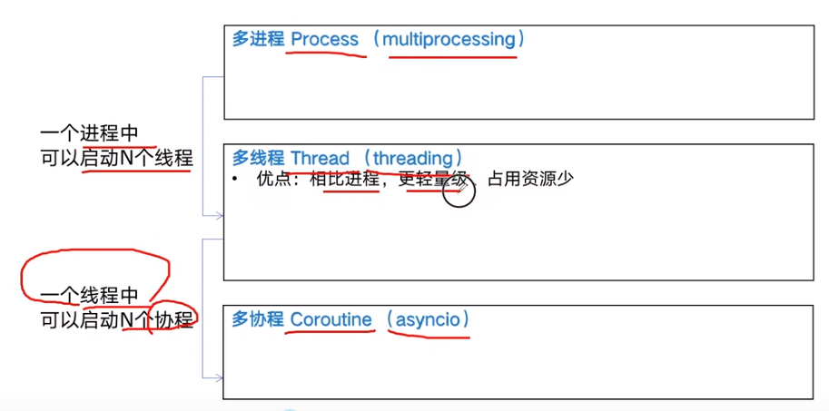


## 如何选择？

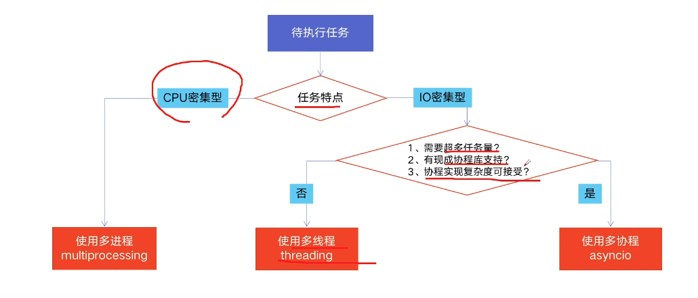


## Python 为什么慢吞吞？

Python 慢，在一些特殊场景，python 比C++慢100～200倍。


### 原因：

1. Python 是解释型语言，边解释边执行。
2. GIL 无法利用多核CPU并发执行的。


### GIL

全局解释器锁 （GLOBAL INTERPRETER LOCK，缩写GIL）

是解释器用于同步线程的一种机制，它使得任何时刻仅有一个线程在执行。

即使在多核处理器上，使用GIL的解释器也只允许同一时间执行一个线程。


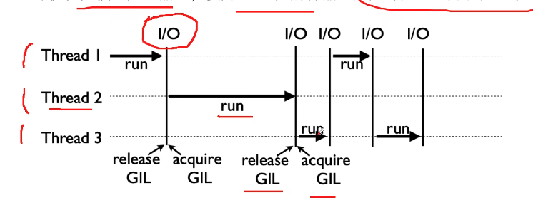

### 为什么有GIL这个东西？

> Python语言的设计初期，为了规避并发问题引入了GIL，现在想去掉也无法去除了， 已经形成软件生态。


为了解决多线程之间数据完整和状态同步问题

Python中对象的管理，是使用引用计数器进行的， 引用数为0则释放对象。


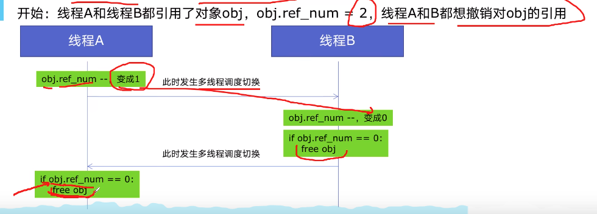


GIL 确实有好处：‵简化了对共享资源的管理‵


### 总结

1. 多线程threading机制依然有用，用于I/O密集计算。

   因为在I/O期间，线程会释放GIL， 实现CPU和IO的并行，因此多线程用于IO密集型可以大幅度提升速度。

   但是多线程用于CPU密集计算时，只会拖慢速度。

2. 使用multiprocessing的多进程机制实现并行计算、利用多核CPU优势。

   为了应对GIL的问题，Python提供了multiprocessing.


## Python 多线程实战

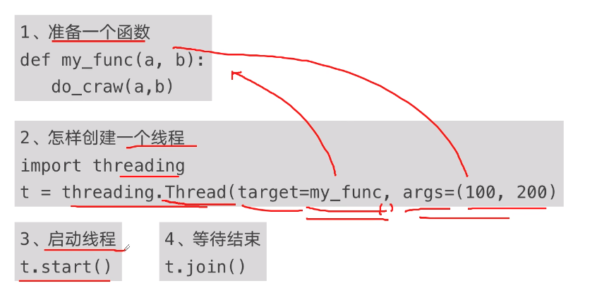


```python
import time
import threading
import requests

urls = ["https://www.cnblogs.com/#p{}".format(page) for page in range(1, 50 + 1)]


def craw(urls):
    r = requests.get(urls)

    
def single_thread():
    print("single_thread begin.")
    for url in urls:
        craw(url)
    print("single_thread end.")


def multi_thread():
    print("multi_thread begin.")
    threads = []
    for url in urls:
        threads.append(
            threading.Thread(target=craw, args=(url,))
        )
    for thread in threads:
        thread.start()
    for thread in threads:
        thread.join()
    print("multi_thread end.")


if __name__ == "__main__":
    start = time.time()
    single_thread()
    end = time.time()
    print("single thread cost: {} seconds".format(end - start))

    start = time.time()
    multi_thread()
    end = time.time()
    print("multi thread cost: {} seconds".format(end - start))
```


### python 实现生产者消费者模式

### 1. 多组件的Pipeline技术架构

复杂的事情一般不会一下子做完，而是会分为很多中间步骤一步步完成。


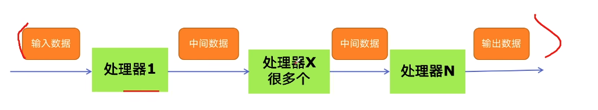


### 2. 生产者消费者爬虫的架构


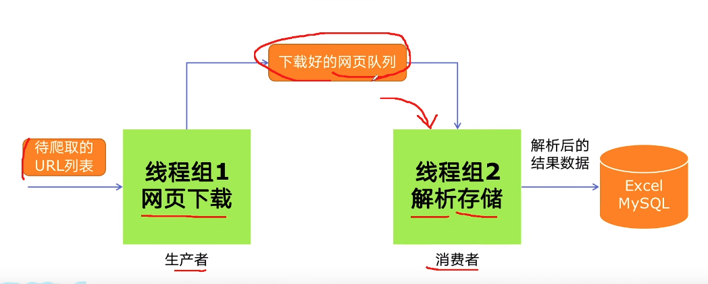


### 3. 多线程数据通信的queue.Queue

queue.Queue可用于多线程之间的、线程安全的数据通信


> 1. 导入类库
>
>    ```python
>    import queue
>    ```
>
> 2. 创建Queue
>
>    ```python
>    q = queue.Queue()
>    ```
>
> 3. 添加元素
>
>    ```python
>    q.put(item)
>    ```
>
> 4. 获取元素
>
>    ```python
>    item = q.get()
>    ```
>
> 5. 查询状态
>
>    1. 查看元素的多少
>
>       ```python
>       q.qsize()
>       ```
>
>    2. 判断是否为空
>
>       ```python
>       q.empty()
>       ```
>
>    3. 判断是否已满
>
>       ```python
>       q.full
>       ```
>
> 

### 代码实战

```python
import threading
import requests
from bs4 import BeautifulSoup
import queue
import time
import random

urls = ["https://www.cnblogs.com/#p{}".format(page) for page in range(1, 50 + 1)]


def craw(url):
    r = requests.get(url)
    return r.text


def parse(html):
    soup = BeautifulSoup(html, "html.parser")
    links = soup.find_all('a', class_="post-item-title")
    return [(link["href"], link.get_text()) for link in links]


def do_craw(url_queue: queue.Queue, html_queue: queue.Queue):
    while True:
        url = url_queue.get()
        html = craw(url)
        html_queue.put(html)
        print(threading.currentThread().name, f"craw {url} ", html_queue.qsize())
        time.sleep(random.randint(1, 2))


def do_parse(html_queue: queue.Queue, fout):
    while True:
        html = html_queue.get()
        results = parse(html)
        for result in results:
            fout.write(str(result) + "\n")
        print(threading.currentThread().name, f"result.size: ", len(results), "html_queue.size", html_queue.qsize())
        time.sleep(random.randint(1, 2))


if __name__ == "__main__":
    url_queue = queue.Queue()
    html_queue = queue.Queue()
    for url in urls:
        url_queue.put(url)

    # 3个生产者
    for idx in range(3):
        t = threading.Thread(target=do_craw, args=(url_queue, html_queue), name=f"craw{idx}")
        t.start()

    fout = open("data.txt", "w")
    for idx in range(3):
        t = threading.Thread(target=do_parse, args=(html_queue, fout), name=f"parse{idx}")
        t.start()

```

## 线程安全的概念

线程安全指的是某个函数、函数库在多线程环境中被调用时，能够正确地处理多个线程之间的共享变量，使程序功能正确完成。

由于线程的执行随时会发生切换，就造成了不可预料的结果，出现线程安全。


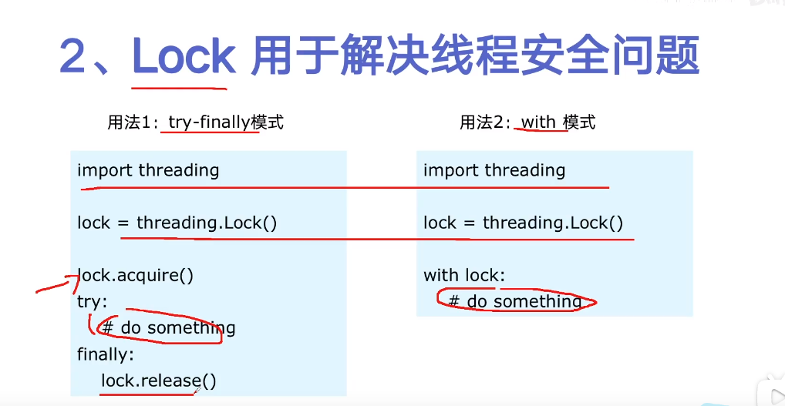


 ```python
 import threading
 import time
 
 
 class Account:
     def __init__(self, balance):
         self.balance = balance
 
 
 def draw(account, amount):
     if account.balance >= amount:
         print(threading.currentThread().name, "取钱成功.")
         account.balance = account.balance - amount
         print(threading.currentThread().name, "余额: ", account.balance)
     else:
         print(threading.currentThread().name, "取钱失败，余额不足")
 
 
 if __name__ == "__main__":
     account = Account(1000)
     ta = threading.Thread(target=draw, args=(account, 800), name="ta")
     tb = threading.Thread(target=draw, args=(account, 800), name="tb")
     ta.start()
     tb.start()
 ```


## 线程池的原理

### 线程的声明周期

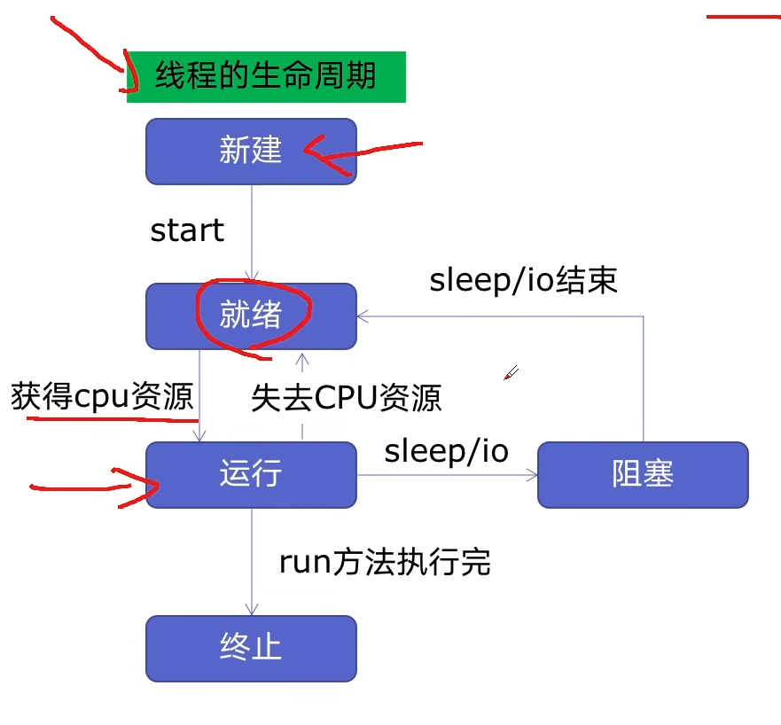


**新建线程系统需要分配资源、终止线程系统需要回收资源，如果可以重用线程，则可以减去新建/终止的开销。**


### 线程池

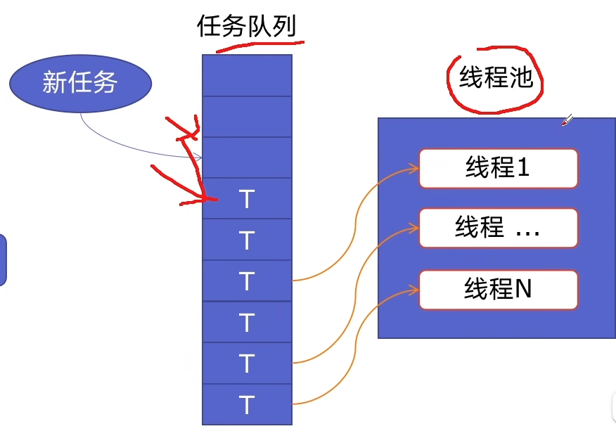


> 使用线程池的好处
>
> 1. 提升性能： 因为减去了大量新建、终止线程的开销，重用了线程资源；
> 2. 适用场景：时和处理突发性大量请求或需要大量线程完成的任务、但实际任务处理时间较短。
> 3. 防御功能： 能有效避免系统中因为创建的线程过多，而导致系统负荷过大相应变慢的问题。
> 4. 代码优势： 使用线程池的语法比自己创建执行线程更加简洁。


### ThreadPoolExecutor的使用方法


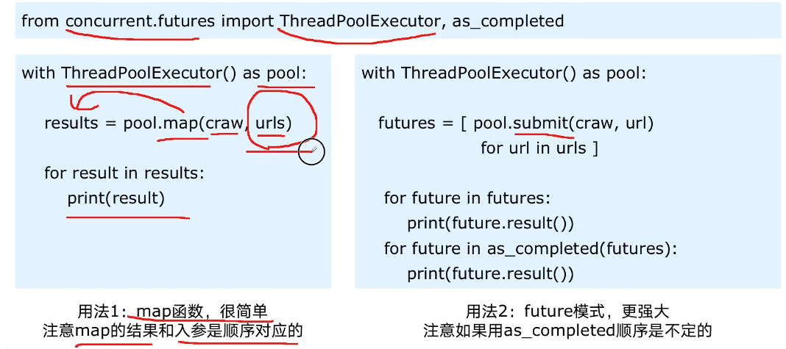


