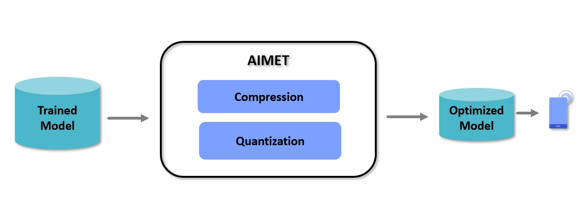

# AIMET

- AI Model Efficiency ToolKit 软件包
- 提供用户模型量化和压缩的工具
- AIMET使用后训练和微调技术优化预训练模型， 最大限度地减少量化和压缩过程中产生的精度损失。
- AIMET目前支持PyTorch、Tensorlfow和keras



## 特性

- 模型量化： AIMET可以对给定的模型模拟量化HW的行为，**使用训练后量化PTQ和微调（量化嘎吱训练-QATA）技术进行优化**
- 模型压缩：AIMET支持多种压缩技术， 去除模型中的冗余， 产生更小的模型，在目标上运行的速度更快。

## AIMET install

Release package

```url
https://github.com/quic/aimet/releases
```

