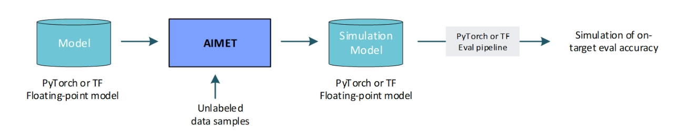
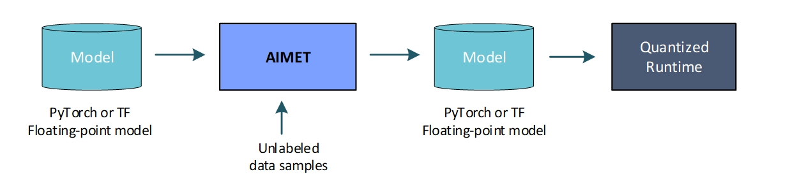
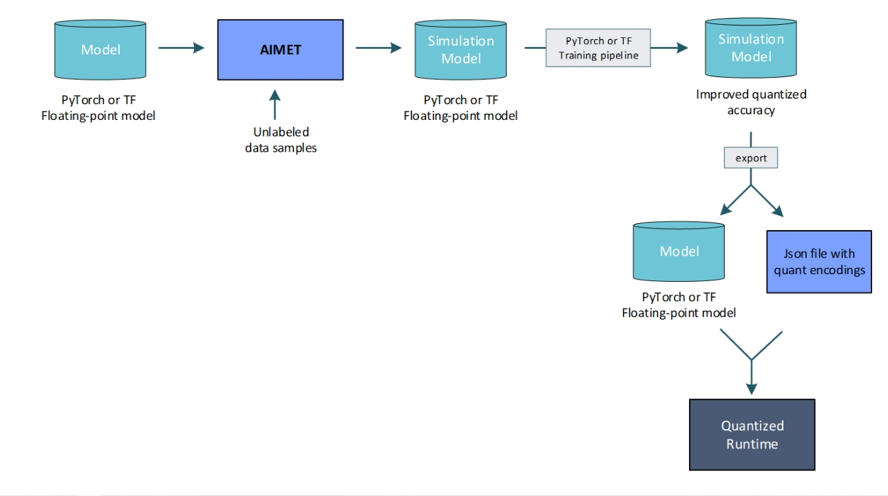

## AIMET Model Quantization

1. 模型的训练在CPU/GPU上训练

2. 推理在支持fix-precision operations 的硬件设备上时， 训练模型的浮点参数要从浮点精度(float-precision)转为固定精度(fixed-precision).

   对于某些模型，在8位固定精度上运行时， 会由于固定精度参数和固定精度操作的所增加的噪声而导致精度损失。

3. AIMET提供了多种技术和工具， 这些技术和工具有助于创建量化模型，并且相对浮点模型的精度损失最小。

## User Case

1. Predict-on-target accuracy. AIMET 能够让用户模拟量化效果，以获得在两乎目标上运行模型精度的一阶估计。

   AIMET使用代表性数据样本来计算逐层量化编码。

   

2. Post-Training Quantization(PTQ): 训练后量化因为不需要重新训练模型就可以实现量化， 所以更加量化友好。推荐PTQ作为量化工作的第一步，因为它有如下优点：

   1. 不需要原有的训练 pipline，只需要一个evalution pipline
   2. 只需要一个小的未标记的数据集进行校准，在某些场景下甚至可以不用数据校准。
   3. 快速，简单，易于使用

   

   Note： 使用PTQ技术，量化模型的精度相对于浮点模型可能仍然存在差距， 在这些场景下，或者为了进一步提高模型精度，建议进行微调。

3. Quantization-Aware Training (QAT)/Fine-Tuning 量化感知训练： 能够使用户能够通过在网络图中插入量化操作来进行微调模型，这实际上使模型参数量化噪声更具有鲁棒性。 

   1. QAT需要重新训练和使用数据集，
   2. 需要几次微调而需要更长的运行时间，

   但是它可以提供更好的准确性，特别是低位宽时。

   QAT工作流如下：

   

   ## AIMET 量化特点

   - Quantization Simulation 量化模拟

     QuantSim 允许用户通过添加量化方正操作来修改模型。当在这些量化仿真操作的模型上运行评估时，用户可以子啊量化硬件上观察到预期精度的一阶仿真。

   - 量化感知训练

     QAT 允许用户采用QnantSim模型，并通过考虑量化进一步微调模型。

     支持两种QAT模式

     1. Regular QAT

          模型参数的微调。可以更新模块的权重，偏置等可训练参数。

        The scale and offset quantization parameters for activation quantizers remain constant.

        Scale and offset parameters for weight quantizers will update to reflect new weight values after each training step.

     2. QAT with Range Learning:
        模型参数的微调。可以更新模块的权重，偏置等可训练参数。

        激活量化其的weights和bias也在每个训练步骤中更新。

   - PTQ： 训练后量化

     训练后量化可以帮助模型在不需要重新训练的情况下提高量化的精度。

     1. AutoQuant

        AIMET 提供了一个API， 这个API 集成了下面介绍的训练后量化技术。PTQ支持AutoQuant。 如果需要，可以使用独立的功能特定的api调用单个技术。

     2. Adaptive Rounding 自适应舍入

        确定权重张量的最有舍入， 以提高量化性能。

     3. 跨层均衡 Cross-Layer Equalization

        均衡连续层的权重范围

     4. BN Re-estimation

         在折叠BN层之前重新估计层统计信息

     5. 偏差矫正 已经弃用

   - Debugging/Analysis Tools  调试/分析工具

     1. QuantAnalyzer

        自动调试模型， 了解权重 激活量化的敏感性

     2. Visualizations

        权重和激活范围的可视化和直方图

   ## AIMET量化工作流

   ```
   https://quic.github.io/aimet-pages/releases/latest/user_guide/model_quantization.html#ug-model-quantization
   ```