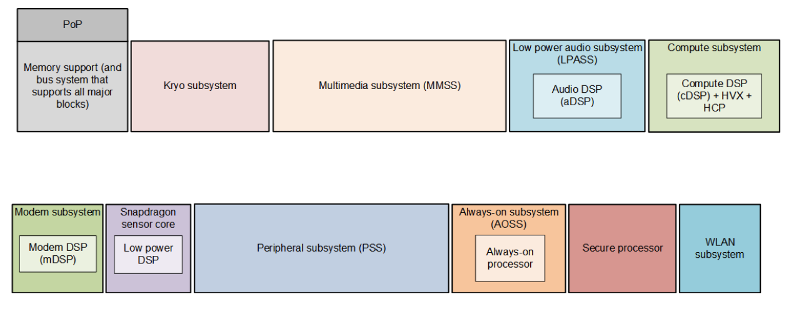
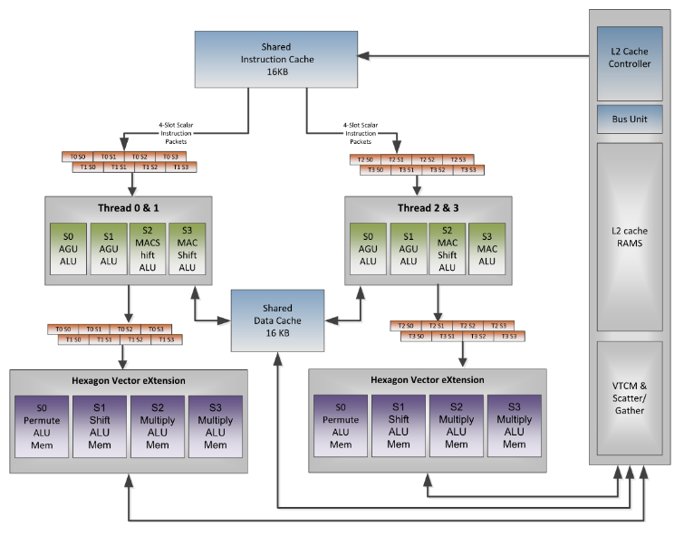
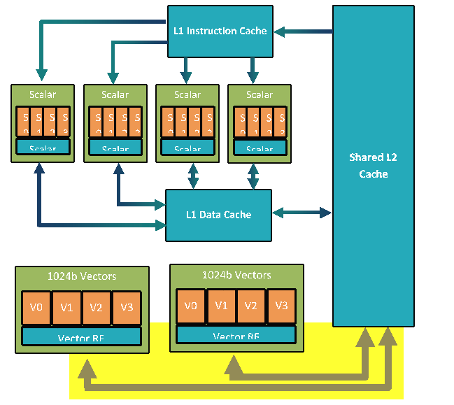

# Hexagon SDK overview

## 术语

**ALU operation**

ALU is the short of Aricthmetic Logic Unit(算术逻辑单元)；ALU是计算机处理器中的一个关键组件，负责执行各种算术和逻辑运算。ALU可以执行包括加法、减法、乘法、除法、位移、逻辑与、逻辑或、逻辑非等操作。它接收输入数据，并根据指令对数据进行操作，然后生成输出结果。

 **Instruction Set Architecture** 指令集架构

HVX 	Hexagon Vector eXtensions.

---

## Hexagon SDK的作用

**支持Qualocomm嵌入式计算设备，编写在CPU端执行的应用程序，并将计算任务卸载到DSP上的过程。**

## SDK components

├── addons
├── build
├── docs
├── examples	   Code examples
├── incs				Public header files needed to access system-level software libraries
├── ipc				  Inter-processor communication libraries providing [FastRPC](software/ipc/rpc.html) support
├── libs				 System-level software libraries and Hexagon libraries
├── readme.txt
├── rtos				[Real-time DSP OS](pdf/80-VB419-178_B_QuRT_User_Guide.pdf)
├── setup_sdk_env.source
├── tools			  Development tools (see ***Tools\*** tab)
└── utils			   Helper scripts to automate tasks commonly performed by developers

## Development process

为高通嵌入式设备开发基于Hexagon功能的过程通常涉及下面的几个步骤：

1. 使用C/C++开发你的核心算法。比如在x86环境中。
2. Once the workload is functional and the top-level API's are defined, build it as a Hexagon shared library and an executable test driver that exports main(), as is done with the examples in this SDK.
3. [Build](tools/build.html), [execute](tools/run.html), [debug](tools/debug.html), and [profile](tools/profile.html) the test driver **on the Hexagon ISS (Instruction Set Simulator)** and/or target device.
4. 准备将共享 Hexagon 库集成到运行时 HLOS 应用程序或多媒体框架中。 为此，请使用 SDK 的 FastRPC 框架为共享 Hexagon 库构建处理器间接口。 这可能需要更新共享库和测试驱动程序才能使用 RPC 接口。
5. 使用SDK中的技术来优化和增强Hexagon 共享库。

## Architecture overview

高通的移动芯片家族一共分为5层，分别是高端SM8XXX 系列、中端系列SM7XXX系列，低端系列SM6XX， SM4XX and SM2XX系列。

由低到高，处理器数量增加、处理器复杂性增加、时钟速度加快。

下图概述了一种具有代表性的高端产品：SM8150 芯片组。 处理单元包括一个 Kryo CPU、一个 Adreno 640 GPU 和四个 Hexagon DSP，每个专用于特定的应用空间：传感器 (sDSP)、调制解调器 (mDSP)、音频 (aDSP) 和计算 (cDSP)。

每个 Qualcomm 芯片都包含多个 Hexagon DSP，例如计算 DSP (cDSP)、音频 DSP (aDSP) 和传感器 DSP（SLPI - 传感器低功耗岛）。 这些 DSP 中的每一个都实现特定的指令集架构 (ISA) 版本。 此 Hexagon SDK 支持的 ISA 如下：

- V65
- V66
- V68

The compute DSP(cDSP), 主要是处理计算密集的任务，比如图像处理，计算机视觉，camera 流，还包括用于fixed-point(定点)向量运算的指令集扩展，称为Hexagon Vector eXtensions(HVX) 。 从 Lahaina 开始，cDSP 被称为 Qualcomm® Hexagon™ 张量处理器（**Qualcomm® Hexagon™ Tensor Processor**），以反映其高效处理神经网络张量数据的能力。

Compared to the host CPU, `the DSP typically runs at a lower clock speed but provides more parallelism opportunities at the instruction level`. This often makes the DSP a better alternative in terms of throughput and/or power consumption. As a result, it is `preferable to offload as many large compute-intensive tasks as possible onto the DSP `to reduce power consumption of the device and free up cycles on the CPU for additional features. `[RPC](software/ipc/rpc.html) is the main mechanisms allowing to offload tasks onto the DSP.`

下图概述了 cDSP 内的处理单元以及它们如何连接到内存缓存。

#### Hexagon Core

Hexagon Core 由多个DSP硬件线程组成，大多数的cDSP有4-6个线程。每个DSP硬件线程都可以访问Hexagon标量指令，这些指令在32位寄存器上执行定点和浮点运算，可以是单个或一对寄存器。

每个数据单元能够进行最多64位宽的加载或存储，或者进行32位标量ALU操作。

每个执行单元能够进行16/32/64位矢量乘法、ALU运算、位操作、移位或浮点运算。

在V66之前，标量浮点和乘法资源由所有执行单元共享。这意味着所有组合的硬件线程每个处理器周期最多执行一次每个操作。从V66开始，每个簇都有自己的浮点和乘法资源。

如上图所示，簇指的是一对线程（线程0和1，线程2和3）。在一个簇内，这两个线程通常在交替的时钟周期上提交指令包，因为大多数指令需要至少两个时钟周期来完成。在最佳情况下，每个簇在每个DSP时钟周期内完成一个指令包，只要避免停顿，就可以获得（2 * DSP时钟）每秒的总吞吐量。（有关最小化延迟的指南，请参阅关于DSP优化技术的讨论。）

#### Hexagon HVX unit

HVX 是一个协处理器，为cDSP提供128位字节向量处理功能。标量硬件线程通过HVX 寄存器文件（也成为HVX上下文）使用HVX协处理器。

指令包流经标量 Hexagon 管道，其中包含的任何标量指令均在此处进行处理。

然后指令继续进入 HVX 矢量 FIFO。
因此，HVX 指令可以与标量指令混合，即使在同一指令包内也是如此。

#### Hexagon HMX unit

Hexagon HMX单元 HMX是在Lahaina中引入的矩阵引擎，用于提供卷积操作的非常高的吞吐量。

该SDK不直接暴露HMX指令。HMX加速仅通过机器学习库和工具（如QNN SDK）提供，该工具允许神经网络在Lahaina上运行，并广泛使用HMX引擎

### Memory subsystem

The following diagram provides an overview of the DSP memory subsystem.

cDSP 具有两级高速缓存子系统。 L1 只能由标量单元访问，这使得 L2 成为标量单元的第二级存储器和 HVX 协处理器的第一级存储器。

L1只支持写入操作，这使得缓存可以实现硬件一致性。为了保持一致性，如果HVX存储命中L1，则会使L1行无效。向量单元支持各种加载/存储指令，包括对非对齐向量和按字节条件存储的支持。

为了让HVX硬件读取L2内容并隐藏L2读取延迟，使用了一个流水线化的向量FIFO。有关内存延迟的更详细讨论，请参阅优化指南中的内存部分。

cDSP还包括一个紧密耦合的存储器（TCM），称为VTCM（Vector TCM）。VTCM是一种低功耗存储器，提供了大约是L2带宽的两倍，并减少了存储到加载的延迟。VTCM在执行分散-聚集查找操作和使用HMX引擎时是必需的。
