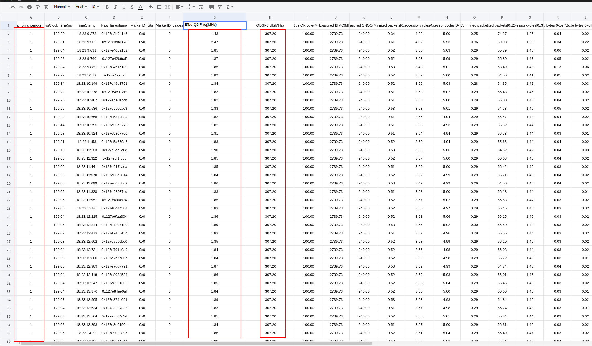
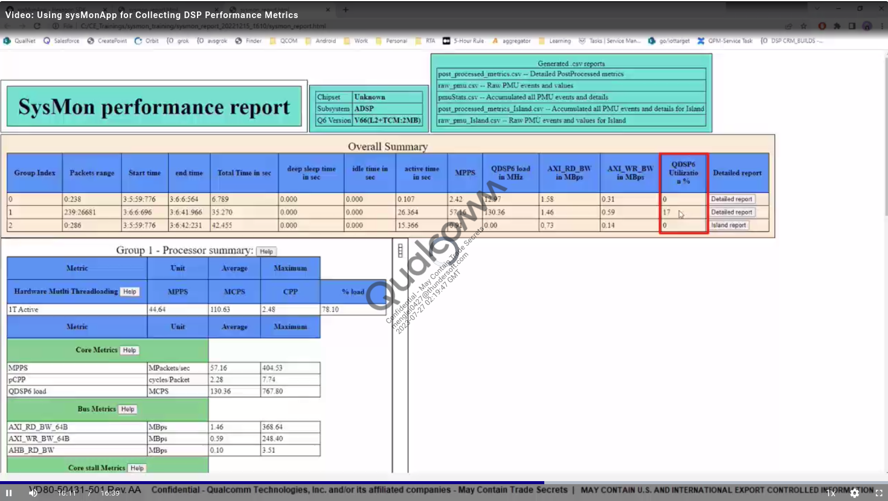

## Using sysMonApp for Collectiong DSP Performance Metrics

**sysMon APP is for collectiong DSP performance metrices.**

sysMonApp is an `Android application` that configures and displays from multiple performance-related services on the cDSP, aDSP and sDSP.

### Steps

Collectiong performance metrics using sysMonApp includes the following steps.

#### 1. Setup sysMonApp

- Go to Hexagon_SDK/<version>/tools/utils/sysmon

  

- select the approrpriate sysMonApp file and parser.

- push the execuable file to the device and chmod 777 the file.

  ```shell
  adb push sysMonApp_64Bit /data/local/tmp/
  adb shell chmod 777 /data/local/tmp/sysMonApp_64Bit
  ```

- For more detailed info, please check the document `Hexagon_SDK/<version>/docs/tools/sysmon_app.html`

#### 2. Capture profile data

Lets look at a demo, which shows the steps to capture the performance metrics of  a use case.

```shell
kona:/data/local/tmp # ./sysMonApp_64Bit profiler --samplingPeriod 1 --q6 adsp 
```

Note: Sampling period is the time interval between snapshots capturing the performance metrics.

#### 3. Parse profile data

```
(base) ts@menglei:~/sysmon/parser_linux_v2/HTML_Parser$ ./sysmon_parser sysmon.bin 
sysmon_bin_size = 7512
Found header packet: 66, c, c
Processed packets : 0
Profiled duration 8394.563 Accumulated sample duration 8523.762

Total NPA packets : 1
Total DCVS packets : 1
Total Profiler packets : 66
Total DSPPM packets : 1
Finding different packet types
Computing average of PMU metrics
Computing average of other metrics
Generating post processed csv report
Generating raw csv report
Generating PMU accumulated csv report
Generating html report
Generating html report done
Generating Summary csv report

```

#### 4. Analyze reports

1. **post_processed_metrics.csv**

   

   - Sampling period is one millisecond(ms)

   - QDSP6 core is runing at  307.20 MHz.

     Processing modules will vote based on requirements.

     DSP PM aggregates the voting requests and sets the QDSP6 clock to meet the requirements.

     When there is no voting from modules, then aDSP PM sets the QDSP6 core clock to lower frequency.

     When voting from modules is very high, then aDSP PM sets the core clock to turbo. 
     
   
   - Effec Q6 Freq(MHz)
   
     The modules will not always utilize the maximum MHz. If there is no processing involved, modules use less MHz.
   
2. **sysmon_report.html**

   