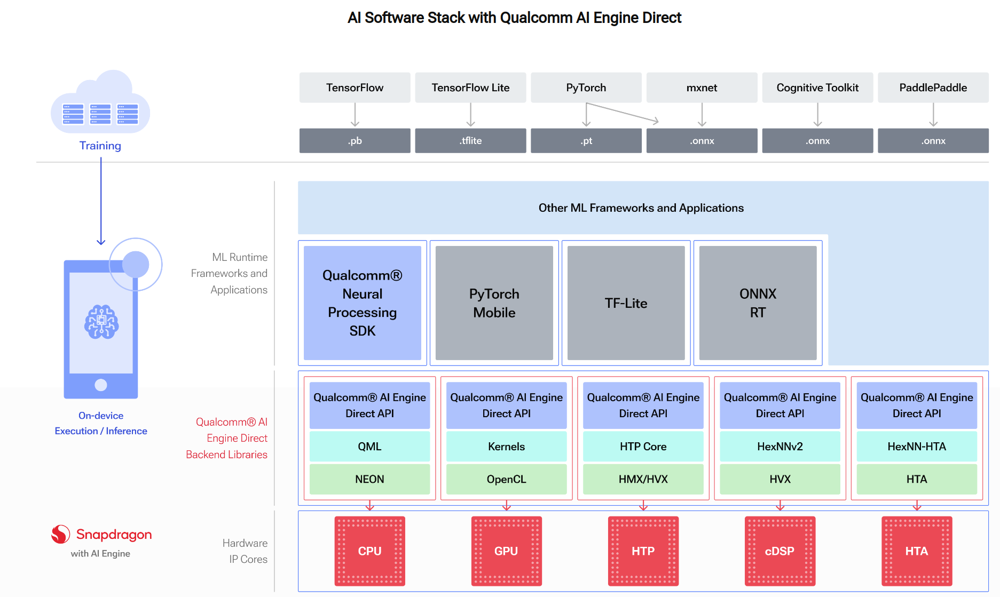
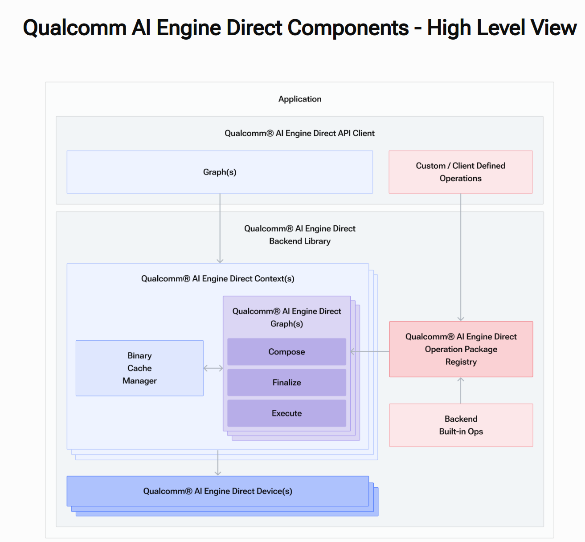
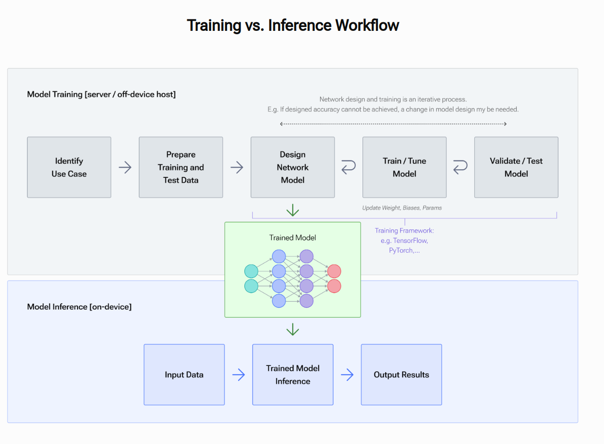
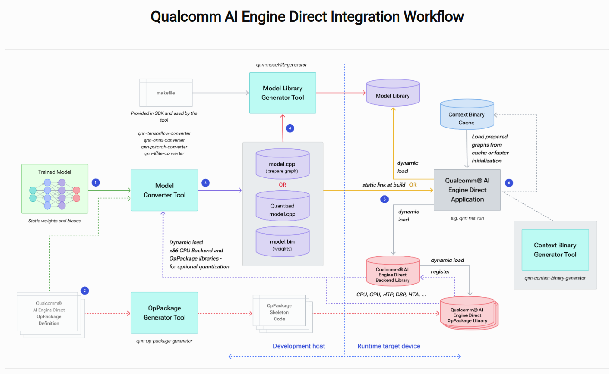

# QNN Overview

| eNGLISH                                                      | CHINA                | SHORT |
| ------------------------------------------------------------ | -------------------- | ----- |
| Qualcomm Technologies Inc                                    | 高通股份有限公司     | QTI   |
| Qualcomm® [AI Engine Direct](introduction.html#qnn-ai-engine-note) architecture | 高通边缘人工智能框架 |       |
|                                                              |                      |       |
|                                                              |                      |       |
|                                                              |                      |       |
|                                                              |                      |       |
|                                                              |                      |       |
|                                                              |                      |       |

---

Qualcomm® [AI Engine Direct](introduction.html#qnn-ai-engine-note) architecture is designed to provide an unified API and modular and extensible per-accelerator libraries which form a reusable basis for full stack AI solutions, both QTI’s own and third party frameworks (as illustrated with [AI Software Stack with Qualcomm AI Engine Direct](#qnn-sw-stack-figure) diagram).

## Features

**Modularity based on hardware accelerators**

The Qualcomm® [AI Engine Direct](introduction.html#qnn-ai-engine-note) architecture is designed to be modular and allows for clean separation in the software for different hardware cores/accelerators such as the CPU, GPU and DSP that are designated as *backends*.

The Qualcomm® AI Engine Direct backends for different hardware cores/accelerators are compiled into individual core-specific libraries that come packaged with the SDK.

**Unified API across IP Cores**

One of the key highlights of Qualcomm® [AI Engine Direct](introduction.html#qnn-ai-engine-note) is that it provides a unified API to delegate operations such as graph creation and execution across all hardware accelerator backends. This allows users to treat Qualcomm® [AI Engine Direct](introduction.html#qnn-ai-engine-note) as a hardware abstraction API and port applications easily to different cores.

**一定级别的抽象**

The Qualcomm® [AI Engine Direct](introduction.html#qnn-ai-engine-note) API 旨在支持高效的执行模型， 内部有一些图优化等功能。但与此同时，这遗漏了更广泛的功能，例如模型解析和网络分区到更高界别的框架。

**可扩展算子**

支持客户集成自定义算子，以便与内置算子无缝协作。

**提高执行效率**

凭借优化网络加载和异步执行支持，能为机器学习框架提供高效的接口，以便在所需的硬件加速器上加载和执行网络。

## Software Architecture

### Device

硬件加速平台的软件抽象。提供了关联所需的硬件加速器资源以执行用户组成的图所需要的所有构造。一个平台可以被分解成多个设备，设备可能有多个核心。

### Backend

后端是一个顶级的API组件，它托管和管理图组合和执行所需的大部分后端资源，包括存储所有可用算子的算子注册表。

### Context 上下文

语境
代表维持用户应用程序所需的所有 Qualcomm® AI Engine Direct 组件的构造。 托管用户提供的网络，并允许将构造的实体缓存到序列化对象中以供将来使用。 它通过提供可共享的内存空间（可以在图之间交换张量）来实现多个图之间的互操作性。

### Graph 图

表示加载网络的方式。由（表示算子的节点）和（将节点互联以组成有向无环图的张量）组成。高通的图结构的APIs是支持网络模型的图初始化，优化，和执行。

### Operation Package Registry

一个注册表，用于维护可用于执行模型的所有算子的记录。 这些操作可以是内置的，也可以由用户作为自定义操作提供。

## Integration Workflow on Linux

The Qualcomm® [AI Engine Direct](introduction.html#qnn-ai-engine-note) SDK includes tools to aid clients in integrating trained DL networks into their applications. The basic integration workflow is illustrated with the [Qualcomm AI Engine Direct Integration Workflow](#qnn-basic-workflow-figure) diagram.

1. 用户将训练的模型作为输入，利用SDK 提供的工具进行模型转换。

2. 当客户的模型中存在SDK 后端不支持的算子的时候，用户需要需要想转化器提供OpPackage定义文件，表示客户定义的算子。客户也可以使用OpPackage生成器生成框架代码来实现自定义算子并将其编译到OpPackage库中。详情参考 qnn-op-package-generator.

3. SDK提供的模型转换器是一款可以帮助用户编写一些列的SDK API调用的工具，以神经网络模型作为输入， 输出以下文件：

   - cpp源文件： 包含构建网络所需要的API调用。
   - bin二进制文件，包含float32数据行是的网络权重和偏差。

   用户可以选择至是转换器输出量化模型而不是默认的模型（float32）, 如图中的Quantized model.cpp。 在这种情况下，model.bin 文件将包含量化数据，model.cpp 将引用量化张量数据类型并包含量化编码。 某些 Qualcomm® AI Engine Direct 后端库可能需要量化模型，例如 HTP 或 DSP

4. 用户可以选择模型库生成工具来生成模型库。详见qnn-model-lib-generator.

5. 用户可以通过动态加载模型库或编译并静态连接model.cpp 和 model.bin将模型集成到应用程序中。为了准备和执行模型，用户还需要加载Qualcomm AI Engine Direct 后端加速器和OpPackage库。OpPackagek库在后端注册并由后端加载。

6. 用户可以选择使用准备好的和最终的图来保存上下文二进制缓存。请先参阅上下文缓存以供参考。可以从缓存中重复加载此类图，而无需进一步使用模型cpp库，从缓存加载模型比通过模型.cpp库提供的一系列图API调用要快的多。缓存的图无法进一步修改；他们用于部署准备好的图表，从而能够更快的初始化客户端应用程序。

   

