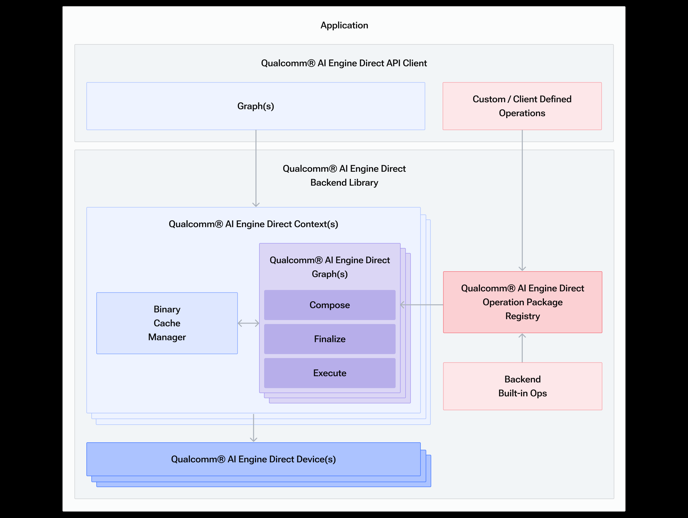
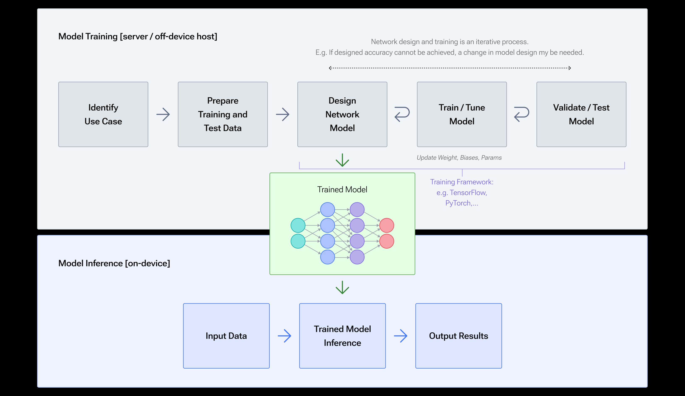
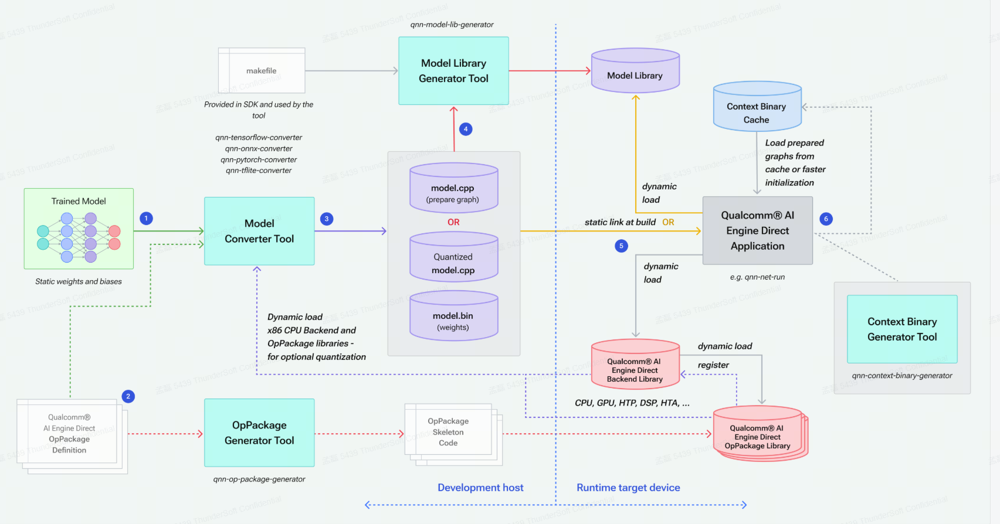

# QNN

QNN 旨在提供统一的API 以及模块化和扩展的加速库， 为全栈AI解决方案提供可重用的基础。

## 软件架构

- Device

  硬件加速器的软件抽象， 提供关联所需硬件加速资源以执行用户组成的图形所需要的构造。一个平台可以分为多个device， 一个`device`可以有多个核心。

- backend

  后端是一个`顶级API组件`， 它托管和管理图组合和执行所需的大多数资源， 包括存储所有可操作的操作注册表。

- Context

  代表维持用户程序所需要的QNN组建的`构造`。 托管用户提供网络，并`允许将构造的实体缓存到序列化对象中`以提供将来使用. 它通过提供`可共享的内存空间`来实现多个图之间的互操作性。

- Graph 

  表示可以加载网络模型的方式，由表操作节点和他们互联以组成有向无环图的张良组成，QNN 图形结构支持执行网络模型的初始化， 优化和执行的API。

- Operation Package Registry 

  一个注册表， 用户维护可用于执行模型的所有操作的记录， 这些操作可以是内置的， 也可以由用户作为自定义的操作提供。

## Integration Workflow

### QNN workflow

1. 输入训练好的模型

2. 当模型中包含QNN不支持的算子的时候， 需要想转换提供OpPackage定义的文件， 以表达自定义算子。

   客户可以使用OpPackage生成器工具生成框架代码，来实现自定义代码，并将这些代码编译到OpPackage库中。

3. `Model Converter Tool`是一款工具， 可以帮助客户编写一系列QNN API调用来生成QNN格式的`用户提供的训练模型`的图表示。模型的输出如下：

   - `cpp` source file 包含QNN API 调用的`模型网络`图。
   - `bin` 二进制文件 ` 包含网络的权重和biases`的`float32 数据`

   客户可以指示转换器输出量化模型而不是默认模型， 如图中的量化model.cpp所示， 在这种情况下， model.bin文件中将包含量化数据， model.cpp将引用量化数据并包含量化编码， 某些QNN的后端库需要使用量化模型，如 HTP和DSP。

4. 客户可以使用QNN的模型库生成工具来生成模型库， 相关工具`qnn-model-lib-generator`.

5. 客户通过动态加载模型库护着编译并静态链接model.cpp和model.bin将模型集成到应用程序中， 为了准备和执行模型，客户还需要加载后端加速器和OpPackage库， OpPackage库在后端注册并在后端加载。

6. 客户端可以选择使用准备好的和最终的图来保存上下文二进制缓存。 请参阅上下文缓存以供参考。 可以从缓存中重复加载此类图，而无需进一步使用模型 .cpp/库。 从缓存加载模型图比通过模型 .cpp/库中提供的一系列图组合 API 调用进行准备要快得多。 缓存的图无法进一步修改； 它们用于部署准备好的图表，从而能够更快地初始化客户端应用程序。

7. 客户可以选择利用 Qualcomm 神经处理 SDK 生成的深度学习容器 (DLC) 与提供的 libQnnModelDlc.so 库结合使用，从应用程序中的 DLC 路径生成 QNN 图形句柄。 这提供了跨产品使用的单一格式，并支持无法编译到共享模型库的大型模型。 有关使用的详细信息，请参阅使用 DLC。

